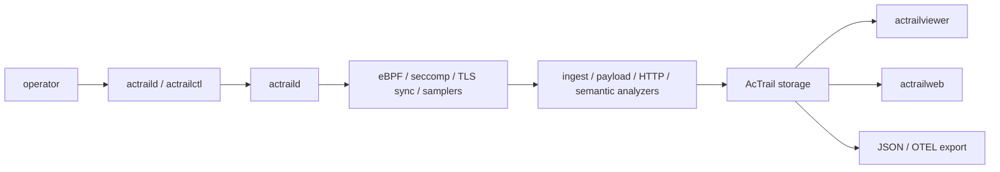

# AcTrail

> AcTrail: Action Trail, Actual Trail > > Do not rely on what an agent says. Verify what it does.

AcTrail records what an AI-agent process tree actually did on Linux/WSL: process launches, file/IPC/network activity, plaintext payloads, HTTP semantics, resource samples, policy/enforcement facts, and derived agent actions.

Use it to answer: what ran, what it touched, what it sent to an LLM, what came back, and what evidence proves it.

## Runtime Shape



| Surface | Role |
| --- | --- |
| `actraild` | Runs collection, analysis, trace lifecycle, storage writes, and live export. |
| `actrailctl` | Initializes config, checks daemon readiness, launches traced workloads, lists traces, and cleans runtime artifacts. |
| `actrailviewer` | Reads storage from the CLI for summaries, events, payloads, actions, diagnostics, JSON, and OTEL. |
| `actrailweb` | Reads storage through a read-only Web UI centered on semantic action evidence. |

## Quick Start

The fastest path is `init -> start -> launch -> web`. The generated default config enables broad collection and can retain sensitive payload data, so use it on a host and workload where that is intentional.

Install native dependencies:

```bash
# openEuler / Fedora / RHEL-like
sudo dnf install -y clang llvm elfutils-devel zlib-devel pkgconf-pkg-config openssl-devel java-17-openjdk-devel

# Debian / Ubuntu-like
sudo apt-get install -y clang llvm libelf-dev zlib1g-dev pkg-config libssl-dev openjdk-17-jdk
```

The release build also compiles the embedded Java JSSE payload agent used for
Java HTTPS plaintext capture. Keep JDK 17+ `java` and `javac` on `PATH`; if the
host has multiple JDKs, prepend the JDK 17+ `bin` directory before building:

```bash
export PATH="/path/to/jdk-17/bin:$PATH"
```

If Java JSSE payload capture is intentionally unavailable, build with
`ACTRAIL_SKIP_JAVA_AGENT_BUILD=1`. Set `ACTRAIL_REQUIRE_JAVA_AGENT_BUILD=1` when
this payload agent must be present and build failures should be fatal.

Build release binaries:

```bash
npm ci --prefix crates/apps/web/frontend
cargo build --release
```

Run a traced workload and open the Web UI:

```bash
sudo ./target/release/actraild init
sudo ./target/release/actraild start
sudo ./target/release/actrailctl doctor
sudo -E ./target/release/actrailctl launch --name demo -- <agent-or-cli-command> <args>
sudo ./target/release/actrailweb --config /etc/actrail/actraild.conf --addr 127.0.0.1 --port 18080
```

Open `http://127.0.0.1:18080`, select the new trace, and inspect actions, payload evidence, diagnostics, and raw details.

Stop the daemon when finished:

```bash
sudo ./target/release/actraild stop
```

For a low-risk process/network-only walkthrough with payload capture disabled, use [docs/examples/01.quick-start/README.md](docs/examples/01.quick-start/README.md).

## CLI Inspection

Use the viewer when you want terminal output or exports:

```bash
sudo ./target/release/actrailctl list-traces
sudo ./target/release/actrailviewer summary --trace-id <TRACE_ID>
sudo ./target/release/actrailviewer actions --trace-id <TRACE_ID> --head 120
sudo ./target/release/actrailviewer payloads --trace-id <TRACE_ID> --head 80
sudo ./target/release/actrailviewer diagnostics --trace-id <TRACE_ID>
sudo ./target/release/actrailviewer export-otel --trace-id <TRACE_ID> --output /tmp/actrail-trace.otlp.json
```

## Notes

AcTrail is config-driven and fail-fast: required capabilities should fail visibly instead of silently downgrading collection.

`actraild` needs the privileges required by the target Linux/WSL kernel for eBPF tracepoint/uprobe attachment; fanotify enforcement has additional kernel requirements.

Payload capture can persist prompts, API keys, Authorization headers, and model responses; review redaction and export settings before using broad configs outside disposable validation.

## Documentation

| Document | Use It For |
| --- | --- |
| [docs/usage.md](docs/usage.md) | Daily command reference. |
| [docs/deployment.md](docs/deployment.md) | Persistent host deployment and config layout. |
| [docs/use-cases.md](docs/use-cases.md) | Choosing the right capability path for a security question. |
| [docs/platform-requirements.md](docs/platform-requirements.md) | Kernel, BTF, tracefs, seccomp, pidfd, fanotify, and preflight details. |
| [docs/examples/README.md](docs/examples/README.md) | Example index. |
| [docs/examples/08.full-monitor-validation/README.md](docs/examples/08.full-monitor-validation/README.md) | Full real-agent validation. |
| [tests/agent-trace/README.md](tests/agent-trace/README.md) | Real agent acceptance cases. |

## License

AcTrail is licensed under the Mulan Permissive Software License, Version 2. See [LICENSE](LICENSE).

The eBPF C programs include Linux kernel verifier license-section strings such as `char LICENSE[] SEC("license") = "GPL";`; those strings are for BPF loading/helper compatibility and do not replace the repository-level license.
