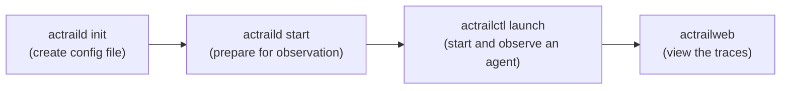
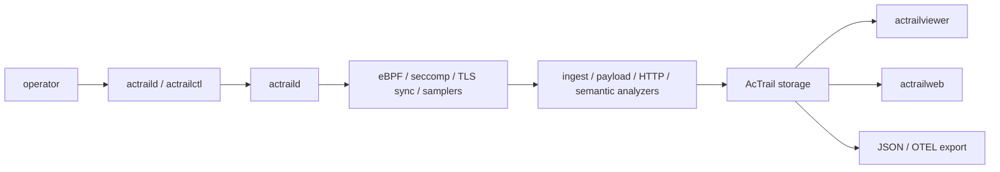

# AcTrail

> **Action Trail, Actual Trail.** Verify what an agent does, not just what it says.

AcTrail records what an AI-agent process tree actually did on Linux/WSL, then links the evidence back to traceable actions: process launches, file and IPC activity, network connections, TLS/plaintext payloads, HTTP semantics, LLM requests and responses, resource samples, and policy decisions.

## Targeted for


Use it when an agent's own logs are not enough. AcTrail answers:

- What process tree ran, and which commands did it spawn?
- Which files, sockets, pipes, and network endpoints did it touch?
- What did it send to an LLM provider, and what came back?
- Which low-level payload, HTTP, or process event proves a higher-level action?
- Which observations were complete, partial, blocked, or degraded?


## Install

Install from source when developing or testing a checkout:

```bash
./scripts/install-release.sh /usr/local/bin
```

The install script checks build dependencies, installs the actrailweb frontend dependencies with `npm ci`, builds missing release binaries, and copies them into the destination directory. It uses `sudo` only for the final copy when the destination directory requires elevated permissions. Use another directory if you do not want to install into `/usr/local/bin`.

RPM packages are published from the latest release page:

```text
https://gitcode.com/openeuler/AcTrail/releases/latest
```

Download the package that matches your release and architecture, for example:

```text
AcTrail-<VERSION>-<RELEASE>.<DISTRO>.<ARCH>.rpm
```

Then install it with your system package tooling:

```bash
sudo rpm -Uvh AcTrail-<VERSION>-<RELEASE>.<DISTRO>.<ARCH>.rpm
```

## First Run

The fastest path is the default local workflow:



The default config enables broad collection and can persist sensitive plaintext payloads, including prompts, API keys, Authorization headers, and model responses. Use it first on a disposable development host or workload.

The commands below assume `actraild`, `actrailctl`, and `actrailweb` are installed on `PATH`. From a source checkout without installation, use the matching `./target/release/...` binaries instead.

Initialize config, start the daemon, launch one traced command, and open the Web UI:

```bash
sudo actraild init
sudo actraild start
sudo actrailctl launch --name quickstart -- \
  bash -lc 'echo ACTRAIL_QUICKSTART_OK; id >/dev/null; ls /etc/hosts >/dev/null'
sudo actrailweb
```

Open `http://127.0.0.1:18080`, select the `quickstart` trace, and inspect the process tree, derived actions, evidence, diagnostics, and raw details.

`actrailweb` runs in the foreground. Keep it open while using the UI, then press `Ctrl-C` before stopping the daemon.

Stop the daemon when finished:

```bash
sudo actraild stop
```

For the full step-by-step walkthrough, including expected output and cleanup, see [docs/examples/01.quick-start/README.md](docs/examples/01.quick-start/README.md).

## What It Shows

| Area | Evidence |
| --- | --- |
| Process activity | Launches, exits, process tree membership, command context, and agent invocation markers. |
| File and IPC activity | File events, mmap activity, Unix sockets, pipes/FIFOs, and compact summaries for noisy terminal or bulk-read patterns. |
| Network and payloads | Socket activity, TLS plaintext capture, HTTP/HTTP2/SSE semantics, retained payload metadata, and payload evidence links. |
| LLM behavior | Provider routes, request and response actions, canonical request blocks, assembled response text/reasoning, tool calls, and usage summaries. |
| Governance | Fanotify enforcement facts, allow/deny decisions, resource samples, diagnostics, JSON export, and OTEL JSON export. |

## Choose Your Path

| Goal | Start Here |
| --- | --- |
| Run AcTrail once and view a trace | [docs/examples/01.quick-start/README.md](docs/examples/01.quick-start/README.md) |
| Learn day-to-day CLI commands | [docs/usage.md](docs/usage.md) |
| Check kernel, privilege, BTF, tracefs, seccomp, and fanotify requirements | [docs/platform-requirements.md](docs/platform-requirements.md) |
| Deploy a persistent host daemon | [docs/deployment.md](docs/deployment.md) |
| Pick a capability path for a security question | [docs/use-cases.md](docs/use-cases.md) |
| Capture LLM HTTP/TLS payloads | [docs/examples/02.llm-http-payload-capture/README.md](docs/examples/02.llm-http-payload-capture/README.md) |
| Validate broad real-agent coverage | [docs/examples/08.full-monitor-validation/README.md](docs/examples/08.full-monitor-validation/README.md) |
| Run real-agent acceptance cases | [tests/agent-trace/README.md](tests/agent-trace/README.md) |

## Runtime Shape



| Surface | Role |
| --- | --- |
| `actraild` | Runs collection, analysis, trace lifecycle, storage writes, and live export. |
| `actrailctl` | Initializes config, checks daemon readiness, launches traced workloads, lists traces, and cleans runtime artifacts. |
| `actrailviewer` | Reads storage from the CLI for summaries, events, payloads, actions, diagnostics, JSON, and OTEL. |
| `actrailweb` | Reads storage through a read-only Web UI centered on semantic action evidence. |

## Safety Notes

AcTrail is config-driven and fail-fast: required capabilities should fail visibly instead of silently downgrading collection.

`actraild` needs the privileges required by the target Linux/WSL kernel for eBPF tracepoint/uprobe attachment. Seccomp and fanotify paths have additional kernel and permission requirements.

Payload capture can persist prompts, API keys, Authorization headers, file excerpts, and model responses. Review redaction, retention, export, and storage settings before using broad configs outside disposable validation.

## License

AcTrail is licensed under the Mulan Permissive Software License, Version 2. See [LICENSE](LICENSE).

The eBPF C programs include Linux kernel verifier license-section strings such as `char LICENSE[] SEC("license") = "GPL";`; those strings are for BPF loading/helper compatibility and do not replace the repository-level license.
