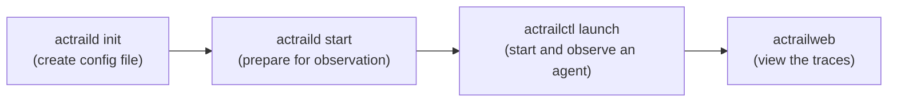
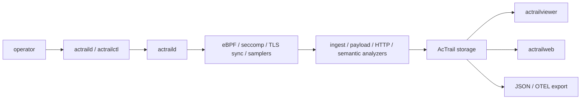

# AcTrail

> **Action Trail, Actual Trail.** Verify what an agent does, not just what it says.

AcTrail records what an AI-agent process tree actually did on Linux/WSL, then links the evidence back to traceable actions: process launches, file and IPC activity, network connections, TLS/plaintext payloads, HTTP semantics, LLM requests and responses, resource samples, and policy decisions.

## When Agent Logs Are Not Enough


AcTrail provides system-level evidence for security investigations, agent development, and platform operations where an agent's own logs are insufficient. It answers:

- What process tree ran, and which commands did it spawn?
- Which files, sockets, pipes, and network endpoints did it touch?
- What did it send to an LLM provider, and what came back?
- Which low-level payload, HTTP, or process event proves a higher-level action?
- Which observations were complete, partial, blocked, or degraded?


## Install

A source checkout can be installed for development or testing with:

```bash
./scripts/install-release.sh /usr/local/bin
```

The install script checks build dependencies, installs the actrailweb frontend dependencies with `npm ci`, asks Cargo to refresh the release binaries and TLS sync runtimes, and copies them into the destination directory. Cargo's incremental freshness checks keep repeated installs fast while ensuring changed sources are rebuilt. All Cargo builds and artifact reads share `${CARGO_TARGET_DIR:-target}`. The script also installs the official plugin packages, including the built-in `otel-jsonl` and `otel-http` exporter descriptors, under `${ACTRAIL_PLUGIN_DIR:-$HOME/.actrail/plugins}`. Installation makes plugins discoverable but does not load them; the Plugins Web workspace refreshes discovery and loads selected plugins explicitly. The script uses `sudo` only for copies whose destination requires elevated permissions. Alternative binary and plugin directories remain supported, and the configured plugin discovery path must match the user that runs `actrailweb`.

RPM packages are published on the [latest release page](https://gitcode.com/openeuler/AcTrail/releases/latest).

The package must match the target operating-system release and architecture, for example:

```text
AcTrail-<VERSION>-<RELEASE>.<DISTRO>.<ARCH>.rpm
```

The matching package can then be installed with the system package manager:

```bash
sudo rpm -Uvh AcTrail-<VERSION>-<RELEASE>.<DISTRO>.<ARCH>.rpm
```

## First Run

The fastest path is the default local workflow:


```mermaid
flowchart LR
    Init["actraild init<br/>(create config file)"] --> Start["actraild start<br>(prepare for observation)"]
    Start --> Launch["actrailctl launch<br>(start and observe an agent)"]
    Launch --> Web["actrailweb<br/>(view the traces)"]
```

The default config enables broad collection and can persist sensitive plaintext payloads, including prompts, API keys, Authorization headers, and model responses. The first run belongs on a disposable development host or workload.

The commands below assume `actraild`, `actrailctl`, and `actrailweb` are installed on `PATH`. From a source checkout without installation, use the matching `./target/release/...` binaries instead.

The following commands initialize the config, start the daemon, launch one traced command, and start the Web UI:

```bash
sudo actraild init
sudo actraild start
sudo actrailctl launch --name quickstart -- \
  bash -lc 'echo ACTRAIL_QUICKSTART_OK; id >/dev/null; ls /etc/hosts >/dev/null'
sudo actrailweb
```

With `actrailweb` running, open `http://127.0.0.1:18080` in a browser, select the `quickstart` trace, and inspect its process tree, derived actions, evidence, diagnostics, and raw details. A visible `quickstart` trace with the launched command and its evidence completes the first-run check.

`actrailweb` runs in the foreground. After inspection, `Ctrl-C` stops the Web UI and the following command stops the daemon:

```bash
sudo actraild stop
```

For the complete prerequisites, verification steps, and cleanup procedure, see the [Quickstart](docs/getting-started/quickstart.md).

## What It Shows

| Area | Evidence |
| --- | --- |
| Process activity | Launches, exits, process tree membership, command context, and agent invocation markers. |
| File and IPC activity | File events, mmap activity, Unix sockets, pipes/FIFOs, and compact summaries for noisy terminal or bulk-read patterns. |
| Network and payloads | Socket activity, TLS plaintext capture, HTTP/HTTP2/SSE semantics, retained payload metadata, and payload evidence links. |
| LLM behavior | Provider routes, request and response actions, canonical request blocks, assembled response text/reasoning, tool calls, and usage summaries. |
| Governance | Fanotify enforcement facts, allow/deny decisions, resource samples, diagnostics, JSON export, and OTEL JSON export. |

## Choose a Path

| Goal | Start Here |
| --- | --- |
| Run AcTrail once and view a trace | [Quickstart](docs/getting-started/quickstart.md) |
| Start or stop the daemon | [Daemon lifecycle](docs/operations/daemon/start-stop.md) |
| Check kernel, privilege, BTF, tracefs, seccomp, and fanotify requirements | [Platform support](docs/reference/platform-support.md) |
| Deploy a persistent host daemon | [Host deployment](docs/operations/deployment/host.md) |
| Deploy execution isolation with a Firecracker sandbox | [deploy/execution-isolation/README.md](deploy/execution-isolation/README.md) |
| Deploy the optional Kata virtual-container profile | [deploy/virtual-container/README.md](deploy/virtual-container/README.md) |
| Pick a capability path for a security question | [Capability overview](docs/concepts/capabilities.md) |
| Configure HTTP/TLS payload collection | [Collection configuration](docs/reference/configuration/collection.md) |
| Browse all concepts, operations, architecture, and reference material | [Documentation index](docs/README.md) |

## Runtime Shape


```mermaid
flowchart LR
    Operator["operator"] --> CLI["actraild / actrailctl"]
    CLI --> Daemon["actraild"]
    Daemon --> Collectors["eBPF / seccomp / TLS sync / samplers"]
    Collectors --> Analyzers["ingest / payload / HTTP / semantic analyzers"]
    Analyzers --> Store["AcTrail storage"]
    Store --> Viewer["actrailviewer"]
    Store --> Web["actrailweb"]
    Store --> Export["JSON / OTEL export"]
```

| Surface | Role |
| --- | --- |
| `actraild` | Runs collection, analysis, trace lifecycle, storage writes, and live export. |
| `actrailctl` | Initializes config, checks daemon readiness, launches traced workloads, lists traces, and cleans runtime artifacts. |
| `actrailviewer` | Reads storage from the CLI for summaries, events, payloads, actions, diagnostics, JSON, and OTEL. |
| `actrailweb` | Reads storage and provides a local Plugins administration workspace for explicit discovery, load, and unload. |

## Safety Notes

AcTrail is config-driven and fail-fast: required capabilities should fail visibly instead of silently downgrading collection.

`actraild` needs the privileges required by the target Linux/WSL kernel for eBPF tracepoint/uprobe attachment. Seccomp and fanotify paths have additional kernel and permission requirements.

Payload capture can persist prompts, API keys, Authorization headers, file excerpts, and model responses. Operators must review redaction, retention, export, and storage settings before using broad configs outside disposable validation.

## License

AcTrail is licensed under the Mulan Permissive Software License, Version 2. See [LICENSE](LICENSE).

The eBPF C programs include Linux kernel verifier license-section strings such as `char LICENSE[] SEC("license") = "GPL";`; those strings are for BPF loading/helper compatibility and do not replace the repository-level license.
