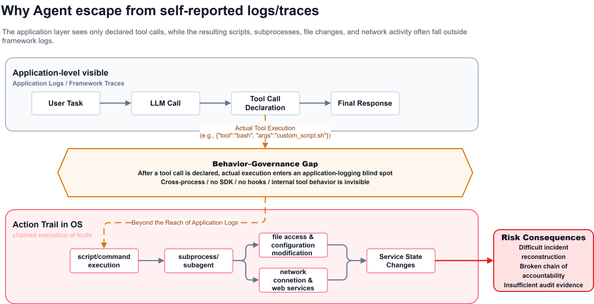
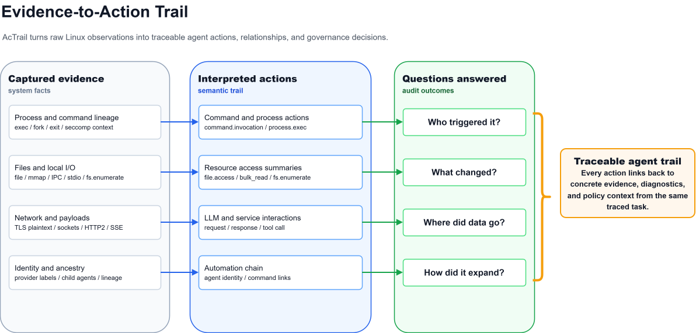
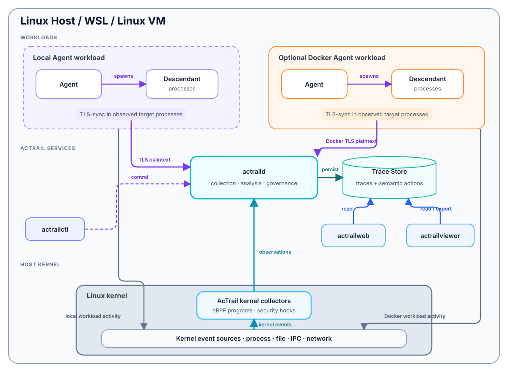
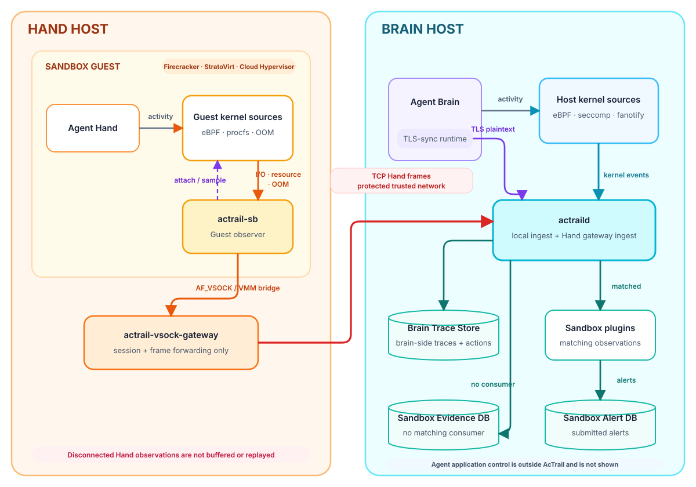

# AcTrail

[中文](README.zh-CN.md) | [English](README.md)

> **Action Trail, Actual Trail.** 验证 Agent 真正做了什么，而不只是它声称做了什么。

## AcTrail 是什么

AcTrail 是面向 Linux 和 WSL AI Agent 的观测与治理底座。它记录 Agent 进程树实际发生的活动，从系统与协议证据中还原高层行为，为安全、研发和运维团队提供可调查、可追溯、可治理的事实基础。

一条 trace 可以关联进程启动、文件与 IPC 活动、网络连接、TLS 明文、HTTP 语义、LLM 请求与响应、工具调用、资源信号、诊断信息和策略决策。

## 为什么需要 AcTrail



Agent 日志只描述 Agent 选择上报的内容，无法可靠覆盖脚本、子进程、文件修改、网络流量，也难以说明执行是否完整或降级。AcTrail 提供独立的系统级证据，用于回答：

- 实际运行了哪棵进程树，派生了哪些命令？
- 接触了哪些文件、socket、pipe 和网络端点？
- 向 LLM 服务发送了什么，收到了什么？
- 哪个 payload、HTTP 或进程事件能证明某个高层行为？
- 哪些观测是完整、部分、被阻断或已降级的？



## 核心能力

- **系统级 Agent 观测**：独立于 Agent 自报日志，观测 Linux/WSL 进程树中的命令、文件、mmap、IPC、stdio、socket、网络活动和资源信号。
- **加密流量证据**：在授权边界内采集 TLS 明文，将 payload 元数据与 socket、进程身份关联。
- **协议与语义还原**：从底层证据重建 HTTP/1、HTTP/2、SSE、LLM 请求响应、推理内容、工具调用和用量语义。
- **证据链接的行为轨迹**：将语义 action 与进程祖先、身份、payload、诊断信息、完整性和降级状态关联。
- **治理与告警**：执行 fanotify 和 seccomp 决策，加载策略与分析插件，持久化告警并转发指定类别，下游故障不会反向中断采集。
- **本地与外部分析**：通过 Web 或 CLI 检索 trace，导出 JSON/OpenTelemetry 数据，并可选将终态 trace 上报到集群服务。
- **多种部署边界**：支持 Linux/WSL 主机、主机 daemon 观测 Docker workload，以及面向独立 Guest 信任边界的执行隔离。

## 部署视图

AcTrail 有两类明确不同的部署。普通 Host/VM 部署在 Agent 身边运行完整 AcTrail runtime；执行隔离部署将 Agent 的 Brain 与远端 Hand sandbox 分开，并在 sandbox 内使用轻量 `actrail-sb` 路径。

### Agent 与 actraild 位于同一运行边界

物理 Linux Host 与普通 Linux VM 采用同一拓扑：`actraild`、存储和 Agent 均位于同一操作系统边界内。Agent 运行在 Docker 中时，`actraild` 仍位于 Docker Host；workload 使用已配置的本地 AcTrail 控制通道和 payload 通道，Host collector 则观测其系统活动。完整 VM 必须在 Guest 内运行自己的 `actraild`，因为 Host eBPF 采集无法替代 Guest 内核采集。



### Brain 与远端 Hand sandbox 位于不同 Host

执行隔离模式中，Brain 运行在一台 Host，Hand 运行在另一台 Host 上的 sandbox Guest 内。Guest 运行唯一的 `actrail-sb`，而不是完整 `actraild`。Hand Host 上的 `actrail-vsock-gateway` 承接 VMM 暴露的 VSOCK 端点，再将观测帧转发到 Brain Host 上的 `actraild`。此路径的仓库默认 VMM 为 Firecracker，同时支持 StratoVirt 和 Cloud Hypervisor 作为可选 backend。



gateway 到 daemon 目前使用 AcTrail 自定义帧上的明文 TCP。跨 Host 部署必须通过可信私有网络或外部安全隧道保护该链路，不得直接暴露到不可信网络。更多边界见[选择部署模式](docs/operations/deployment/choose-a-mode.md)、[默认部署架构](docs/architecture/deployment/default.md)和[执行隔离部署](deploy/execution-isolation/README.md)。

## 前置依赖

- Linux 或 WSL。`x86_64` 已验证；ARM64 已有代码支持，但尚未在目标发行版验证。
- 用于 live collection 的 root 权限或等效内核 capabilities。
- Kernel BTF、可写 tracefs 控制挂载点，以及附加 perf tracepoint 和 uprobe 的权限。
- Rust `1.90+`、`rustup`，安装器需要可用的 `wasm32-wasip2` target。
- Clang/LLVM、libelf、zlib、pkg-config、OpenSSL 开发包和 musl 工具链。
- Node.js `18+` 和 npm，用于 Web 前端。

依赖安装器支持 `dnf` 和 `apt-get`。内核与特定功能要求见[平台支持范围](docs/reference/platform-support.md)。

## 安装

### 给 AI Agent

将下面的指令交给工作在 AcTrail 源码目录中的 AI 编码 Agent：

```text
请从当前仓库将 AcTrail 安装到这台已授权的 Linux/WSL 主机。
先阅读 README.zh-CN.md、docs/reference/platform-support.md 和
scripts/install-release.sh，检查构建前置条件，再以 /usr/local/bin 为目标运行
release 安装器。不要降低主机安全设置，不要覆盖已有 AcTrail 配置；
遇到内核能力或依赖缺失时明确报告，不要隐藏或降级。最后验证 actraild、
actrailctl、actrailviewer 和 actrailweb 已在 PATH 中可用。
```

Agent 应使用仓库安装器，不要手工重新拼装构建和复制步骤。

### 人工手动安装

#### 源码安装

在仓库根目录安装或检查构建依赖：

```bash
./scripts/install-build-deps.sh --install
```

构建 release 产物，并安装二进制、TLS runtime 和官方插件包：

```bash
./scripts/install-release.sh /usr/local/bin
```

安装器仅在目标目录需要提权时使用 `sudo`。默认情况下，插件包安装到 `${ACTRAIL_PLUGIN_DIR:-$HOME/.actrail/plugins}`，在显式加载前保持禁用。

#### RPM 方式

从[最新发布页](https://gitcode.com/openeuler/AcTrail/releases/latest)下载与目标发行版和架构匹配的软件包：

```text
AcTrail-<VERSION>-<RELEASE>.<DISTRO>.<ARCH>.rpm
```

安装或升级：

```bash
sudo rpm -Uvh AcTrail-<VERSION>-<RELEASE>.<DISTRO>.<ARCH>.rpm
```

## 快速运行

默认配置会进行广泛采集，并可能持久化 prompt、API key、Authorization header 和模型响应等敏感明文。首次运行应仅在已授权、可丢弃的开发主机或 workload 上进行。

安装后，初始化配置、启动 daemon、运行一条受观测命令，然后启动本地 Web UI：

```bash
sudo actraild init
sudo actraild start
sudo actrailctl launch --name quickstart -- \
  bash -lc 'echo ACTRAIL_QUICKSTART_OK; id >/dev/null; ls /etc/hosts >/dev/null'
sudo actrailweb
```

打开 `http://127.0.0.1:18080`，选择 `quickstart` trace，查看它的进程树、action、证据和诊断信息。`actrailweb` 在前台运行；按 `Ctrl-C` 停止，再停止 daemon：

```bash
sudo actraild stop
```

CLI 验证和排查步骤见完整 [Quickstart](docs/getting-started/quickstart.md)。

## 更多文档

| 目标 | 文档 |
| --- | --- |
| 了解支持的安全问题与证据 | [能力概览](docs/concepts/capabilities.md) |
| 核对采集覆盖范围 | [采集与观测清单](docs/concepts/collection-observation-checklist.md) |
| 审阅信任、数据与权限边界 | [安全模型](docs/concepts/security-model.md) |
| 配置采集与保留 | [采集配置](docs/reference/configuration/collection.md) |
| 运行与排查 AcTrail | [运维指南](docs/operations/README.md) |
| 了解当前实现 | [架构](docs/architecture/README.md) |
| 浏览全部文档 | [文档索引](docs/README.md) |

## 许可证说明

AcTrail 使用[木兰宽松许可证第 2 版](LICENSE)。

eBPF C 程序中包含供 Linux 内核 verifier 识别的 license section 字符串，用于 BPF 加载和 helper 兼容性；这些字符串不会替代仓库级许可证。
