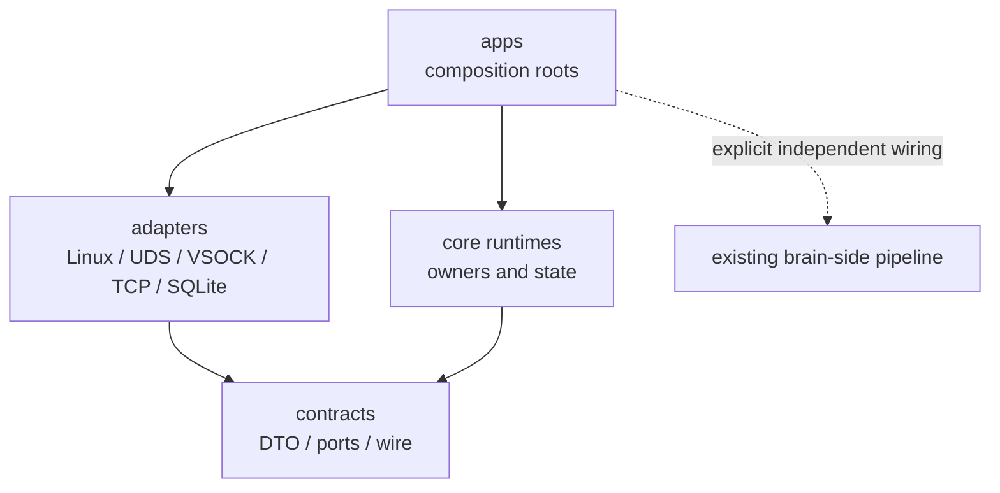

# AcTrail 执行隔离代码布局设计约束

本文只定义执行隔离模块必须保持的结构与运行边界。文件位置和逐文件职责见 [目标代码布局](target-layout.md)。

## 1. 依赖边界



- `actrail-sb`、`actrail-vsock-gateway` 与 `actraild` app crates 不互相依赖。
- contract 不依赖 app、runtime、adapter、factory、plugin implementation 或 SQLite。
- core runtime 不依赖 app 或具体 transport/storage implementation。
- Guest packages 不依赖 actraild、plugin、storage、semantic、recording、export、`actrailctl` 或 tools packages。
- gateway 不依赖 plugin、storage、semantic、recording 或 export。
- `GatewayIngestRuntime` 不依赖既有 Ingest、Identity、Trace、Semantic、Recording、Export 或主 `StorageBackend`。
- sandbox Evidence/Alert SQLite adapters 不实现主 `StorageBackend`，不复用主数据库 schema。
- product app/runtime 不反向依赖 tools crate。

## 2. Owner 与封装边界

- 每个独立状态或故障域由一个 owner struct 聚合；composition root 只持有窄 facade 和 lifecycle handle。
- `actrail-sb daemon` 是 Guest 内唯一采集设施 owner，独占 Guest-only eBPF programs、maps、links、procfs readers、workers、VSOCK session 和实例锁。
- 同一 binary 的 `connect` CLI 是短生命周期 Control Client，不加载 eBPF、不创建采集线程、不持有 VSOCK data session。
- Daemon Owner 聚合 workers、Connection Gate、Session Owner 和 control port，不向 app 暴露 queue、channel、socket 或 session 私有状态。
- Session Owner 独占运行时 endpoint、VSOCK connection、`sb-id`、connection generation、batch sequence、Heartbeat 和 reconnect target。
- collector 与 sampler 不持有 endpoint、control connection 或 transport session。
- Guest-local Control Server 独占 listener、accepted connections、poll owner、dispatcher 和 health fd；CLI 与 runtime 只依赖 control contract。
- `lib.rs` 与 `mod.rs` 只声明 module 并执行最小 re-export；可见性按 `private → pub(super) → pub(crate) → pub` 收敛。
- 相关行为通过 owner/manager/runtime struct 的方法暴露；纯转换工具才允许成为自由函数。

## 3. Guest-local control 边界

- control UDS 只传递 Guest-local lifecycle 命令，不复用、不封装且不转发 SB↔gateway wire frame。
- Host CID 与 VSOCK port 由 `actrail-sb connect` 在运行时提交；daemon 静态配置和 microVM 快照不保存部署实例 endpoint。
- UDS connection 使用固定 frame 上限、连接容量和 request deadline；读取 header 后必须先校验长度再扩展 buffer。
- UDS poll owner 不执行 VSOCK connect/handshake；合法命令交给独立单 worker dispatcher。
- dispatcher 同时最多执行一个 control command；已有 command 执行时，其他 command 立即得到 `Busy`，不得排入无界等待队列。
- CLI timeout 只限制 CLI 等待响应，不撤销 daemon 已接受的 Connect；daemon 通过单 owner 串行、防重入和同端点幂等保证重试安全。
- 同一有效 endpoint 的重复 connect 返回当前 session；不同 endpoint 由 Session Owner 串行替换。
- Control Server 运行期退出只使新的 CLI 控制不可用，必须产生一次集中诊断；Daemon Owner、collector、sampler 和当前 data session 继续运行。

## 4. Observation 通路边界

```text
actrail-sb → actrail-vsock-gateway → actraild / GatewayIngestRuntime
    → 有消费目标：sandbox plugin delivery
    → NoInterest：独立 Sandbox Evidence DB
```

- Hand observation 不进入既有 Ingest、Identity、Trace、Semantic、Recording、Export 或主 Storage。
- gateway 处理连接、frame、ID、quota 和转发，不解码或重编码 observation payload。
- `gateway-id` 与 `sb-id` 只标识当前独立通路的存活连接，不映射脑侧 trace、agent、identity 或 process。
- 路由按 observation 粒度生成；有匹配目标的 observation 只投匹配插件，`NoInterest` observation 只写独立 Evidence DB。
- matcher failure、stale plan、plugin queue full 或 plugin failure 不得伪装成 `NoInterest`；Evidence failure 不得改投 plugin 或主 Storage。
- 同一 observation 不跨 plugin/Evidence 分支重复落地。

## 5. Connection Gate 与 session 边界

- Connection Gate 位于任何 observation queue、batch 或 Guest 持久化入口之前。
- gate 使用原子 connection generation；Disconnected、Connecting 和 Reconnecting 状态下 observation 以常数时间丢弃。
- gate 关闭时不创建 session batch、不触碰 Guest 文件/数据库、不等待未来连接，也不补发。
- producer 在采样开始前捕获 generation，并在入队前再次确认 generation，防止跨 session admission。
- 首次连接和每次重连必须在 gate 关闭时完成 handshake、I/O baseline、旧 queue/pending 丢弃和新 generation 建立，然后才能开放 gate。
- baseline 读取存在任何 collector failure 时连接失败，不能在未知计数边界下开放 gate。
- session 写失败时先关闭 gate，再丢弃 pending 与旧 queue；collector 和 sampler 继续运行。
- Heartbeat 只在已连接且连续没有任何 observation frame 达到最大静默周期时发送；正常资源快照持续到达时不触发 Heartbeat。

## 6. 配置边界

- app composition root 只聚合组件配置；各 component 自己校验周期、容量、frame 和 timeout。
- 所有容量、周期、frame/batch 上限、timeout、connection limit 和 worker stack 都有配置入口与默认值。
- `actrail-sb` 配置按 `collector`、`sampler`、`observation_queue`、`sender`、`control`、`diagnostics` 和 `instance_lock_path` 分层。
- CLI 的 control request timeout 与 frame limit 默认值复用 daemon profile 的单一 Rust 定义；checked-in TOML 与该 profile 保持一致。
- control frame limit必须容纳最大 rejection frame，并受协议 payload 长度上限约束。
- `diagnostics.interval_ms = 0` 表示关闭周期诊断；关闭时 daemon main 不得发生诊断轮询唤醒。
- 缺失必需配置、路径非绝对、容量为零、timeout/frame 越界或组合不合法时启动失败，不使用隐式 fallback。

## 7. 性能边界

- Guest eBPF 热路径只执行 lineage lookup 和计数聚合，不复制用户 payload、不计算内容 hash、不逐 syscall 上报。
- producer 路径是“采集 → 原子 generation gate → 有界 `try_send`”；不得等待 control、transport、disk 或 plugin。
- disconnected producer 路径不分配第二份 observation collection，不创建 batch buffer。
- daemon 启动时预分配 observation queue 与 session pending batch 容量；断连期间不建立 backlog。
- daemon main 使用 `signalfd + ppoll` 等事件驱动等待，同时监听 shutdown signal、Control Server health 和可选 diagnostics deadline；禁止固定周期 wake loop。
- 周期诊断集中读取原子累计值并统一输出；collector、sampler、sender 和 gate 不直接格式化日志。
- gateway 使用 per-SB quota 与全局有界 queue；单 sandbox 不得耗尽其他 sandbox 的保留容量。
- network/admission 热路径不执行同步 SQLite/fsync；独立 store 由有界 writer 批量事务写入。
- 慢 plugin 只消耗对应 consumer queue，不形成全局同步等待。

## 8. 故障与关闭边界

- 启动阶段对静态配置、实例锁、procfs、eBPF object/maps/attach、首次 baseline/resource sample、worker、control bind 和 transport配置执行 fail-fast。
- daemon ready 不以 gateway 存在、VSOCK endpoint 已知或 VSOCK 已连接为前提。
- 运行期 collector/resource 单轮失败、VSOCK 失败、control server失败和 diagnostics输出失败均局部化，不使无关 owner 退出。
- shutdown signal 到达后，app 先停止 Control Server admission，再关闭 Sandbox Agent Runtime，最后 join Control Server poll owner并释放实例锁。
- shutdown 不排空 observation，不为尾部数据重连，也不等待 gateway 或 actraild 确认。
- gateway 单 SB session、TCP upstream 和 actraild 单 gateway connection 分别构成独立故障域。
- plugin consumer、Evidence writer 与 Alert writer 的故障不得反向关闭健康 gateway connection或 Guest collector。

## 9. 部署与验证边界

- Firecracker 是主线 backend；Cloud Hypervisor 与 native AF_VSOCK 是独立可选 backend，不能替代 Firecracker 主线结论。
- 快照前启动并预热 `actrail-sb daemon`；运行时顺序为 `actraild → gateway → 恢复 Guest → actrail-sb connect`。
- Firecracker 中 Guest connect port 与 Host `${uds_path}_${port}` 表示同一 VSOCK port。
- `tests/v2/` 是唯一允许新增、维护和执行的测试根；`tests/` 下其他目录禁止引用或扩展。
- 功能完成声明需要当前 release binary、刷新默认配置、真实 Firecracker Guest 和 Guest 内真实 Agent 的端到端结果。
