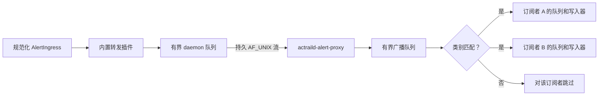

# 告警代理

> 本文展示外部告警的过滤、排队、编码及慢速订阅者隔离边界。

外部告警投递由一个内置 daemon 插件和独立的 `actraild-alert-proxy` 进程共同完成。`AlertIngress` 是转发插件接收的规范化内部告警。

每个订阅者的分支都独立求值。某个订阅者的队列填满时，只关闭该订阅者会话；不会向告警生产者或其他订阅者施加背压。

内置插件负责生效后的启用状态、不可变的类别过滤器快照、队列准入、连接代次和 daemon 侧心跳。**连接代次**是单调变化的链路标识，用于拒绝为旧连接排队的记录。它的热路径读取启用状态和过滤器，然后执行 `try_send`；不会重连、重复序列化 JSON、轮询存储，也不会阻塞告警持久化。

代理负责 daemon 认证、订阅者认证、订阅状态、一个广播队列，以及每个订阅者的写入器。它为每条告警分配一个 UUID，仅编码一次带长度前缀的 JSON 帧，并在匹配的订阅者之间共享不可变的已编码字节。过滤和队列准入发生在订阅者注册表锁之外。

连接代次可防止旧的或已禁用的 daemon 链路中排队的记录在重连后发出。旧代次迟到的 EOF 或超时不能覆盖较新链路的状态。

队列压力被限制在局部：daemon 只丢弃转发副本；代理广播压力只丢弃该副本；缓慢的订阅者只会关闭自己的会话。协议错误、EOF、超时和单个连接故障都不会终止生产者或代理。无效的启动配置、bind 或权限错误，以及所要求的初始连接失败会使启动失败。
