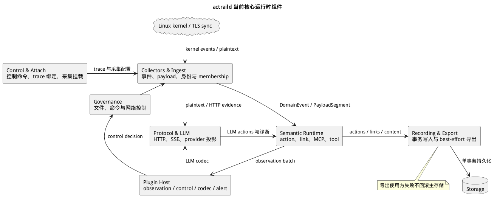

# Core Runtime

> 本文展示 `actraild` 如何将采集、身份、协议投影、治理、插件和持久化组织为一个运行时。

`actraild` 是默认部署中的核心 daemon。它拥有 brain-side 采集与 trace 生命周期，接收明文 payload 和内核事件，将它们投影为语义 action，并把治理、插件和持久化连接到明确的故障边界。Trace 是一次受观测进程树的证据集合；action 是从底层证据归纳出的语义活动记录。



## 组件目录

| 组件组 | 当前职责 |
|---|---|
| Control 与 Attach | 处理控制协议，创建或绑定 trace，裁决 launch 权限并挂载采集器 |
| Collectors 与 Ingest | 接收扩展伯克利包过滤器（eBPF）、seccomp、fanotify、TLS-sync 等来源，按[进程身份统一时序](process-identity-runtime.md)规范化 PID 坐标并解析 trace membership |
| Protocol 与 LLM | 在明文 payload 上恢复 HTTP、服务器发送事件（Server-Sent Events，SSE）和模型服务协议语义，生成大语言模型（LLM）action、content、lineage 和诊断 |
| Semantic Runtime | 将 domain event 和 payload 投影为 agent、command、file、HTTP、MCP、tool action 与 link |
| Governance | 对文件访问、命令执行和网络连接执行已配置的控制策略 |
| Plugin Host | 托管 observation consumer、control decider、LLM codec 和 alert producer 等 WebAssembly（WASM）能力 |
| Recording 与 Export | 以事务写入主存储，并把允许导出的语义批次投递给使用方 |

**Brain-side** 指拥有 `actraild` 和主存储的观测侧；执行隔离部署中的 Guest 采集路径称为 hand-side，其组件见[执行隔离运行时](execution-isolation.md)。

## 事件路径

内核 collector、TLS-sync service 和控制服务先把不同来源的数据转换成 daemon 内部 contract。Ingest 路径按[进程身份运行时](process-identity-runtime.md)将 raw kernel TGID、daemon 可见 PID 与稳定 `ProcessIdentity` 收敛，再补齐 trace membership 并将 `DomainEvent` 交给实时语义运行时。Payload 路径保留来源边界和传输身份；应用协议与 LLM pipeline 只消费符合条件的明文段。

实时语义运行时根据事件种类调用对应的有状态 projector。LLM pipeline 的输出还会进入 [Live Tool Projector](live-tool-projector.md)，形成工具与 Agent 调用关系。所有 action、link、content write、lineage 和诊断在服务边界合并后进入 recording runtime。

## 控制与插件路径

Governance 从 seccomp、fanotify 或网络控制边界取得待裁决操作。内置规则和已加载的 control-decider 插件在各自能力范围内返回决策；插件不能直接取得 daemon 内部状态或存储句柄。

Observation consumer 接收允许导出的语义观测。LLM codec 扩展 provider 解码，但不接管 transport assembly。Alert producer 提交的告警经过校验、去重和队列边界后持久化或转发。

## 故障边界

启动阶段会验证配置、存储、所需内核能力和必需监听端点；这些基础设施不成立时 daemon 不宣布就绪。运行阶段的 parser、exporter、插件使用方和单次存储操作各自限制故障范围。

主存储写入和 best-effort 导出是独立结果：导出失败不会回滚已提交的记录，也不会反向阻塞采集热路径。插件或下游解析失败由对应服务转成诊断、丢弃计数或局部错误，不应终止无关 trace。

## 源码导航

```text
crates/apps/daemon/src/
├── startup/             # 配置与运行时启动
├── services/            # daemon 服务实现
├── runtime_wiring.rs    # 跨服务依赖组合
├── control_loop.rs      # 控制事件循环
└── service_host.rs      # 服务生命周期

crates/core/
├── ingest_runtime/              # 事件摄入
├── semantic_action_runtime/     # 语义与 LLM 投影
├── trace_runtime/               # trace 生命周期与 membership
└── plugin_wasm_runtime/         # WASM 插件宿主
```
