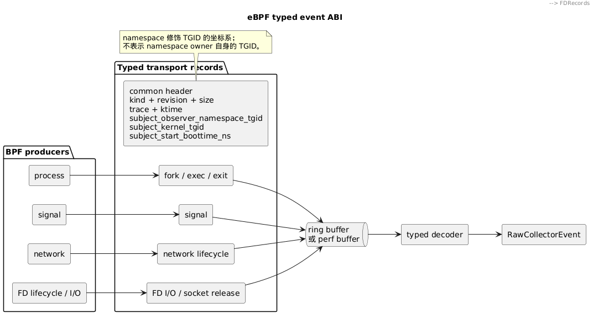

# eBPF 事件 ABI

eBPF producer 使用公共 header 加 typed record 向 daemon 传递事件。record 类型直接表达事件语义，不使用需要结合 kind 解释的通用 `aux`、`reserved` 或第二 endpoint 槽位。



## 公共 header

所有 typed record 以相同 header 开头：

```c
struct actrail_event_header {
    __u32 kind;
    __u16 abi_revision;
    __u16 record_size;
    __u64 trace_id;
    __u64 observed_ktime_ns;
    __u32 subject_observer_namespace_tgid;
    __u32 subject_kernel_tgid;
    __u64 subject_start_boottime_ns;
} __attribute__((packed));
```

header 固定 40 bytes，只表达传输边界和每类事件都需要的 subject 身份。TID、第二进程、FD、result、endpoint 和事件专用 flags 只属于对应 typed payload。

`record_size` 和 `abi_revision` 使 decoder 能在读取 payload 前验证完整布局。内部 ABI 不兼容时 daemon 启动失败；运行中的单条非法 record 被隔离并形成诊断，不影响 command-control。

## Typed records

| Record | Subject | Payload |
|---|---|---|
| `actrail_process_fork_event` | child | parent 的完整进程坐标 |
| `actrail_process_exec_event` | exec process | filename length、flags、filename bytes |
| `actrail_process_exit_event` | exiting process | signed exit code、validity flags |
| `actrail_process_signal_event` | signal source | target kernel TID、signal、result、group |
| `actrail_network_event` | syscall process | kind、result、FD、syscall family、flags、FD object generation、一个 endpoint及其 role |
| `actrail_fd_io_event` | syscall process | kind、syscall family、result、FD、category、requested bytes、FD object generation、可选 endpoint及其 role |
| `actrail_socket_release_event` | releasing process | FD、FD object generation |

fork 的 header 始终描述 child，parent 只出现在 fork payload。network record 每条只携带实际观测到的 endpoint，并用 `endpoint_role` 标明 local 或 remote；需要双 endpoint 的语义使用独立 record，不扩大全部网络事件。

file、TLS、stdio 与 socket payload 保持各自的 typed layout，不套入上述 record。

## PID 坐标

PID 字段同时编码角色和坐标系：

- `*_observer_namespace_tgid`：进程在 daemon 所在 PID namespace 中的 TGID，不是 observer 自身的 TGID。
- `*_workload_namespace_tgid`：进程在 workload 所在 PID namespace 中的 TGID，并伴随 PID namespace identity。
- `*_kernel_tgid`：进程在 initial PID namespace 中的 TGID。
- TID 使用对应的 `*_observer_namespace_tid`、`*_workload_namespace_tid` 或 `*_kernel_tid`。
- 内核进程代际使用 `*_start_boottime_ns`；procfs tick 使用 `*_start_time_ticks`。

字段名描述 PID 坐标本身，不描述它被存储或索引的位置。角色前缀使用 `subject_`、`parent_`、`child_`、`target_` 或 `peer_`。

## 构造与数据流

producer 根据事件 family 构造确定大小的 typed record，填充公共 header 和本类 payload，再提交给 ring buffer 或 perf buffer。公共 header 以 raw kernel TGID 对进程身份 cache 做一次 O(1) 查询，同时取得 observer TGID 和精确 generation；不发送未使用字段，也不在高频路径扫描 BPF state或查询 `/proc`。TLS/seccomp 专用 correlation 对 trace-namespace 线程坐标使用独立 cache，每个线程只在首次触达时执行一次 namespace helper，不能把该坐标混入公共 subject 身份。

consumer 原样批量交接 raw bytes。daemon decoder 先读取公共 header，按 `kind` 选择唯一 record 类型，严格校验 `abi_revision` 与 `record_size`，然后生成 typed kernel event并投影为 `RawCollectorEvent`。transport consumer 不猜测或改写 PID 坐标。

同一 `kernel_tgid + start_boottime_ns` 只对应一个进程代际。observer-namespace 和 workload-namespace 坐标是该身份在不同 PID namespace 中的投影，不得反向作为内核 eBPF state 的主身份。身份 cache miss 不得以 `subject_observer_namespace_tgid = 0` 伪造正常 record；producer 计数并隔离该条事件，consumer 只允许已有精确 binding 的第二层恢复。
