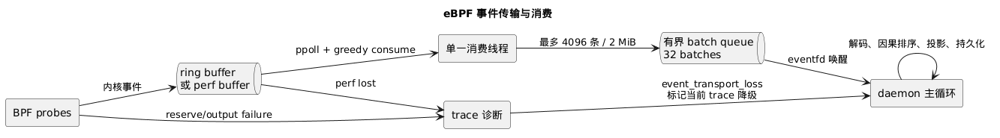

# eBPF 事件传输

> 本文说明 AcTrail 如何选择 ring buffer 或 perf buffer，并将内核事件安全地交给 daemon 主循环。

主 eBPF collector 编译进一种事件传输：优先使用 BPF ring buffer；构建环境无法证明其可用时使用 perf buffer。两条路径共享事件 ABI 和下游消费模型，运行时不会在已经编译好的二进制中切换 transport。



事件 record 的结构、构造规则和解码数据流由[eBPF 事件 ABI](ebpf-event-abi.md)定义；本页只负责 transport 的选择、缓冲与交接。

## 构建时选择

默认 release 构建依次参考 `bpftool` capability、内核 BTF 和内核版本。只有能力证据确认 ring buffer map 与 helper 可用时才选择 ring buffer；明确不支持或始终无法确认时选择 perf buffer。构建日志会打印最终 transport，daemon 的 `host_ebpf_preflight completed` 诊断也会记录制品内编译的 `event_transport`。

跨主机构建可预测的 perf buffer 制品时，可执行：

```bash
cargo build --release -p daemon --features perf-buffer
```

也可以用 `ACTRAIL_EBPF_EVENT_TRANSPORT=perf-buffer` 或 `ring-buffer` 显式选择。`ring-buffer` 与 Cargo `perf-buffer` feature 同时出现属于配置冲突，构建会立即失败。

## 内核侧差异

ring buffer 路径直接使用 `bpf_ringbuf_reserve`、submit 和 discard。perf buffer 没有等价的可变长 reserve，因此使用 per-CPU scratch map 暂存事件，再调用 `bpf_perf_event_output`；perf event array 的 entry 数按主机 CPU 数设置。

TLS direct-copy 事件最大可达 4 MiB。perf buffer 不为此分配同等大小的 per-CPU scratch，而是让 direct-copy 未命中，交给既有的 seccomp 用户态读取路径。

## 单消费者与有界交接

ring buffer 和 perf buffer 都由一个专用线程 drain。consumer 独占内核 buffer 的 epoll fd，在就绪或 250 ms 看门狗到期后尽可能清空事件，并按最多 4096 条或 2 MiB 组成 batch。batch 进入容量为 32 的同步队列，随后通过 eventfd 唤醒 daemon 主循环。

daemon 主循环从用户态队列取 batch，再执行解码、按观测时间排序、语义投影和持久化。Kernel TGID 与 daemon 可见 PID 的关联遵循[进程身份运行时](process-identity-runtime.md)，不由 transport consumer 猜测或改写。重处理不会直接占用内核 buffer 的消费线程。队列满时 consumer 会等待，内核 buffer 继续承接短时突发；若最终发生内核侧丢失，诊断链会显式报告。

## 传输丢失诊断

perf buffer 的 lost callback，以及 BPF map 中的 reserve、output、stdio assembly 和 socket failure 计数都会进入 `event_transport_loss` 诊断。仅 lost 计数变化而没有 raw event 时，consumer 也会发送一条计数消息。daemon 观察到传输丢失后，会持久化诊断并把所有活动 trace 标记为 degraded。

runtime 关闭时先通知并 join consumer，再释放 BPF object。
