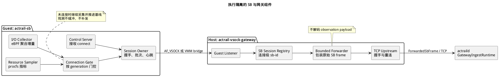
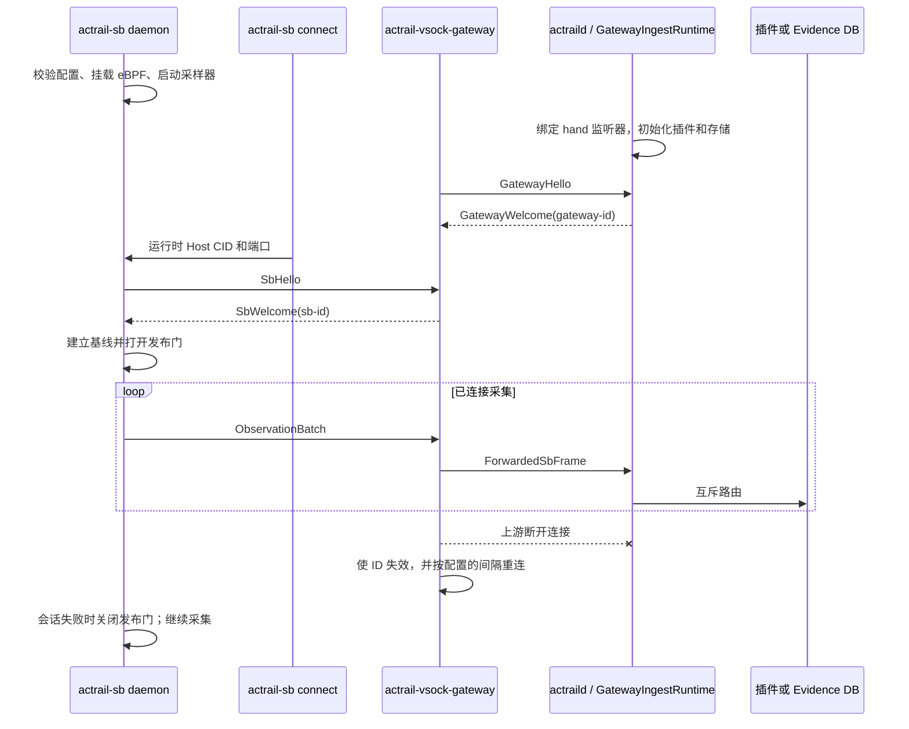

# 执行隔离运行时

> 本文展示 Sandbox 会话从 Guest 启动到连接、观测投递、重连和关闭的完整过程。

下图展示 Guest 内的采集与会话组件，以及 Host 网关只做有界转发的边界。

下列时序展示一次会话如何启动，以及发布开始有效的位置。**发布门**是由会话控制的边界，它要么允许新观测进入发送队列，要么立即将其丢弃。

欢迎消息完成后，`gateway-id` 和 `sb-id` 只标识图中仍然存活的传输会话。它们不会成为 trace 身份或进程身份。

## 启动与连接

1. 创建 Guest 快照前，`actrail-sb daemon` 校验静态配置、获取 Guest 全局实例锁、加载并挂载所需的 eBPF 程序、初始化 procfs 采样和有界工作单元、绑定 Guest 本地控制端点，并在断开连接的状态下就绪。
2. `actraild` 在宣布就绪前，初始化 hand-side TCP 监听器、已配置的 Sandbox 插件和相互独立的存储。
3. `actrail-vsock-gateway` 校验其后端和容量，建立到 daemon 的上游连接，然后接受 SB 连接。
4. 快照恢复后，`actrail-sb connect` 通过 Guest 本地控制套接字发送运行时 Host CID 和端口。Daemon 的单一命令工作单元执行 VSOCK 连接和 `SbHello/SbWelcome`；只有握手完成后，CLI 才返回成功。

控制轮询由接受 Guest 本地控制连接的事件循环对象负责。它从不执行 VSOCK 连接。当单一命令工作单元正在工作时，并发的有效 `Connect` 会以 `busy` 被拒绝。CLI 停止等待后，已过期或取消的命令不能发布会话。

## 采集与发布

无论数据会话是否存在，Guest 进程 I/O 采集和资源采样都会继续。只有在完整握手后，连接门才允许观测通过。断开连接或重连期间，每个样本都在发布时被丢弃，I/O 基线仍会推进，数据不会被缓冲、持久化或重放。

连接后，发送器会立即发送首个可用观测，并且只将已经就绪的观测合并成有界批次。只有达到最大静默间隔后才发送心跳。队列耗尽会记录一次丢弃，绝不阻塞 eBPF 热路径或资源采样器。

## 两跳传输与路由

网关分配连接局部的 `sb-id`，将未经修改的 SB 帧包装进 `ForwardedSbFrame`，再通过其唯一的 daemon TCP 上游发送。`ForwardedSbFrame` 是包含 SB ID 和未经修改的内部 SB 帧的外层网关帧。Daemon 分配连接局部的 `gateway-id`。在这些连接的生命周期内，源键为 `(gateway-id, sb-id)`。

`GatewayIngestRuntime` 校验并解码观测批次，然后执行互斥的“插件或证据”路由。网关不解码观测载荷、不匹配插件、不创建身份，也不持久化数据。

## 故障与关闭

SB 写入失败时，会关闭其发布门并丢弃该会话的待发送数据。网关上游失败时，会使其 gateway ID 失效，并按照配置的间隔开始重连，但不会终止 SB 监听器。格式错误的 SB 会话或耗尽的单 SB 配额只会关闭对应的 SB 连接。

Daemon 将故障限制在网关连接、插件使用方或独立存储操作之内。这些故障都不会使 daemon 退出，也不会传播到 brain-side 观测路径。

Guest 关闭时，先停止准入并禁用发布，然后停止采集器和会话工作单元，最后释放控制端点、eBPF、套接字和实例锁。关闭过程不会发起重连，也不会等待观测积压排空。
