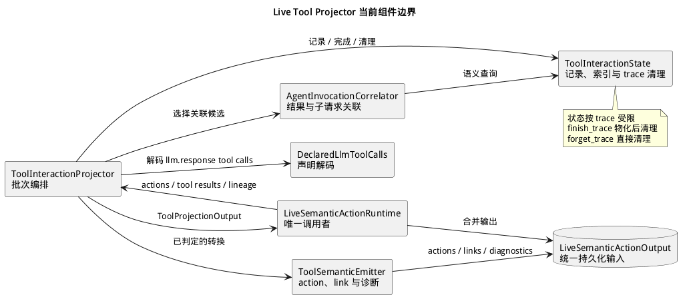

# Live Tool Projector

> 本文展示工具调用、工具结果和 Agent 调用如何在实时语义运行时中关联为可查询的 action 与 link。

Live Tool Projector 是 `LiveSemanticActionRuntime` 内部的有状态组件。它消费已经标准化的大语言模型（LLM）action、工具结果和请求 lineage，生成 `llm.tool_call`、`llm.tool_result`、`agent.invocation` action，以及它们之间的语义 link。**Action** 是一次有明确类型和时间范围的语义活动记录；**link** 表示两条 action 的关系；**lineage** 指请求与父请求、前序响应之间的来源关系。



## 边界与输入输出

`LiveSemanticActionRuntime` 是唯一调用者。它通过 `ToolProjectionBatch` 一次提交三类输入：

- LLM pipeline 已生成的 `llm.request` 和 `llm.response` action；
- 从 request body 中识别出的工具结果；
- 用于判断 child request 的 request lineage。

投影器返回 `ToolProjectionOutput`，其中只包含新增 action、link 和 LLM pipeline 诊断。运行时将这些结果与同批其他语义结果合并，再交给统一持久化路径。

该组件不解析 TLS、HTTP、服务器发送事件（Server-Sent Events，SSE）或模型服务方的传输格式，也不负责存储和导出。输入在到达这里之前已经完成传输组装与 LLM 协议投影。

## 组件职责

| 组件 | 当前职责 |
|---|---|
| `ToolInteractionProjector` | 按批次顺序编排声明解码、状态更新、关联和输出 |
| `DeclaredLlmToolCalls` | 从 `llm.response` attributes 解码声明的 tool call，并报告损坏或缺失名称的条目 |
| `AgentInvocationCorrelator` | 按工具结果 ID、Agent 工具策略和 prompt fingerprint 选择关联候选 |
| `ToolInteractionState` | 独占主记录、查询索引、trace ownership 和容量淘汰 |
| `ToolSemanticEmitter` | 构造 action、link 和诊断，并持有本批输出 |

状态和关联分离：Correlator 只能通过状态对象的语义方法查询候选，不能直接修改内部 map；所有主记录和辅助索引的变更由同一个状态方法完成。

## 一批数据如何投影

1. 投影器先遍历 `llm.response`，解码其中声明的 tool call。
2. 每个有效声明生成 `llm.tool_call`；符合 Agent 工具策略的声明同时建立或更新 `agent.invocation`。
3. 投影器从本批 `llm.request` 建立查找表，再将每个工具结果绑定到对应 tool call。缺少 ID、没有候选或候选不唯一时，结果仍可形成 action，同时产生生命周期诊断。
4. 对继续既有 trajectory 的请求，Correlator 尝试将其绑定为某次 Agent 调用的 child request。
5. Emitter 一次返回完整输出，运行时将其与 LLM pipeline 的 action、content 和 lineage 合并。

这里的 **prompt fingerprint** 是从 prompt 中提取的消息哈希集合与预览，用于缩小 Agent 调用和 child request 的候选范围；它不是请求身份。

## Trace 生命周期与故障边界

每个 trace 的记录数受启动配置限制。容量耗尽时，状态对象按既定顺序淘汰条目，Emitter 产生数据丢弃诊断；解析或关联失败不会使实时运行时退出。

`finish_trace` 会先物化仍有意义的未完成 Agent 调用，再确定性清理该 trace 的记录和索引。`forget_trace` 不产生输出，只清理该 trace。两种路径都通过 trace ownership 定点删除，不扫描全部 trace 状态。

## 源码位置

```text
crates/core/semantic_action_runtime/src/live/
├── runtime.rs                 # 唯一调用者与输出合并
└── tool/
    ├── contract.rs            # ToolProjectionBatch / ToolProjectionOutput
    ├── projector.rs           # 投影 façade
    └── internal/
        ├── declaration/       # tool call 声明解码
        ├── correlation/       # 工具结果与 Agent child request 关联
        ├── state/             # 记录、索引、容量和 trace 清理
        └── emission/          # action、link 与诊断构造
```
