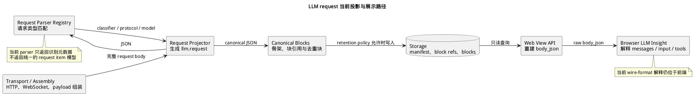

# LLM Request 当前投影路径

> 本文展示 LLM request 从完整 JSON 到持久化内容和 Web 展示的当前职责边界。

当前路径包含两种投影：daemon 识别 LLM 请求类型并生成 `llm.request` action；浏览器从重建的原始 JSON 中提取消息和工具。



## 从字节到完整请求

HTTP、WebSocket 和 payload transport 组件负责帧、分片与消息边界。它们把完整 request body 交给 LLM request projector；request parser 每次只识别一份完整 JSON，不维护网络帧状态。

Request Parser Registry 目前注册结构化 JSON/SSE parser 和通用 JSON parser。每个 parser 对当前 JSON 返回 `NoMatch`、`Plausible` 或 `Strong`。Registry 选择唯一的最高强度候选；最高强度并列时不选择 parser。

被选中的 parser 当前只返回：

- `classifier_id`：识别器身份；
- `protocol_id`：可选的协议身份；
- `model`：可选的模型名称。

这些字段描述识别结果，不包含 messages、tools 或有序 item。

## Action 与内容保留

Request projector 使用识别结果生成 `llm.request` action，并按 semantic retention 配置处理 request body。当前有三种内容状态：

| 状态 | 保存内容 |
|---|---|
| `none` | 不保存 request content |
| `shape` | 保存 canonical hash、大小和有限的形状元数据，不写入可重建正文 |
| `canonical_blocks` | 写入 manifest、按原顺序排列的 block reference，以及按内容哈希去重的 block |

**Canonical JSON** 是键顺序和编码方式确定的 JSON 表示。`canonical_blocks` 将 `messages`、`tools`、`prompt` 和 `input` 中的内容替换为有序占位符，形成 skeleton；读取时再按 block reference 的 ordinal 恢复完整 `body_json`。item 类型由浏览器在展示时解释。

## Web 当前如何展示

Web View API 以只读方式从 storage 读取 manifest、block reference 和 block，校验读取边界后重建 `body_json`。浏览器端 `llm/insight.js` 随后执行 wire-format 解释：

- 从 `system`、`messages`、`input` 或字符串 `prompt` 提取消息；
- 从顶层 `tools` 或 `functions` 提取工具定义；
- 将提取结果交给 LLM insight 组件渲染。

## 故障边界

无法匹配或存在同等级歧义时，Registry 返回无结果。Canonical content 是否写入由 retention policy 独立决定；下游展示失败不会改变已经持久化的原始内容。

超出读取上限的 request content 由 API 拒绝或截断在明确边界内，Web 查询使用只读 storage handle，不参与 daemon 的写事务。

## 源码位置

```text
crates/core/semantic_action_runtime/src/llm_pipeline/
├── transport/                              # HTTP/1、HTTP/2、WebSocket 消息边界
├── assembly/                               # payload 流组装
├── provider/registry/request.rs            # request parser contract 与选择
├── projection/projector/request.rs         # llm.request action 与 retention 接线
└── projection/retention/request_blocks.rs  # canonical skeleton、块引用与元数据

crates/apps/web/
├── src/view/actions.rs                     # request content 读取与 body_json 输出
└── frontend/src/llm/insight.js             # 当前 messages/tools 解释
```
