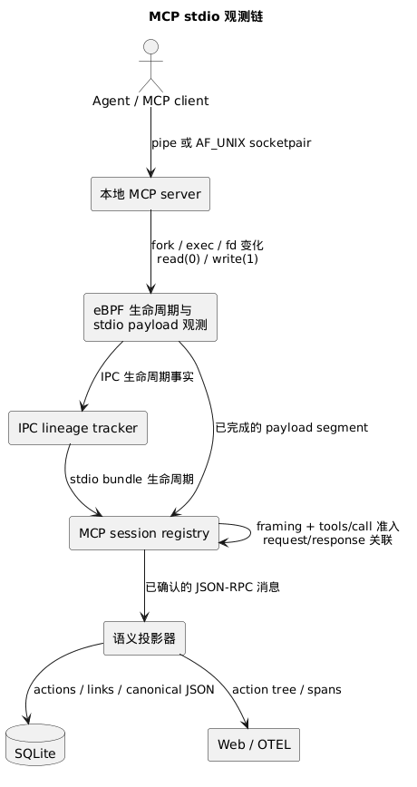

# MCP stdio 观测

> 本文展示 AcTrail 如何从本地进程与字节流事实中确认一次 MCP stdio 工具调用，并把它投影为可查询的动作图。

本页覆盖 Agent 通过匿名 pipe 或 Unix `socketpair` 启动的本地 MCP stdio server。



图中有两条独立的事实链：IPC lineage 证明“谁与谁相连”，stdio payload 提供 JSON-RPC 字节。两条链在 MCP session registry 中汇合，任何一条都不能单独证明一次 MCP 工具调用。

## 配置依赖

`payload.mcp.enabled` 默认 `false`。默认 L4 也关闭，stdio 按需采集因无消费者而关闭。显式启用 MCP 后，stdio 按有效需求开启。

`ebpf.ipc_lineage.enabled` 默认 `true`，允许 MCP stdio 维护 pipe 与 Unix socketpair 端点关联。基础 `ipc-pipe-fifo` 和 `ipc-unix-socket` 能力使用内核 FD 分类，按各自请求独立启用。

当 `semantic_retention.projection_enabled=true`、`payload.mcp.enabled=true`、`payload.stdio.enabled=true`、`payload.stdio.capture_stdin=true` 且采集计划请求 `stdio-chunk` 时，存在有效 MCP stdio 需求，要求 `ebpf.ipc_lineage.enabled=true`。缺少许可会在启动时明确报错。许可开启且没有有效需求时，停止 MCP 专属上下文上传和状态维护。stdio 的 `enabled=true` 表示允许按需采集，实际启用由有效 MCP 或 L4 消费者决定。

| 事实 | 消费者 |
|---|---|
| 内核 FD 分类与生命周期 | 基础 IPC、网络及相关内核采集 |
| pipe/socketpair 新 FD、close、dup、close_range | 文件路径绑定失效或 MCP 端点关联 |
| open 成功返回的 FD | 文件路径绑定或 MCP 旧端点绑定失效 |
| 路径字符串、cwd、目录 FD | 文件路径解析 |
| CLOEXEC 上下文、端点持有者、祖先关系、stdio bundle、生命周期诊断 | MCP stdio |

上传需求由共享 runtime 的采集计划在初始化时确定。仅有 MCP 需求时，open 上传出口所需的 FD 事实；文件路径和文件结果解析按文件需求运行。MCP 专属入口及 syscall 适配集中在 collector 的 `state/mcp_context.rs`，端点与 bundle 状态由 `mcp_stdio` 模块中的 `McpStdioTracker` 管理。基础 IPC 分类类型由通用 decoder 定义。

用户态再按绑定 trace 的实际能力选择消费者。文件状态只保存路径解析和文件结果所需的 cwd、FD→路径、创建标记及待完成调用；没有文件需求时停止其初始化、继承与维护。MCP 的通信端点、持有者及 bundle 状态独立受 MCP 需求控制。文件语义层的状态服务于动作聚合和目录枚举。文件传输格式及无效目录 FD 的处理见 [eBPF 文件采集配置](../../reference/configuration/collection.md#ebpf)。

## 从 stdio bundle 到已确认会话

`McpStdioTracker` 按 trace 跟踪 pipe、Unix socketpair、fork、exec、FD 复制、关闭和进程退出。server 完成 exec 后，只有 fd 0 与 fd 1 都连接到同一个祖先 client，tracker 才建立 **stdio bundle**。bundle 是一组已经证明属于同一 client/server 连接的标准输入输出通道。

daemon 再以 trace、stdin channel 和 stdout channel 组成稳定的连接身份。exec wrapper 或 FD 别名变化不会自动建立新会话；channel 对改变时，新旧连接状态保持隔离。

连接首先处于 **Candidate**（候选）状态。候选只在 server fd 0 上观察到合法 JSON-RPC 2.0 `tools/call` 请求后成为 **Session**（已确认会话）。`initialize`、`tools/list`、通知和普通 JSON 输出不构成会话准入证据。

当前 framer 接受 JSON Lines、`Content-Length` framing 和 JSON-RPC batch。输入截断、非法 framing 或候选容量越界只拒绝当前候选；已确认会话中的单流解析错误只清理该方向的 framing 状态。

## 一次工具调用的动作图

已确认的 `tools/call` 请求创建以下层级：

```text
command.invocation
└── mcp.tool_call
    ├── mcp.request
    │   └── mcp.stdout
    └── mcp.response
        └── mcp.stdin
```

`mcp.stdout` 和 `mcp.stdin` 采用 **MCP client 视角**命名：client 写给 server fd 0 的请求是 stdout；server 从 fd 1 返回给 client 的响应是 stdin。这个命名与 server 进程看到的 fd 名称相反。

request id 只在一个稳定连接 Session 内相关联。相同 id 再次使用时，调用序号保持 action identity 唯一；等待响应的调用按 FIFO 匹配。JSON-RPC `error` 或 `result.isError=true` 会把 root 和响应分支收口为 error，其他匹配结果收口为 success。

LLM 投影器若观察到形如 `mcp__<server>__<tool>` 的 tool proposal，会把对应的 LLM response action id、tool call id 和名称补充到 MCP root。LLM proposal 归因与会话准入独立。

## 内容留存是两层策略

原始 stdio payload 与规范化 JSON-RPC 内容由两组独立策略控制：

| 层 | 控制内容 | 关闭后的影响 |
| --- | --- | --- |
| `payload.stdio.*_storage_mode` | 原始 segment、body 和 payload evidence | 不影响 MCP 语义识别；`drop` 时不创建悬空 evidence |
| `semantic_retention.l0_mcp_call` | 与 request/response action 关联的 canonical JSON | action 与 link 仍存在，但详情页不能读取该方向的规范化消息 |

canonical JSON 会递归排序 object key、保留 array 顺序，并在单个 trace 内按 SHA-256 去重。它只关联 `mcp.request` 或 `mcp.response`，不会写入 OTEL span。工具参数与返回值可能包含敏感信息；只关闭原始 stdout payload 并不会关闭 response canonical JSON。

## 故障边界

- PID generation 区分进程号复用前后的进程 lineage。
- syscall completion 提供读写有效长度；失败和零长度操作不生成 payload。
- 事件在投影前按内核观测时间排序。
- trace finalize 把仍在 correlation state 的未响应调用收口为 error/partial；已清除的 correlation state 不生成响应或终态。
- lifecycle gap、容量拒绝和 stream discard 会形成 RuntimeDropped warning；问题只影响对应候选、会话或 trace。

必须保持的准入、动作和生命周期语义见 [MCP stdio 规范](../../specifications/observation/mcp-stdio.md)。
