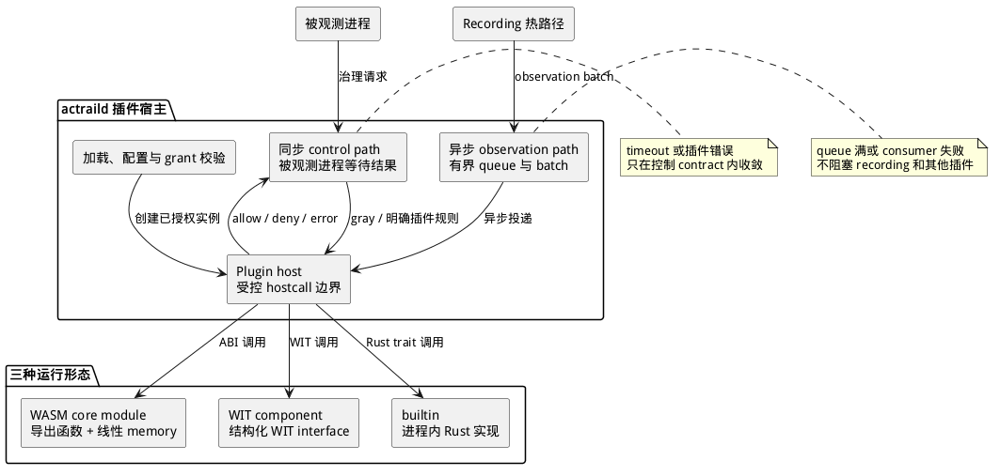

# 插件运行时

> 本文展示插件进入 daemon 的运行形态、可调用的宿主能力，以及同步控制与异步观测的故障边界。

AcTrail 把插件的**用途**与**运行形态**分开：用途决定宿主调用 observation consumer、control decider 或 LLM codec 中的哪一类接口；运行形态决定接口如何跨越执行边界。

图的上半部分是三种运行形态，下半部分是两条执行通路。所有外部能力都经过 plugin host；manifest 中声明 capability 只是请求，只有管理员 grant 允许后，相应 hostcall 才能成功。

## 三种运行形态

| 运行形态 | 调用方式 | 边界所有者 |
| --- | --- | --- |
| WASM core module | 宿主调用导出函数，通过线性 memory、`actrail_alloc` 和整数返回码交换数据 | 插件作者实现底层 ABI；宿主校验 memory 与返回值 |
| WIT component | 宿主按 WIT interface 传递结构化参数与结果 | component toolchain 负责 lowering/lifting；宿主实现 WIT world |
| builtin | daemon 直接调用编译进进程的 Rust 实现 | Rust trait 与 daemon 生命周期 |

三种形态都经过同一个插件加载、配置、授权和实例生命周期。builtin 不经过 WASM ABI，但编译进 daemon 不等于自动启用，也不绕过 capability policy。

## 宿主调用边界

plugin host 是 daemon 内唯一向插件暴露 AcTrail 能力的边界。WASM 插件不能直接访问 daemon 内存或任意系统资源；它只能调用 ABI/WIT 提供、且 grant 允许的 hostcall。宿主负责输入上限、memory range、返回码、timeout 和资源限制校验。

LLM codec 当前使用 WASM core module 入口；observation consumer 与 control decider 可按各自 contract 使用支持的运行形态。精确函数、编码和返回值属于 [插件 API 参考](../../reference/plugin-api/README.md)。

## 同步控制与异步观测

control decider 位于同步治理路径：被观测进程等待最终 allow/deny 结果。本地明确规则在 daemon 快路径完成，只有 gray 或明确要求插件参与的规则才调用插件。插件错误或 timeout 按控制 contract 收敛，不能让被观测进程无限等待。

observation consumer 位于异步路径：recording 通过有界 queue、batch 和事件过滤把 observation 交给插件。queue 满或单个 consumer 失败只影响该插件的副本，不阻塞 recording 热路径，也不传播到其他插件。
