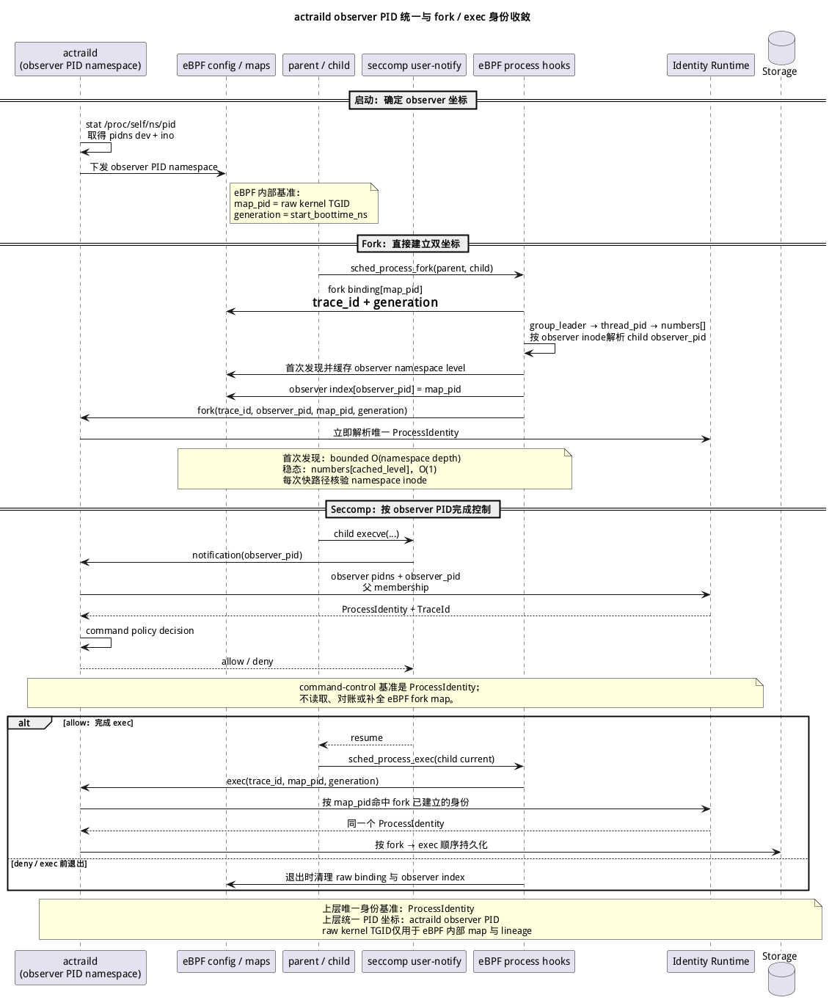
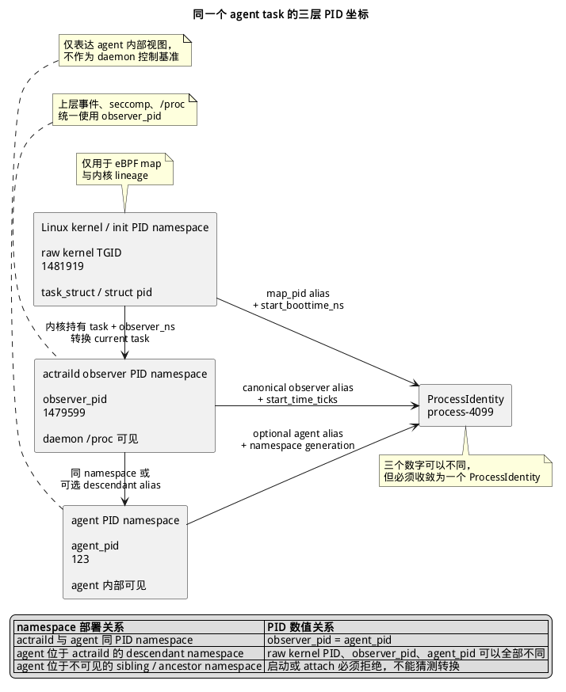

# 进程身份运行时

> 本文规定 `actraild`、seccomp 与 eBPF 之间的 PID 坐标，以及 fork 到 exec 期间进程身份物化的统一时序。



## 统一基准

AcTrail 不把任何裸 PID 当作跨层稳定身份。上层事件、membership、治理与存储统一引用 `ProcessIdentity`；PID 只是在明确 namespace 与 generation 下可解释的坐标。



同一个 agent task 在 Linux 内核、`actraild` observer namespace 和 agent 自身 namespace 中可以同时具有不同的数字 PID。`actraild` 与 agent 位于同一个 PID namespace 时，`observer_pid == agent_pid`；agent 位于 daemon 的 descendant PID namespace 时，三套 PID 都可能不同。Agent namespace PID只作为可选 alias，不能改变 daemon 上层统一使用 observer PID 的基准。

允许的关联方向由持有 task 的内核侧开始：内核根据 observer namespace 产生 `observer_pid`，并在需要时附带 agent namespace alias。处于子 namespace 的用户态不能可靠反查 raw kernel TGID；不可见的 sibling 或 ancestor namespace 进程不得通过扫描或时间匹配强行 attach。

| 名称 | 坐标 | 使用边界 |
|---|---|---|
| `map_pid` | raw kernel TGID + `start_boottime_ns` | eBPF map、内核事件关联、FD lineage；不直接作为上层进程 PID |
| `observer_pid` | `actraild` PID namespace + daemon 可见 PID + `start_time_ticks` | seccomp notification、`/proc/<pid>`、上层事件中的统一 PID |
| workload namespace PID | workload PID namespace + workload 可见 PID + generation | 可选 alias；不替代 `observer_pid` |
| `ProcessIdentity` | AcTrail 分配的稳定 ID | trace membership、治理、事件、action 与持久化的唯一身份基准 |

`actraild` 在启动时读取 `/proc/self/ns/pid`，取得 observer PID namespace 的 device/inode，并在 collector 宣布 ready 前下发给 eBPF。`/proc/1/ns/pid` 必须与该 namespace 一致，否则说明 daemon 看到的 procfs 不是自己的 observer 视图，collector 启动失败。运行期间不得把 daemon 可见的 `/proc` PID直接当作 raw kernel TGID，也不得在用户态通过扫描 eBPF map或比较低精度时间反向猜测 `map_pid`。

已有进程 attach 与 snapshot seed 使用按需 BPF task iterator 完成反向关联：daemon 批量提交 `(observer_pid, start_time_ticks)`，iterator 在持有 `task_struct` 的内核侧返回 `(map_pid, start_boottime_ns)`。一次 seed batch 只扫描一次 task 列表；iterator 完成后立即 detach，不进入 syscall、network、file 或 payload 热路径。找不到精确进程代际时 attach 失败，不回退为 `map_pid = observer_pid`。

进入观测范围后，eBPF 以 raw kernel TGID 为 key 缓存 `{start_boottime_ns, observer_pid}`。typed event 的公共 header 只做一次 O(1) cache lookup；cache miss 的单条事件 fail-local 丢弃并计数，decoder 仍可用已建立的精确 binding 做第二层恢复。TLS/seccomp correlation 另以 raw kernel pid_tgid 缓存 trace namespace 的 `(TGID,TID)`；未来线程无法在进程注册时预知，因此每个线程首次 TLS 触达时填充一次，后续 enter/completion 为 O(1)。线程 exit、trace unbind、进程 exit、取消、promotion rollback 与显式 untrack 必须清理对应 cache。

## Fork、控制与 Exec

`sched_process_fork` 发生时 current task 仍是 parent。eBPF 从 child `group_leader->thread_pid->numbers[]` 读取 observer namespace 对应的 TGID：首次按 namespace inode 在最多 33 层 PID namespace 中发现 observer level，随后缓存 level；稳态 fork 直接读取 `numbers[cached_level]` 并核验 inode，复杂度为 O(1)。

fork hook 先以 raw kernel TGID 发布内核治理 binding，再用同一 child task 发布 `(observer_pid, map_pid, start_boottime_ns)` fork event。Collector 立即以 observer PID 创建或解析唯一的 `ProcessIdentity`，同时把 raw TGID仅登记为 eBPF map 坐标；不存在 host-only pending 身份，也不在用户态反扫 map 猜测两套 PID 的关系。

child 调用 `execve` 时，seccomp user-notify 先于实际 exec 完成到达 daemon。Command control 使用 notification 中 daemon 可见的 PID、父进程 membership 与既有 `ProcessIdentity` 完成 trace 归属和策略裁决；它不读取、校验或补全 collector 的 fork map。daemon 返回 allow 后，exec observation 通过 raw map PID 命中 fork 已建立的同一身份。非 leader 线程执行 exec 并接管 TGID 时，active identity 仍以进程的 raw TGID 为 key；task-storage registration 同时保留按 observer TGID索引的 one-shot 副本，避免把原 leader 的 `task_struct` 当成进程身份。

如果单个 child 的 observer PID解析失败，内核治理 binding 仍保持有效，只丢弃该 child 无法正确标识的 fork observation并增加 per-CPU 诊断计数；不得用 raw TGID冒充 observer PID，也不得将该观测故障传播成无关 command-control 的拒绝。

## 不变量

- eBPF 内核状态只以 `map_pid + start_boottime_ns` 区分进程代际。
- daemon 可读取的 `/proc/<observer_pid>` 必须与上层事件的 PID 坐标一致。
- `ProcessIdentity` 可以关联多套 PID alias，但一个进程代际只能落一个 membership。
- fork 双坐标事件是 kernel PID 与 observer PID 的权威关联来源。
- attach/snapshot 的 task iterator 是已有进程双坐标关联的权威来源。
- observer level 只允许从不可变的 observer namespace 配置发现，并在每次快路径读取时核验 namespace inode。
- 只有明确证明两套身份属于不同 trace 或不同进程代际时，才进入安全冲突策略。

## 相关实现边界

```text
crates/adapters/collectors/ebpf/
├── bpf/                         # raw kernel identity 与 observer PID 转换
└── src/                         # observer namespace 下发、双坐标绑定与事件解码

crates/apps/daemon/src/services/
├── identity/                    # ProcessIdentity 与 membership
└── live/seccomp.rs              # command-control notification 时序

crates/core/
├── process_identity/            # 稳定进程身份与 PID aliases
└── trace_runtime/               # TraceId → membership
```
