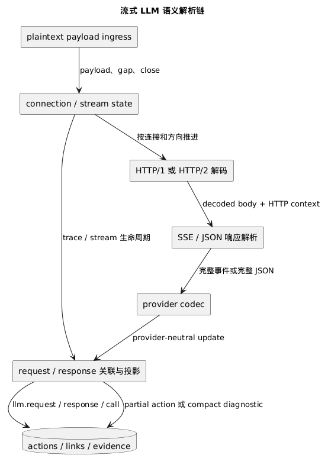

# 流式解析器

> 本文展示当前运行时如何把增量 HTTP payload 解析为 LLM request、response、call、link 与 evidence。

流式解析从 retention 已启用且标记为 `plaintext_http_candidate` 的 payload segment 开始。入口只负责生命周期编排；协议状态按连接、方向以及 HTTP/2 stream 隔离。

## 连接与 HTTP 边界

每个方向起初按 plain stream 累积。识别到 HTTP/2 connection preface 后，状态切换到 HTTP/2 connection assembly；否则由增量 HTTP/1 decoder 处理 header、fixed body、chunked body 和 trailer，并用 request-line boundary 做可信重同步。

HTTP/2 decoder 只交付完整 frame。connection assembly 按 `stream_id` 解复用 DATA，每个 stream 各自持有 plain assembly、evidence、SSE cache 和进行中的 response。partial frame 不会退化成普通 payload，也不会与其他 stream 合并。

gap、truncation、decoder failure 或容量越界会重置当前方向，并尽量从可信 HTTP boundary 恢复。一个方向或 HTTP/2 stream 的问题不会清空同一 trace 的其他连接。

## 响应 body 与 provider

SSE（Server-Sent Events）framer 只消费已经去除 HTTP framing 的 response body，并且只交付以空行完整终止的事件。非 SSE JSON 响应在 body 完整时解析。

stream classifier 只有两个状态：`Undetermined` 与 `ConfirmedLlm`。初始 soft sniff budget 只限制识别成本；超出预算不会把它判定为“普通 SSE”，后续决定性事件仍可确认 LLM provider。late match 时，SSE cache 会重放为确认所保留的 body。

response parser 的当前选择顺序是 OpenAI Responses、Structured JSON SSE、Anthropic、OpenAI-compatible。同等级证据有歧义时保持未确认，不猜测 provider。插件 codec 可以先把 request 或 SSE event 归一化，再进入相同的 provider-neutral 投影链。

## Evidence 与语义投影

evidence tracker 维护 decoded body offset 到 payload segment 的紧凑映射，并检查 syscall operation 是否连续、内容是否完整。它让投影器引用真实采集范围，而不需要把整个 wire payload 复制到 parser state。

provider parser 输出与厂商无关的增量状态。projection 层再结合 HTTP request/response identity、stream id 和已有 correlation state，生成 `llm.request`、`llm.response`、`llm.call` 及其 link。保留策略分别约束 assembly、stream classifier 和 projection state；这些上限来自 `semantic_retention.l0_llm_call` 子配置。

## 正常完成与异常收口

provider finish reason 与完整 HTTP boundary 共同驱动正常 terminal projection。异常 partial 才进入 `ResponseFinalizer`，其原因包括 peer close、trace close、confirmed gap、operation incomplete、protocol decode failure、HTTP/2 reset、buffer bytes exceeded 和 segment ranges exceeded。

已确认且包含有效语义的异常 response 会生成 error/partial action；未确认或没有有效内容的 stream 只产生紧凑诊断。trace close 会为 partial action 附加对应属性。finalizer 释放当前 stream 状态，不反向终止 payload ingress。

必须保持的分层与容量约束见[流式解析器规范](../../specifications/observation/streaming-parser.md)。
