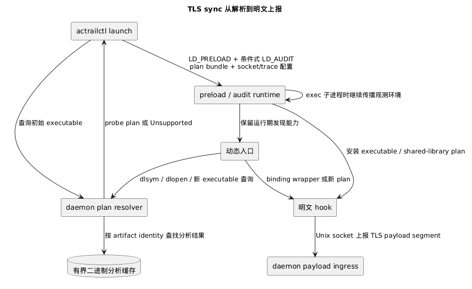

# TLS sync 运行时

> 本文展示 TLS sync 如何解析目标二进制、覆盖动态加载与子进程，并把明文字节送回 daemon。

TLS sync 是 launch 注入的用户态采集运行时。它不解密网络包，而是在进程调用 TLS 明文接口时记录函数真实处理的字节。**Probe plan** 是针对某个 executable 或 shared object 的 provider、符号与 hook 位置集合。

## 初始进程

`actrailctl launch` 创建 trace 后，向 daemon 请求初始 executable 的 probe plan。resolver 在目标进程当前 mount namespace 可见的 peer root 下打开 ELF，识别 binary identity、架构、依赖和 TLS provider，并尝试符号、pattern 或 Go pclntab 等解析器。

静态 executable 必须取得 direct plan，它不会注入 TLS sync runtime。动态 executable 则按 libc 选择 runtime，注入 `LD_PRELOAD`、event socket、trace id、redaction、容量设置和可用的 plan bundle。`LD_AUDIT` 只用于 glibc 且初始 plan 来自 shared library 的场景，并非每次 launch 都注入。

preload runtime 通过 `.init_array` 初始化。base namespace 安装初始 plan 并扫描已经加载的 shared object；audit namespace 只装载配置与 binding callback，避免重复安装 inline hook。初始化配置或必需资源无效属于启动错误，运行时会以 126 退出，不带着不完整观测继续执行目标程序。

## 运行期发现

初始 plan 不是唯一入口。运行时继续覆盖三类变化：

1. glibc audit 和 `dlsym`/`dlvsym` 可以为 allowlist 中的 TLS symbol 返回 per-binding wrapper；
2. `dlopen`/`dlmopen` 在真实 load 前预取请求 library 的 plan，成功后再扫描该 library 与 `/proc/self/maps` 中已加载的 TLS library；
3. exec 与 posix_spawn 系列入口为动态子进程重写 TLS 环境，并根据目标 libc 与已有 capture plan 决定 preload/audit 注入。

静态子进程会剥离 AcTrail loader 环境和 `TLS_PAYLOAD_SYNC_*`；musl 子进程不会继承 `LD_AUDIT`。运行期 plan 会按 binary identity 和映射关系复核，避免把预取结果应用到另一个 artifact。

plan 安装会去重同一 binary、OpenSSL interpose 和 rustls singleton 已覆盖的入口。OpenSSL shared-library plan 可由 interpose 或 binding wrapper 捕获；executable 内符号、BoringSSL、rustls 和 Go 等场景使用相应的 native hook。未识别的 library 只影响本次发现，后续 loader 事件仍可继续尝试。

## 二进制分析缓存

daemon 的 resolver worker 持有有界 LRU 缓存，保存不含路径的符号、pattern marker、offset 和 pclntab 分析结果。带 GNU build-id 的 ELF 以 `BinaryIdentity` 为分析键；没有 build-id 时，再结合已打开文件的 device、inode、size、mtime 与 ctime 区分 artifact generation。

路径和 PID 不进入缓存键。每次查询仍在当前 peer root 下重新发现依赖，并把缓存的分析结果绑定到本次 runtime path。这样同一 artifact 可以复用昂贵扫描，又不会把另一个 namespace 的路径或已经更换的 ELF 当成同一个运行对象。容量由 `payload.tls.binary_analysis_cache_capacity` 控制。

## 明文捕获与故障边界

inline hook、OpenSSL interpose、audit wrapper、resolver wrapper 和 Java JSSE hook 最终都产生 TLS payload segment。native wrapper 先调用真实 TLS 函数，再根据真实返回值确定方向和有效长度；segment 经 Unix socket 发送给 daemon 的 payload ingress，之后才进入应用协议和语义投影。

启动后的 plan lookup 返回 Unsupported、某个 library 无法访问、身份变化或动态扫描失败时，只跳过当前目标并记录错误。daemon resolver 与其他进程继续运行，后续 loader 事件仍有机会发现新的 TLS provider。

部署所需 library 与 launch 条件见[在 Linux 主机部署](../../operations/deployment/host.md)。
