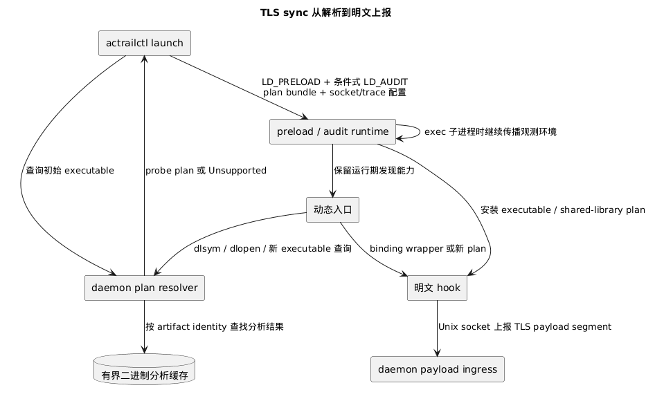

# TLS sync 运行时

TLS sync 在进程调用 TLS（传输层安全协议）的明文读写接口时采集数据，并将实际处理的字节送回 daemon。设置 `payload.tls.capture_backend = "tls-sync"` 并启用 TLS 采集后，`actrailctl launch` 会准备该后端所需的探针计划和注入资源。

## 对象与术语

| 对象 | 含义与用途 |
| --- | --- |
| 可执行文件与共享库 | 进程的主程序和运行时加载的库。Linux 通常用 ELF 文件格式保存它们的代码、符号和依赖信息 |
| TLS 实现（provider） | 提供 TLS 读写接口的库或语言运行时，例如 OpenSSL、rustls 和 Go；在本文中用于选择探针解析方式 |
| 探针计划（probe plan） | 一个可执行文件或共享库的 TLS 实现、目标函数及拦截位置集合；直接探针计划（direct plan）用于直接挂载相应入口 |
| 解析器（resolver） | daemon 中负责打开目标文件、识别 TLS 实现并生成探针计划的服务 |
| 注入运行库（runtime） | 装入目标进程的用户态库；安装探针、发现新加载的库并上报明文字节 |
| 挂载命名空间（mount namespace）与进程根目录（peer root） | 目标进程可见的文件系统视图及其根目录；解析器据此打开目标实际使用的文件 |
| 二进制身份（binary identity） | 识别已打开的二进制文件，供探针计划绑定和分析缓存查找使用 |
| 函数拦截（hook） | 在目标函数入口或调用绑定处安装采集入口；包装函数调用真实 TLS 函数并记录其处理结果 |

解析器可以通过导出的符号、机器码特征（pattern）或 Go 的程序计数器与行号表（pclntab）定位函数。pclntab 保存代码位置与函数信息，供 Go 二进制分析使用。

## 初始进程

使用 sync 后端时，`actrailctl launch` 在创建并注册受观测子进程前，向 daemon 请求初始可执行文件的探针计划。解析器在目标文件系统视图中打开 ELF，识别二进制身份、架构、依赖和 TLS 实现，再选择相应的函数定位方式。

静态可执行文件必须取得直接探针计划，运行库注入适用于动态可执行文件。动态可执行文件按所用 C 运行库（libc）选择注入运行库，通过 `LD_PRELOAD` 加载它，并传入事件 socket、观测任务标识（trace id）、脱敏和容量设置，以及可用的探针计划集合。`LD_AUDIT` 是 glibc 提供的动态链接审计入口，用于初始计划来自共享库的场景。

预加载运行库通过 ELF 的初始化函数表 `.init_array` 启动。动态链接器的基础命名空间负责安装初始计划并扫描已加载的共享库；独立的审计命名空间负责装载配置和符号绑定回调。直接修改函数入口的拦截方式称为 inline hook，由基础命名空间统一安装。初始化配置或必需资源无效时，运行库以退出码 126 结束启动。

## 运行期发现

运行库通过动态链接器事件继续发现三类变化：

1. glibc 审计回调及符号查询函数 `dlsym`、`dlvsym` 为允许采集的 TLS 符号返回包装函数。每个包装函数对应一次符号绑定，即 per-binding wrapper。
2. 库加载函数 `dlopen`、`dlmopen` 在加载前预取目标库的探针计划。加载成功后，运行库扫描该库及进程内存映射表 `/proc/self/maps` 中的 TLS 库。
3. exec 与 posix_spawn 系列入口为动态子进程配置 TLS 环境，并根据目标 libc 和已有采集计划选择预加载与审计注入。

静态子进程会清除 AcTrail 动态加载环境和 `TLS_PAYLOAD_SYNC_*`。使用 musl C 运行库的子进程会清除 `LD_AUDIT`。安装运行期计划时，运行库核对二进制身份和内存映射关系，确保计划属于当前文件。

计划安装会跳过已覆盖的函数入口。OpenSSL 共享库可通过同名符号替换（interpose）或符号绑定包装函数采集；可执行文件内的符号、BoringSSL、rustls 和 Go 使用相应的原生函数拦截（native hook）。rustls 的单实例安装状态（singleton）记录已覆盖入口，防止重复安装。某个库无法识别时，本次发现结束，后续加载事件仍可继续尝试。

## 二进制分析缓存

daemon 的解析工作线程持有有界的最近最少使用（LRU）缓存，保存符号、机器码特征、偏移和 pclntab 分析结果。带 GNU build-id 构建标识的 ELF 使用 `BinaryIdentity` 作为分析键。缺少构建标识时，再结合已打开文件的设备号、inode、大小、修改时间和元数据变更时间区分文件版本。

每次查询都在当前进程根目录下重新发现依赖，再把缓存分析结果绑定到本次运行路径。同一个二进制文件可以复用扫描结果，路径和进程标识由当前查询提供。缓存容量由 `payload.tls.binary_analysis_cache_capacity` 控制。

## 每进程连接

ctl 在启动检查时连接后立即关闭 socket。每个运行时进程按需建立自己的事件连接，不传递 fd；fork 子进程关闭继承的写 fd 和 release reader fd，使用新的连接及响应等待状态。连接失败后该进程停止上报，不重连。应用线程只把事件入队；发送批次和单次 write 上限由 `payload.tls.sync_event_batch_bytes` 配置，默认 32 KiB。无进度时限由 `sync_event_timeout_ms` 配置，默认 5 秒，每次成功写入后重置；退出排空总预算由 `sync_event_shutdown_timeout_ms` 独立配置，默认 100 ms。ctl 将这些配置传入新 launch 的 runtime。

daemon 接入时只保留 `SO_PEERCRED`，不读取发送进程的 `/proc`。TrackAdd 的 `reply_track_added_v2` 回复将 Trace 专用的 TLS 事件凭据交给 ctl。该凭据由 daemon 随机生成，只保存在内存，不与告警凭据共用；只有启用 TLS-sync 的 launch 才由 ctl 写入子进程的 `TLS_PAYLOAD_SYNC_EVENT_TOKEN`。每个进程的发送线程先发 `Register` 帧（kind 9），再发事件；`Register` 带有该进程是否等待放行（checkpoint launch 设置 `TLS_PAYLOAD_SYNC_HOLD_RESPONSES`），daemon 只为等待放行的连接记录放行进度。首个事件使用登记凭据校验 Trace 归属并绑定连接，后续事件必须属于同一 Trace。凭据在 Debug 输出中遮蔽。即使发送进程在 accept 前已退出，daemon 仍可校验并处理 socket 中完整的缓冲事件。daemon、ctl 和 native runtime 必须配套更新，不接受缺少登记帧的旧事件连接。

daemon 用 epoll 读取就绪连接，`sync_ready_client_batch_max` 默认每轮 128 条，`sync_read_buffer_bytes` 默认 64 KiB，`sync_read_max_bytes_per_client` 默认每条连接每轮 1 MiB。连接的组帧缓冲在清空后，容量超过 `sync_frame_buffer_retain_max_bytes` 时释放，默认阈值 1 MiB。`sync_trace_connection_max` 默认 128，按 Trace 统计，包括工具和子 Agent；计划查询不占配额。启动时按 Trace 数、连接上限、待接入连接和查询队列计算 fd 预算并提高 RLIMIT_NOFILE。fd 耗尽时暂停接入并继续读取已有连接，连接关闭或后台重试后恢复。

启用 checkpoint 时，每批明文识别出的 LLM 请求先按 Trace 和 TLS 连接登记 hold，再生成 `Release`；其他 Trace 的同名连接不参与匹配。没有 hold 的连接进度条目在放行消息进入发送队列后回收，同一 TLS 连接后续上报时重新登记；仍等待 checkpoint 的条目继续保留。回收依据是放行进度，不依赖 TLS 连接关闭通知。

daemon 记下每条进程上报连接送过的 stream。连接断开时，先处理已读到的明文，再通过现有 stream close 流程结束这些 stream，释放协议路由和解析状态。TLS 对象本身仍没有结束事件：存活进程中正常结束的 TLS 连接仍占路由，地址持续不复用时可能耗尽路由方向数配额。采集缺口和非 WebSocket upgrade 对条目的处理不变。

已判定协议的连接收到以完整 preface 开头的出站片段时（旧连接是 HTTP/2 时须在帧边界），投影先调用 `finalize_payload_stream`，再按新连接处理，重建 stream 编号、HPACK 和协议路由状态；运行时 `FlowController` 同时清除该地址的双向流状态及 LRU 记录。此判断不扫描帧正文，也不 hook TLS 对象释放；旧 HTTP/2 地址改作 HTTP/1 的情况仍不支持。

计划查询仍解析活进程身份并打开 peer root，然后把 socket 交给 `payload.tls.sync_plan_queue_capacity` 限制的解析队列，默认最多 1024 项。队列满时 daemon 直接关闭这次查询，不回复 Unsupported。解析线程跳过已断开的请求；运行时不缓存连接、超时、提前关闭或解码失败，下次加载时重新查询，明确的 Unsupported 仍缓存。已加载库扫描和 dlopen 预取共用基础库跳过名单。

采集层按配置的完整 Unix socket 路径排除内部 connect 及后续读写，dup 登记副本，close 和进程退出删除条目。退出时由 BPF 按索引清理最多 64 项，用户态不再为每次退出扫描全表；超过部分留到 Trace 结束统一清理。这些 fd 都在 exec 时关闭，所以 exec 清除该进程的全部条目，fork 子进程也不继承；新程序重新连接时再登记。路径按字节比较，容器内挂载到其他路径时不会命中排除规则。

## 明文捕获与故障边界

函数入口拦截、OpenSSL 符号替换、审计和符号查询包装函数，以及 Java 安全套接字接口（JSSE）探针，最终都产生 TLS 明文片段（payload segment）。原生包装函数先调用真实 TLS 函数，再根据返回值确定有效长度和收发方向。片段经 Unix socket 发送给 daemon 的明文接收入口，然后交给应用协议解析和语义投影。

启动后，若计划查询报告目标不受支持、库无法访问、身份变化或动态扫描失败，运行库会跳过当前目标并记录错误。daemon 解析服务和其他进程继续运行，后续加载事件仍可发现新的 TLS 实现。

部署所需 library 与 launch 条件见[在 Linux 主机部署](../../operations/deployment/host.md)。
