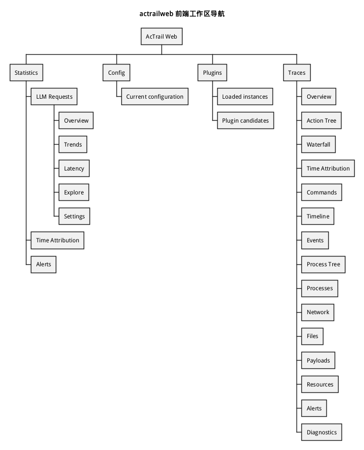
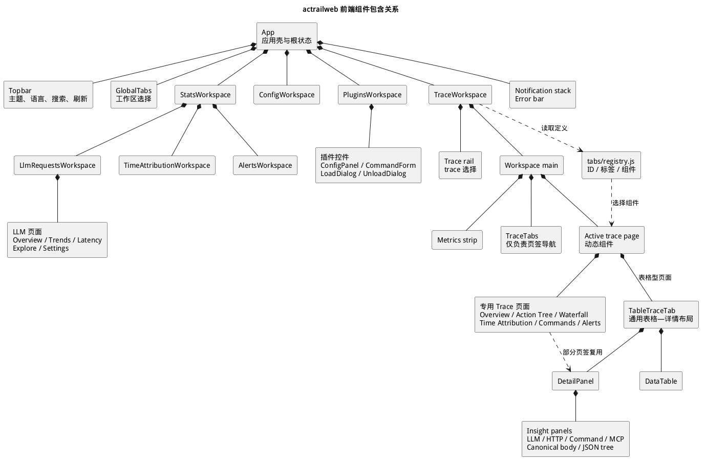
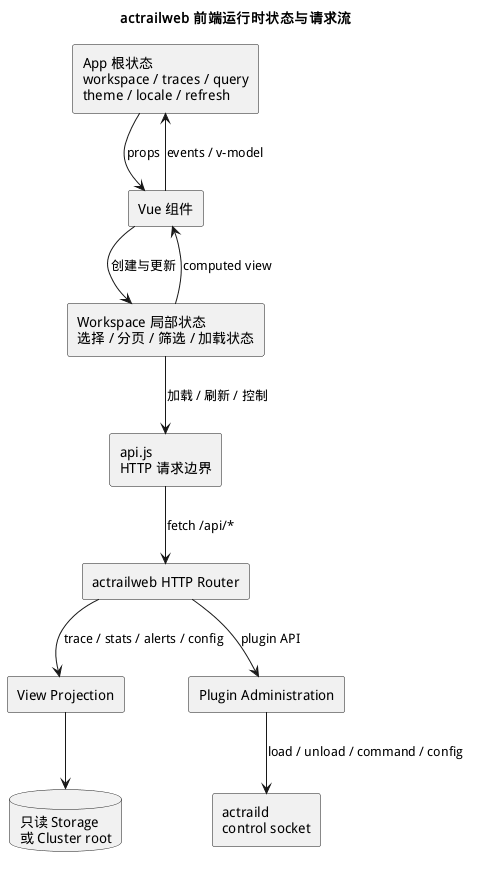
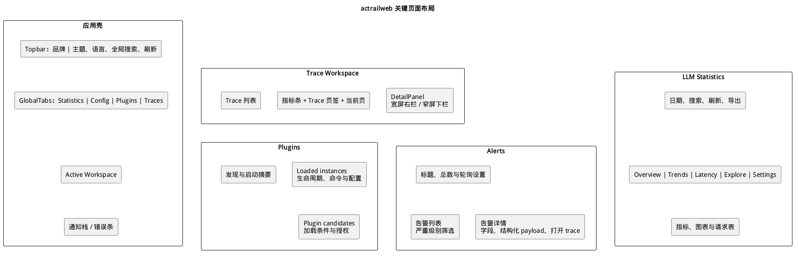
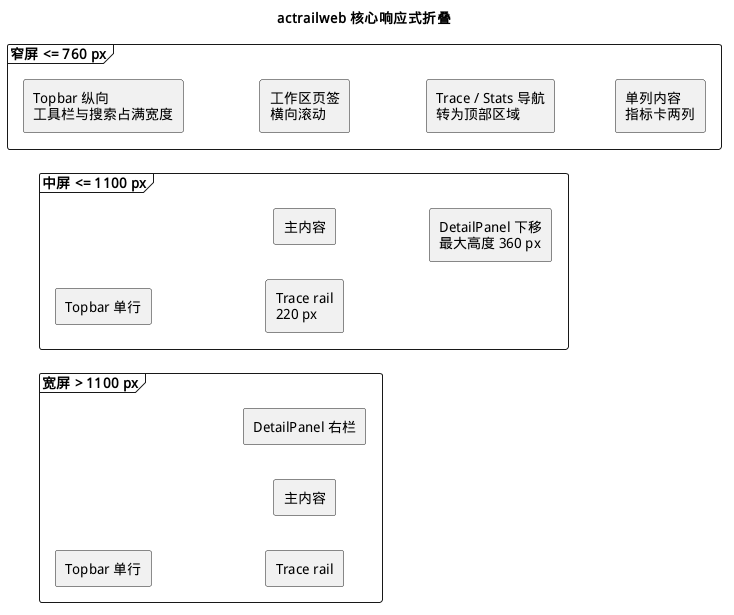

# actrailweb 前端架构

> 本文展示 `actrailweb` 前端的工作区导航、组件包含关系、状态与请求链路、关键页面布局和响应式折叠规则。

`actrailweb` 前端是面向安全分析与本地运行时管理的单页应用。页面由 Vue 组件组成，构建产物嵌入 `actrailweb` Rust binary，并通过同一个 HTTP 服务提供界面资源和 `/api/*` 数据。

## 技术边界

| 层次 | 当前实现 | 作用 |
|---|---|---|
| 组件 | Vue 3.5、Composition API、`<script setup>` | 组织应用壳、工作区和可复用控件 |
| 语言 | JavaScript | 实现组件状态、显示层投影和 API 调用 |
| 构建 | Vite 6 | 生成固定名称的 HTML、JavaScript 和 CSS 资源 |
| 图标 | `@lucide/vue` | 提供工具栏和指标图标 |
| 样式 | 项目自有 CSS、主题 token 和组件局部样式 | 控制主题、页面网格与响应式折叠 |

前端没有 URL router、全局 store 或 UI 控件框架。`App.vue` 通过响应式状态和条件渲染切换工作区；组件通过 props 接收状态，并通过 events 或 `v-model` 向所属组件报告交互。该边界使导航、状态归属和页面组件树保持直接对应。

源码入口为 `crates/apps/web/frontend/src/main.js`。该入口创建 Vue 应用、加载全局 CSS，并把 `App.vue` 挂载到 `#app`。

## 工作区导航



`GlobalTabs` 提供四个顶层工作区：

- `Statistics` 汇总 LLM request、time attribution 和 alerts；其中 LLM request 继续分为 Overview、Trends、Latency、Explore 和 Settings。
- `Config` 展示当前生效配置及其来源摘要。
- `Plugins` 展示已加载实例、候选 package、运行状态和生命周期操作。
- `Traces` 先选择 trace，再从 15 个页签查看同一份证据的不同投影。

导航状态不写入 URL。顶层选择保存在 `App`，Statistics 和 Traces 的子选择分别保存在所属 workspace。告警通知可以发出 `open-trace` 事件，由 `App` 切换到 Traces 并传递待选 trace 与页签。

## 组件包含关系



`App` 是界面组合根，包含 Topbar、`GlobalTabs`、当前 workspace、通知栈和错误条。四个 workspace 分别拥有各自的页面状态与数据加载生命周期。

`TraceWorkspace` 同时包含 trace rail 与 workspace main。workspace main 依次包含 metrics strip、仅负责导航的 `TraceTabs`，以及由动态组件承载的 active trace page。`TraceWorkspace` 从 `tabs/registry.js` 读取 15 个页签的 ID、标签和组件定义；`TraceTabs` 只显示页签并更新当前 ID，不包含活动页面。

Active trace page 分为两类。Overview、Action Tree、Waterfall、Time Attribution、Commands 和 Alerts 使用专用交互布局；Events、Process Tree、Processes、Network、Files、Payloads、Resources、Diagnostics 等表格型页面复用 `TableTraceTab`。

`TableTraceTab` 把 projector 生成的行交给 `DataTable`，并把当前选择交给 `DetailPanel`。`DetailPanel` 再根据证据类型组合以下内容：

- LLM、HTTP、Command 和 Model Context Protocol（MCP）语义面板；
- LLM canonical request body；
- attributes、原始 JSON、payload 与文件路径集合。

这种包含关系把通用选择—详情行为集中在共享组件中，同时允许 Action Tree、Waterfall 和 Commands 等专用页面复用同一详情边界。

## 状态与数据流



### 根状态

`App.vue` 持有跨 workspace 的状态：当前 workspace、trace 列表、全局搜索词、主题、语言、刷新序号、加载状态、告警基线和通知。根状态以 props 向下传递；workspace 通过 events 报告加载状态、标题变化、告警通知和跨工作区选择。

### Workspace 局部状态

每个 workspace 只持有自身交互所需的状态：

- Statistics 管理统计子页、日期范围、rollup、分页和图表筛选；
- Config 管理当前配置文档及其加载状态；
- Plugins 管理 catalog、运行实例、load/unload dialog 和实例配置刷新序号；
- Traces 管理所选 trace、活动页签，以及 action tree、waterfall、commands 和 time attribution 等按需数据；
- Alerts 管理轮询间隔、严重级别筛选、告警列表和当前告警详情。

该结构没有独立 store。跨组件共享范围由最近的共同所属组件确定，局部筛选和展开状态不会进入应用根。

### HTTP 请求边界

`src/api.js` 集中封装浏览器的 `fetch` 调用。组件只调用语义化方法，例如读取 trace、统计、告警和配置，或提交插件 load、unload、command 与配置更新。查询结果返回 workspace 局部状态，再由 computed view 和组件模板投影成界面。

读取类请求经过 Rust HTTP router 和 View Projection，访问只读 Storage 或 Cluster root。插件变更请求进入 Plugin Administration，再由 `actrailweb` 通过 daemon control socket 请求 `actraild` 执行。服务端边界与失败隔离见 [Web Runtime](web-runtime.md)。

## 构建与嵌入


前端随 `actrailweb` 构建，而不是作为独立 Web 服务部署：

1. `crates/apps/web/build.rs` 调用 `npm run build -- --outDir <cargo-out-dir>`；设置 `ACTRAILWEB_PREBUILT_ASSETS_DIR` 时，构建脚本改为读取指定的绝对路径。
2. Vite 生成 `index.html`、`assets/app.js` 和 `assets/app.css`；构建脚本在编译期检查这三项资源。
3. 构建脚本生成静态 asset table，`render.rs` 通过 `include_bytes!` 把资源写入 Rust binary。
4. 运行时 router 在 `/` 返回 `index.html`，在 `/assets/*` 返回对应的嵌入资源。

因此，浏览器资源与 Rust API 共享来源和进程边界，运行时不依赖单独的 Node.js 服务。

## 关键页面布局



### 应用壳

应用壳按纵向排列 Topbar、工作区页签和当前 workspace。Topbar 提供品牌入口、主题、语言、全局搜索和刷新；浮动通知栈与错误条覆盖在当前页面之上，不占用 workspace 网格。

### Trace Workspace

Trace 页面由左侧 trace 列表和右侧主内容组成。主内容依次包含四项指标、Trace 页签和活动页。采用 `TableTraceTab` 或其他详情型页面时，活动页再分为主视图与 `DetailPanel`。

### LLM Statistics

LLM Statistics 顶部统一提供日期范围、搜索、刷新和 CSV 导出。第二层页签在 Overview、Trends、Latency、Explore 和 Settings 之间切换；内容区分别承载指标卡、趋势图、分布图、探索查询和显示设置。Overview 同时包含概览指标、分布和 request rows。

### Plugins

Plugins 顶部展示 package 与实例计数。主体由 discovery/startup 摘要和插件主区组成；主区按 loaded instances 与 plugin candidates 分段。实例条目进一步包含运行状态、host grants、command form、配置面板和 unload 控件，候选条目包含 manifest 信息、能力要求和 load 入口。

### Alerts

Alerts 使用主从布局。左侧列表负责严重级别筛选与告警选择，右侧展示字段、结构化 payload 和打开对应 trace 的入口；顶部独立管理总数、刷新与轮询间隔。

## 响应式折叠



`styles.css` 定义两个核心断点：

- `1100px` 及以下：Trace rail 收窄至 `220px`；表格—详情布局由左右两栏变成主内容在上、`DetailPanel` 在下，详情最大高度为 `360px`。
- `760px` 及以下：Topbar 改为纵向排列，工具栏和搜索占满可用宽度；Trace 页面改为单列，trace rail 移到内容上方，四项指标改为两列；Statistics 的侧栏改为可横向滚动的顶部导航。

Stats、Plugins、Alerts 与图表组件还具有贴近自身内容密度的局部断点。例如 Plugins 在 `68.75rem` 以下把 discovery 摘要移到主区上方，Alerts 在 `47.5rem` 以下把列表与详情改为上下排列。局部断点只改变所属组件，不改变顶层工作区结构。

## 源码导航

```text
crates/apps/web/
├── build.rs                         # Vite 构建与嵌入式 asset table
├── src/render.rs                    # 运行时静态资源查找
└── frontend/
    ├── package.json                 # Vue、Vite 与 lucide 版本
    ├── vite.config.js               # 构建产物命名
    └── src/
        ├── App.vue                  # 应用壳与根状态
        ├── api.js                   # 浏览器 HTTP 请求边界
        ├── styles.css               # 全局布局与核心断点
        ├── workspaces/              # Statistics、Config、Plugins、Traces
        ├── tabs/                    # Trace 页签、注册表与表格投影
        ├── components/              # 表格、详情和 insight 组件
        ├── locale/                  # 界面语言资源
        └── theme/                   # 主题 manifest、token 与 contract
```
