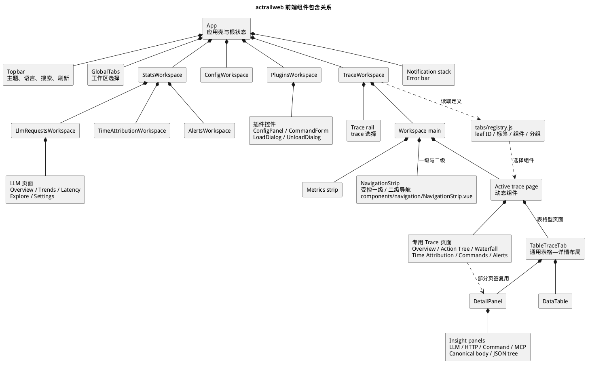
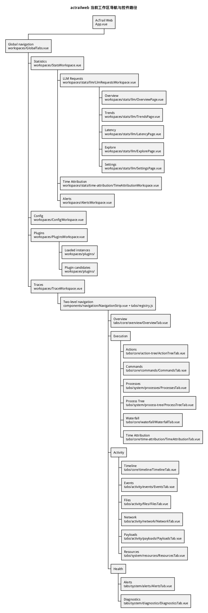
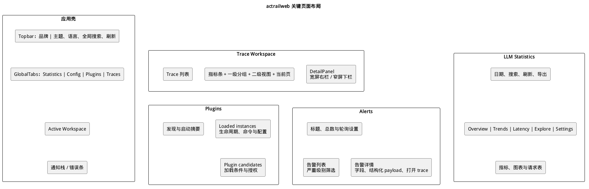
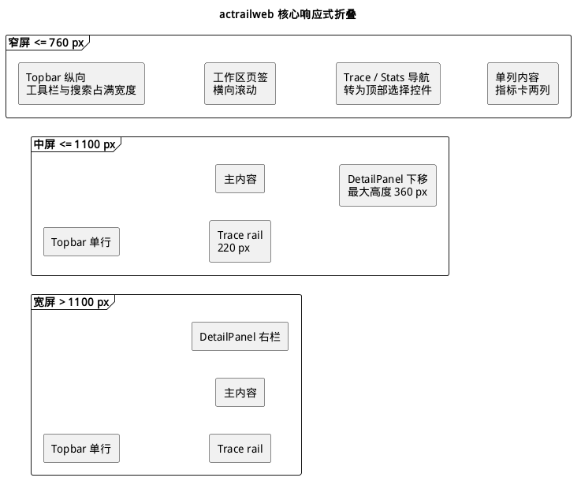

# Web 前端控件与页面布局

本文记录 `actrailweb` 当前控件层级、组合边界、关键页面布局和响应式规则。具体组件路径见 [代码布局](code-layout.md)，Navigator 与 Workspace 的交互契约见 [Navigator 与 Workspace](controls/navigation-workspace.md)。

## 控件层级

- `App`
  - `Topbar`：品牌、主题、语言、全局搜索和刷新。
  - `GlobalTabs`：顶层 Workspace 选择。
  - Active Workspace：Statistics、Config、Plugins 或 Traces。
  - Notification stack 与 Error bar：跨 Workspace 反馈。
- `TraceWorkspace`
  - Trace rail：Trace 选择。
  - Metrics strip：当前 Trace 的摘要指标。
  - Primary `NavigationStrip`：Overview、Execution、Activity 和 Health 分组选择。
  - Secondary `NavigationStrip`：当前分组内的 leaf view 选择；Overview 不显示第二级。
  - Active trace page：由 registry 选择的动态组件。
- 表格型 Trace page
  - `TableTraceTab`：共享的表格—详情组合。
  - `DataTable`：行、选择和滚动边界。
  - `DetailPanel`：证据详情与 insight panels。
- 专用 Trace page
  - Action Tree、Waterfall、Time Attribution、Commands 和 Alerts 等保留自己的交互布局。

页面负责数据加载与用例编排；领域控件负责完整交互；共享控件只持有可复用的显示和输入语义。不得为了复用外观而把 Workspace 的业务状态、请求生命周期或跨页面跳转放进基础控件。

## 当前工作区导航

当前 `GlobalTabs` 提供 Statistics、Config、Plugins 和 Traces 四个顶层 Workspace。导航状态不写入 URL：顶层选择保存在 `App`，Statistics 与 Traces 的子选择由所属 Workspace 持有。

Trace 使用四组两级导航。一级为 Overview、Execution、Activity 和 Health，每组最多包含 6 个 leaf view。两级导航不改变既有 leaf view ID、数据端点或详情组件；完整状态归属和分组见 [Navigator 与 Workspace](controls/navigation-workspace.md)。

## 关键页面布局

### 应用壳

应用壳纵向排列 Topbar、顶层导航和 Active Workspace。通知栈与错误条覆盖当前页面，不占用 Workspace 网格。

### Trace Workspace

Trace 页面由左侧 Trace rail 和右侧主内容组成。主内容依次包含 Metrics strip、一级导航、当前组的可选二级导航和 Active trace page。使用表格—详情页面时，活动页再组合主视图与 `DetailPanel`。

### LLM Statistics

LLM Statistics 顶部统一提供日期范围、搜索、刷新和 CSV 导出。内部视图承载指标卡、趋势图、分布图、探索查询和显示设置。

### Plugins

Plugins 主体由 discovery/startup 摘要和插件主区组成；主区按 loaded instances 与 plugin candidates 分段。实例条目组合运行状态、host grants、command form、配置面板和 unload 控件。

### Alerts

Alerts 使用主从布局。列表负责严重级别筛选与告警选择，详情展示字段、结构化 payload 和打开对应 Trace 的入口。

## 响应式折叠

- `1100px` 及以下：Trace rail 收窄至 `220px`；表格—详情布局由左右两栏变成上下排列，详情最大高度为 `360px`。
- `760px` 及以下：Topbar 改为纵向排列；Trace 页面改为单列，Trace rail 移到内容上方，四项指标改为两列；Statistics 侧栏改为可横向滚动的顶部导航。

Stats、Plugins、Alerts 与图表组件可以设置局部断点，但局部断点只能改变所属组件，不能改变顶层 Workspace 结构。稳定尺寸必须通过 CSS 变量或主题 token 管理，文档只记录布局语义和核心断点。
