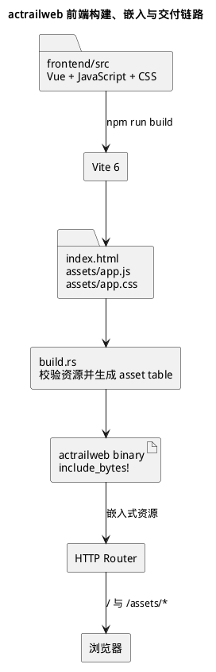

# Web 前端运行时与交付

本文记录 `actrailweb` 前端的技术边界、状态与请求流，以及构建产物进入 Rust binary 的交付链路。

## 技术边界

| 层次 | 当前实现 | 作用 |
|---|---|---|
| 组件 | Vue 3.5、Composition API、`<script setup>` | 组织应用壳、Workspace 和可复用控件 |
| 语言 | JavaScript | 实现组件状态、显示层投影和 API 调用 |
| 构建 | Vite 6 | 生成固定名称的 HTML、JavaScript 和 CSS 资源 |
| 图标 | `@lucide/vue` | 提供工具栏和指标图标 |
| 样式 | 项目自有 CSS、主题 token 和组件局部样式 | 控制主题、页面网格与响应式折叠 |

前端没有 URL router、全局 store 或 UI 控件框架。`App.vue` 通过响应式状态和条件渲染切换 Workspace；组件通过 props 接收状态，并通过 events 或 `v-model` 向所属组件报告交互。

## 状态与请求流

### 根状态

`App.vue` 持有当前 Workspace、Trace 列表、全局搜索词、主题、语言、刷新序号、加载状态、告警基线和通知。Workspace 通过 events 报告加载状态、标题变化、告警通知和跨工作区选择。

### Workspace 局部状态

- Statistics 管理统计子页、日期范围、rollup、分页和图表筛选。
- Config 管理当前配置文档及其加载状态。
- Plugins 管理 catalog、运行实例、load/unload dialog 和实例配置刷新序号。
- Traces 管理所选 Trace、活动 leaf view，以及各视图的按需数据。
- Alerts 管理轮询间隔、严重级别筛选、告警列表和当前详情。

共享范围由最近的共同所属组件确定。局部筛选、展开状态和请求竞态令牌不得提升到应用根。

### HTTP 请求边界

`src/api.js` 集中封装浏览器 `fetch` 调用。组件调用语义化方法读取 Trace、统计、告警和配置，或提交插件生命周期与配置操作。查询结果进入 Workspace 局部状态，再由 computed view 和组件模板投影为界面。

读取类请求经过 Rust HTTP router 和 View Projection。插件变更请求通过 daemon control socket 请求 `actraild` 执行。服务端失败隔离见 [Web Runtime](../web-runtime.md)。

## 构建与嵌入

1. `crates/apps/web/build.rs` 调用 `npm run build -- --outDir <cargo-out-dir>`；设置 `ACTRAILWEB_PREBUILT_ASSETS_DIR` 时改为读取指定绝对路径。
2. Vite 生成 `index.html`、`assets/app.js` 和 `assets/app.css`；构建脚本在编译期检查三项资源。
3. 构建脚本生成静态 asset table，`render.rs` 通过 `include_bytes!` 把资源写入 Rust binary。
4. 运行时 router 在 `/` 返回 `index.html`，在 `/assets/*` 返回对应的嵌入资源。

浏览器资源与 Rust API 共享来源和进程边界，运行时不依赖单独的 Node.js 服务。
