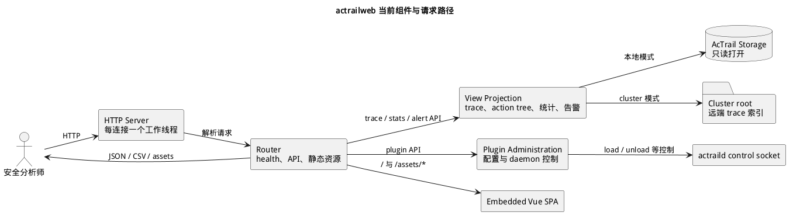

# Web Runtime

> 本文展示 `actrailweb` Rust 服务如何提供嵌入式前端、只读安全分析 API 和本地插件管理边界。

`actrailweb` 是独立的本地 HTTP 服务。它提供嵌入式单页应用（SPA）、trace 与统计 API、告警视图和插件管理入口；它不参与采集，也不写入 trace 主存储。Trace 是一次受观测进程树的证据集合。浏览器内部结构见 [actrailweb 前端架构](web-frontend.md)。



## 请求入口

HTTP server 绑定配置的监听地址，每个已接受连接由独立工作线程处理。请求读取受可选 timeout 约束，响应可以根据 `Accept-Encoding` 使用 gzip。`/health` 只证明 Web 进程能够处理请求，不代表 daemon、插件或所有 trace 数据均健康。

Router 将请求分为三组：

- `/` 与 `/assets/*`：返回编译时嵌入 binary 的 Vue SPA 资源；
- `/api/traces/*`、统计、告警和配置查询：调用 storage-backed view projection；
- 插件管理 API：读取 catalog 和配置，并通过 daemon control socket 执行需要授权的运行时操作。

## View Projection

本地模式在启动时验证 storage 路径，并始终以 `StorageOpenMode::ReadOnly` 打开后端。View 层把存储 contract 投影成面向界面的 JSON 或 CSV，包括：

- trace 摘要、事件、进程树、payload 和诊断；
- action tree、waterfall、命令、LLM request content 与 lineage；
- token、LLM activity 和 time attribution 统计；
- 告警与审计视图。

复杂视图可以使用进程内 projection cache；清除缓存只影响派生视图，不修改主存储。

Cluster 模式不打开单一 storage，而是从配置的 cluster root 定位远端 trace 索引和对应数据。两种模式复用相同的 HTTP 表示，但数据入口不同。

## 前端交付边界

Vue 构建产物在编译期嵌入 `actrailweb` binary。Router 只向 `/` 和 `/assets/*` 返回已登记的静态资源；页面导航、组件状态和响应式布局位于浏览器。完整构建链路、组件树与页面布局见 [actrailweb 前端架构](web-frontend.md)。

服务端返回持久化事实和派生 JSON，浏览器不会直接访问 SQLite 或 daemon 内部模块。大语言模型（LLM）request 的 API 会重建 canonical `body_json`，浏览器再生成 messages 与 tools 的显示视图。该投影边界见 [LLM Request 当前投影路径](llm-request-projection.md)。

## 插件管理边界

插件 catalog、package 展示和配置校验位于 Web 的 `plugins/` 模块。需要改变 daemon 运行状态的 load、unload 或 command 请求通过本地控制 socket 发送给 `actraild`；Web 不直接操作 daemon 的插件宿主。

插件管理失败只影响当前 HTTP 请求。Trace 查询和静态资源仍可继续提供；单个连接中的解析或渲染错误由该连接返回，不终止监听循环。

## 源码导航

```text
crates/apps/web/
├── build.rs                    # 前端构建与嵌入式 asset table
└── src/
    ├── http.rs                 # HTTP server、router 与 API 路径
    ├── http/                   # 告警、插件和查询参数边界
    ├── view.rs                 # storage-backed view façade
    ├── view/                   # trace、action、stats、alert 等投影
    ├── plugins/                # catalog、package 与插件管理表示
    └── render.rs               # 嵌入式 SPA assets
```
