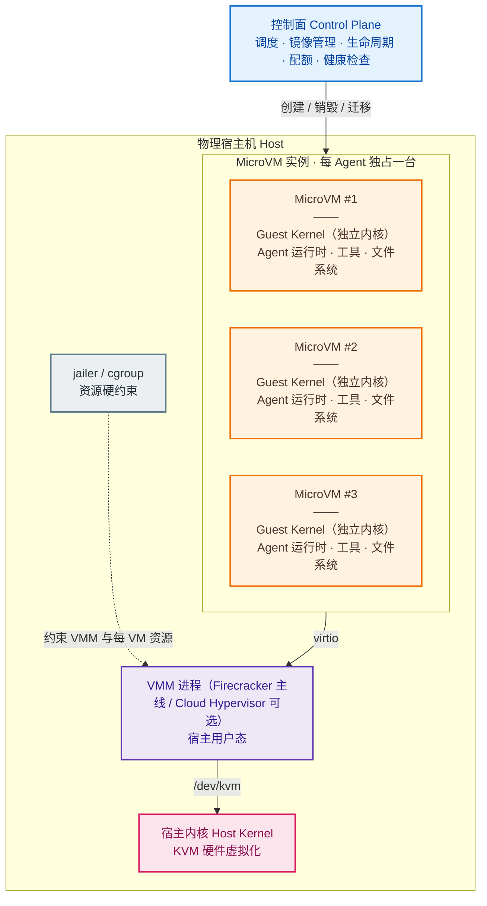
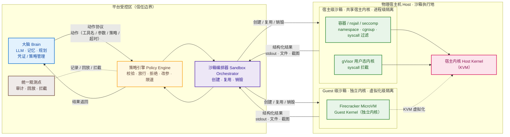

# Agent 集群部署模式：MicroVM 隔离 与 执行隔离

> 面向平台架构师与运维/安全工程师。Agent 集群的两种主流隔离部署模式，核心是下面两张架构图。

## 1. MicroVM 隔离（每 Agent 独占一台微型虚拟机）

平台为每个 Agent 分配一台 MicroVM（如 [Firecracker](https://firecracker-microvm.github.io/)），每台 VM 自带一套独立内核，Agent 整套环境（运行时、工具、文件系统）直接部署在 VM 内部运行，Agent 在环境内直接操作。

- **隔离边界**：虚拟化（KVM）。Guest 内核与宿主机内核完全隔离，Agent 在 VM 内即使拿到 root 也无法触达宿主机与其他 VM。
- **代价**：每实例一份 Guest 内核与常驻内存，配额静态、难以超卖；VM 内部对平台近乎黑盒，语义级观测需内置探针。
- **适用**：多租户强隔离、不可信/任意 workload（AWS Lambda、Kata Containers、Fly Machines 等均基于此路线）。

## 2. 执行隔离（手脑分离 / 缸中之脑）

大脑（Agent 核心运行时：LLM 推理、记忆、规划、凭证与策略管理）由平台管控；手（每次工具调用、代码执行、文件/浏览器操作）被放入隔离沙箱中执行。大脑只输出结构化动作、不直接触达世界，结果以结构化消息返回——即"缸中之脑"。

- **隔离边界**：动作级沙箱，粒度细到单次调用。沙箱运行在物理宿主机上，实现分两级：**宿主级沙箱**（容器 / gVisor / nsjail / seccomp，共享宿主内核、进程级隔离）与 **Guest 级沙箱**（Firecracker MicroVM，独立 Guest 内核、虚拟化级隔离）。无论哪级，沙箱内均无凭证、网络默认关闭或代理化、文件系统为"只读基线 + 可写工作区"。
- **收益**：资源高效可伸缩；所有动作流经统一通道，审计/回放/拦截内建；提示词、记忆、凭证等大脑资产不进入执行环境。
- **代价**：动作协议刚性（新工具需适配）；大脑既是信任边界也是单点；每动作跨越边界有额外延迟。
- **适用**：海量轻量 Agent、治理审计优先（OpenAI Code Interpreter、E2B、Anthropic Managed Agents、GitHub Actions）。

## 3. 对比与组合

| 维度 | MicroVM 隔离 | 执行隔离（手脑分离） |
| --- | --- | --- |
| 隔离边界 | 虚拟化（内核级） | 动作级沙箱（可叠加虚拟化） |
| 隔离强度 | 高、成熟 | 中～高，取决于沙箱技术 |
| 资源开销 | 高（每实例一份内核） | 低～中（可共享、可超卖） |
| 冷启动 | 100ms～秒级 | 毫秒～数百毫秒 |
| 权限/治理粒度 | 整机级 | 动作级 |
| 观测/审计 | 需 VM 内探针，粒度粗 | 统一通道内建，动作级 |
| 典型适用 | 强隔离、不可信/任意 workload | 海量轻量 Agent、治理优先 |

一句话取舍：**要"最强隔离强度 + 最简单心智模型"选 MicroVM；要"资源效率 + 动作级治理 + 内建观测"选执行隔离。**

两者不是二选一，可分层组合为纵深防御：**外层用 MicroVM/容器做租户与会话边界，内层用动作级沙箱做执行边界**。例如 E2B 用 Firecracker 提供执行沙箱，AWS Lambda + Claude Managed Agents 则在 MicroVM 内承载 Agent 运行时。

## 参考

- [Firecracker（AWS 开源的 MicroVM 管理器）](https://firecracker-microvm.github.io/)
- [AWS Lambda 采用 MicroVM 作为计算后端（ADR 021）](https://aws-samples.github.io/sample-autonomous-cloud-coding-agents/decisions/adr-021-lambda-microvms-compute-backend/)
- [E2B：面向 AI Agent 的沙箱执行环境（Firecracker 实现）](https://www.npmjs.com/package/@eidentic/e2b)
- [OpenAI：大规模 Agent 沙箱基础设施设计（运行时到编排）](https://www.zenml.io/llmops-database/designing-agent-sandbox-infrastructure-at-scale-from-runtime-to-orchestration)
- [Pick Your Sandbox（Agent 沙箱选型导览）](https://learn.agentpatterns.ai/security/pick-your-sandbox/)
- [Anthropic Claude Cowork 架构概述（沙箱化执行）](https://support.claude.com/zh-TW/articles/14479288-claude-cowork-%E6%9E%B6%E6%A7%8B%E6%A6%82%E8%BF%B0)
