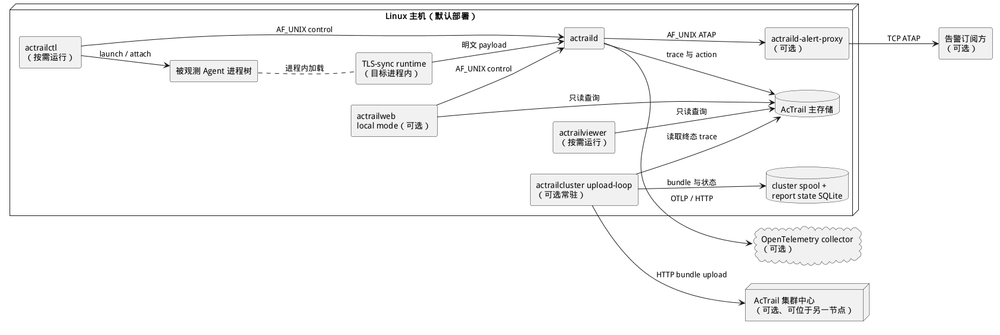

# 默认部署

> 本文展示 AcTrail 默认单主机模式中的进程落位、存储位置及可选外部连接。

默认部署在同一台 Linux 主机上运行 `actraild`、控制工具、被观测 Agent 和本地分析入口，不要求 MicroVM 或集群中心。

`actrailctl` 通过本地 control socket 操作 daemon，并在主机上启动或挂接 Agent 进程树。TLS-sync runtime 加载在目标进程内；daemon 同时接收内核事件与 TLS 明文，将 trace 和语义 action 写入主存储。`actrailviewer` 与本地模式的 `actrailweb` 读取同一份主存储。

告警转发启用时，daemon 在同一主机上管理独立的 `actraild-alert-proxy` 进程。两者通过受保护的 Unix-domain socket 通信，代理通过 TCP 向经过认证的订阅方投递匹配告警。代理断开不会改变主存储中的告警结果。

集群上报启用时，`actrailcluster upload-loop` 读取终态 trace，使用本地 spool 和上报状态库，并通过 HTTP 向集群中心上传 bundle。OpenTelemetry 导出、外部告警订阅方和集群中心均为可选依赖；未启用时不影响本地采集、治理和查询。
