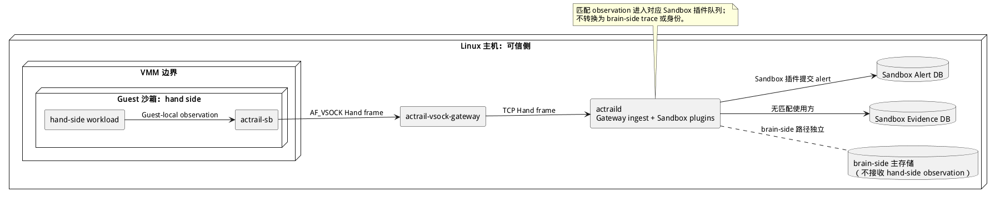

# 执行隔离部署

> 本文展示 hand-side 执行隔离路径中 Guest、VMM、主机网关、可信 daemon 与独立存储的实际落位。

本图是完整部署中的局部视图，只展开 hand-side observation 路径。`actrailweb`、`actrailviewer`、集群上报、OpenTelemetry 和外部告警代理仍按各自部署方式连接可信侧，不在本图重复显示。

Linux 主机上的 `actrail-vsock-gateway` 持有 VMM 暴露的端点，并通过 TCP Hand listener 将 frame 转发给可信侧的 `actraild`。Gateway 只执行会话、配额与转发，不解释 observation。`actraild` 内的 Gateway ingest 和 Sandbox 插件负责校验、兴趣匹配与投递。

VMM 内的 Guest 只运行一个 `actrail-sb` daemon。它采集 hand-side workload 的进程 I/O、资源快照与 OOM 事件，经 AF_VSOCK 发送到主机 gateway。Firecracker 将 Guest 目标端口映射为 `${uds_path}_${port}`；Cloud Hypervisor 使用每个 VM 的 Unix 端点；原生 AF_VSOCK 使用相同的上层会话语义。

匹配到 Sandbox 插件的 observation 进入各插件的独立有界队列；没有匹配使用方的 observation 写入 Sandbox Evidence DB。插件提交的告警写入 Sandbox Alert DB。上述数据不会进入 brain-side 主存储，gateway、插件或 Sandbox 存储故障也不会终止 brain-side 采集。

一个 Firecracker gateway 端点属于一个 MicroVM，一个 daemon 可以接受多个 gateway TCP 连接。`(gateway-id, sb-id)` 只在 hand-side 路径中标识一个存活来源，不会转换为 brain-side 身份或 trace 成员关系。
