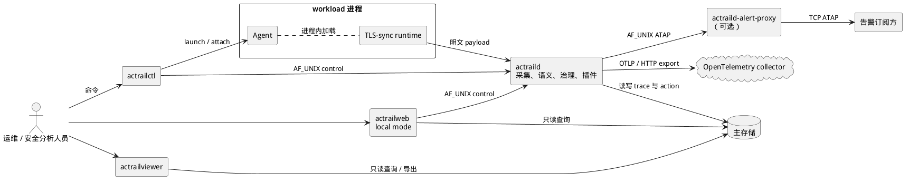
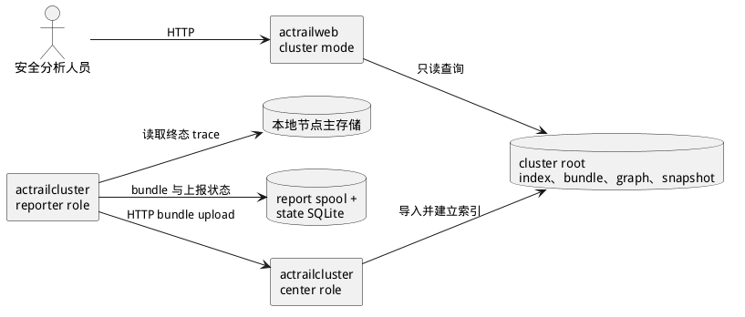
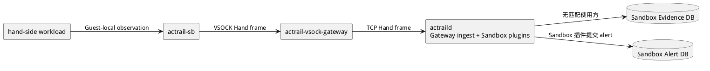

# 运行时容器

> 本文展示 AcTrail 的可执行程序、运行时角色、数据存储及其逻辑通信关系。

本视图只表达软件职责，不表示 Host、MicroVM 或 Guest 等物理包含关系。实际进程落位见[默认部署](../deployment/default.md)与[执行隔离部署](../deployment/execution-isolation.md)。

## 本地节点

- `actraild` 接收内核事件与 TLS 明文，完成身份和 trace 关联、语义投影、治理、插件执行、持久化及已配置的导出。
- `actrailctl` 通过本地 control socket 管理 daemon，并启动或挂接 brain-side 工作负载。
- `actrailweb` 的本地模式读取主存储，并在加载 operator config 时通过 control socket 执行受支持的配置操作。
- `actrailviewer` 直接从主存储执行只读查询与导出。
- TLS-sync runtime 随被观测进程加载，在加密前或解密后捕获应用字节并发送给 daemon。
- `actrailcluster` reporter 读取本地 trace，将终态 trace 打包到 spool，并通过 HTTP 上传到集群中心；上报状态使用独立 SQLite 文件。
- `actraild-alert-proxy` 通过本地 Unix-domain socket 接收 daemon 转发的规范化告警，再通过经过认证的 TCP 会话向匹配订阅方广播。

## 集群中心

同一个 `actrailcluster` 可执行程序以 center 角色接收 bundle，将索引、bundle、JSON graph 和 SQLite snapshot 写入 cluster root。`actrailweb cluster` 从该目录提供集群只读视图。集群上报与集群 Web 不改变本地节点的主存储。

## 执行隔离路径

`actrail-sb` 在 Guest 内采集进程 I/O、资源快照与 OOM 事件。`actrail-vsock-gateway` 只转发有界 frame，不解释 observation；daemon 接收 frame 后，将 observation 投递给匹配的 Sandbox 插件，或在没有匹配使用方时写入 Sandbox Evidence DB。Sandbox 插件提交的告警写入独立的 Sandbox Alert DB。

主存储、cluster reporter 状态、cluster root、Sandbox Evidence DB 和 Sandbox Alert DB 拥有独立的 schema 与生命周期，互不充当后备目标。
