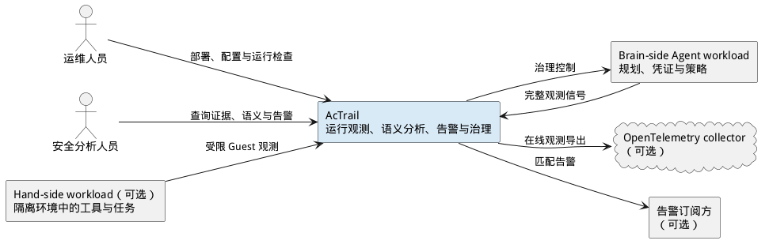

# 系统上下文

> 本文展示 AcTrail 系统与使用人员、被观测工作负载及外部系统之间的关系。

AcTrail 为 AI Agent 提供运行证据、语义视图、告警和治理控制。系统边界内的实现细节不在本视图展开；可执行程序及数据存储见[运行时容器](containers.md)，产品在单节点和集群中心之间的组合见[产品版图](product-landscape.md)。

运维人员负责部署、配置和运行检查，安全分析人员读取 trace、语义 action 与告警。Brain-side 工作负载运行规划、凭证与策略相关逻辑，并向 AcTrail 提供完整观测信号；可选的 hand-side 工作负载运行在隔离环境中，只向 AcTrail 提供受限的 Guest 观测。

AcTrail 可以向 OpenTelemetry collector 导出在线观测，也可以向经过认证的告警订阅方投递匹配告警；两项集成都属于可选能力。

图中的箭头只表示系统间职责关系，不表示具体进程、协议或部署位置。
