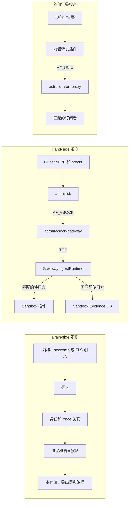

# 关键数据流

> 本文展示观测与告警从生产者到允许使用方的数据流及其故障边界。

下图分开表示三条数据流。实线箭头表示投递步骤；每一行的最终节点是该类数据不会自动越过的边界。

## 脑侧观测

采集与下游解析是否成功相互独立。解析器、导出器或插件的故障被限制在对应的使用方或逻辑流内。

## 手侧观测

摄入后的路由是互斥的。兴趣查询成功且存在匹配插件时，观测会发送到这些插件。查询成功且没有返回匹配项时，观测持久化到 Sandbox Evidence DB。

## 告警投递

告警持久化和外部转发是彼此独立的结果。队列压力或代理断开连接只能丢弃转发副本；不得阻塞或回滚告警生产者。
