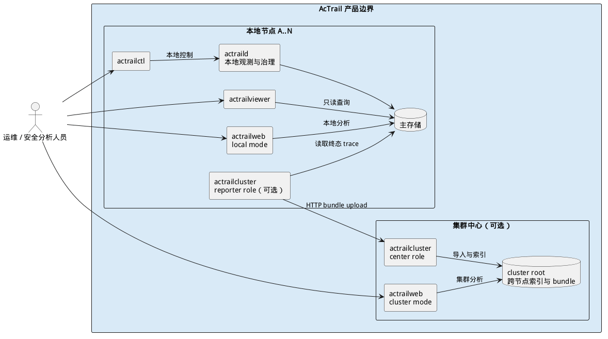

# 产品版图

> 本文展示 AcTrail 本地节点、集群中心及两种 Web 入口的产品级组合关系。

一个 AcTrail 本地节点独立完成 workload 观测、治理和本地分析。集群能力在此基础上增加可选的 reporter：它只打包并上传本地终态 trace，不把集群中心变成本地采集或控制的前置依赖。

产品边界包含本地节点与集群中心两类部署单元：

- 本地节点由 `actraild`、本地工具、可选的本地 Web、主存储及可选 reporter 组成。`actrailweb` 本地模式和 `actrailviewer` 面向同一份本地 trace 数据。
- 集群中心由 `actrailcluster` center、cluster root 和 `actrailweb cluster` 组成。中心接收节点上传的 bundle，并建立跨节点索引和只读分析入口。
- `actrailweb` 是同一个可执行程序。本地模式读取节点主存储，cluster 模式读取中心的 cluster root；两个模式不共享运行时状态。

OpenTelemetry collector 与告警订阅方位于 AcTrail 产品边界之外，分别消费在线导出和匹配告警。
