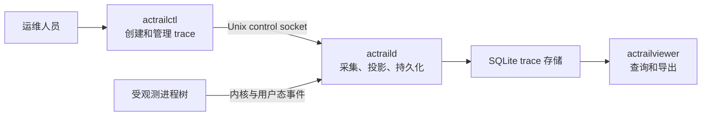

# 运行模型

> 本文说明 trace 的创建、采集、收尾和读取过程，以及 `launch` 与 `track-add` 的适用条件。

AcTrail 的本地运行面由三个角色组成：

- `actraild` 是长期运行的 daemon，加载 collector、接收控制请求并写入存储。
- `actrailctl` 通过本地 Unix socket 创建或管理 trace。
- `actrailviewer` 从存储读取 trace，不参与采集。

Trace 是一次受观测进程树的证据集合。Operator config 是这套实例的主配置文件；它定义 control socket、PID 文件、SQLite、日志和 TLS sync socket，这些路径不应与另一实例共用。

## Trace 生命周期

1. daemon 启动时校验配置、打开存储、验证 collector 并绑定 control socket。启动条件不满足时会直接失败。
2. `actrailctl launch` 或 `track-add` 创建 trace，并把 root process 绑定到该 trace。
3. daemon 接收内核与用户态事件，将低层事实投影为语义动作并持续写入存储。
4. Root process tree 结束或 trace 被移除后，daemon 等待仍可能补充证据的 action 稳定（settle），再运行 trace 终止后才能执行的分析和插件任务（post-trace work）。
5. trace 进入终态后仍可由 viewer 查询或导出；保留策略可能在之后清理它。

运行中的单个下游解析器、插件或 exporter 故障应被限制在对应路径，并通过 diagnostic（结构化故障记录）或 degraded（证据不完整）状态暴露，不应无条件终止整个 daemon。启动阶段则相反：缺少必需能力、配置无效、存储打不开或必需插件加载失败都应阻止 daemon 进入 ready（可以接收控制请求）状态。

## `launch` 与 `track-add`

`launch` 先为 child 准备采集条件，再执行目标命令。TLS sync runtime、launch-time seccomp 和进程 exec 上下文依赖这一顺序，因此相关能力必须使用 `launch`。

`track-add --pid <PID>` 从 attach 时刻开始观察一个现有进程及后续活动。它不能把 preload runtime 或 seccomp listener 安装到已经发生的 exec 之前，也不能恢复 attach 前的事实。

## 存储与读取

默认存储是 append-oriented SQLite。viewer 与 daemon 必须读取同一 operator config，或显式指向同一 storage path。payload、HTTP 语义和 action 各有独立保留边界；高层内容存在时，`content_owner = "highest_consumed"` 可避免同一内容在多个层重复保留。
