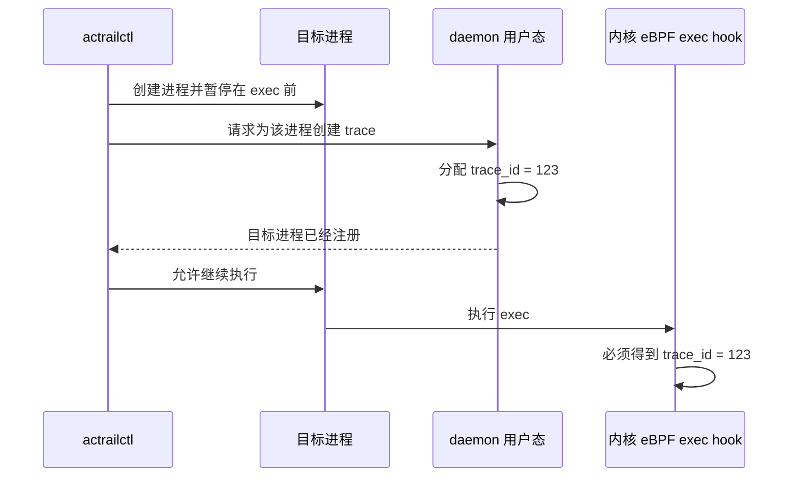
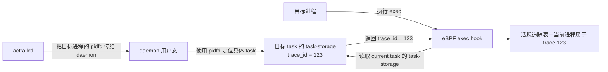
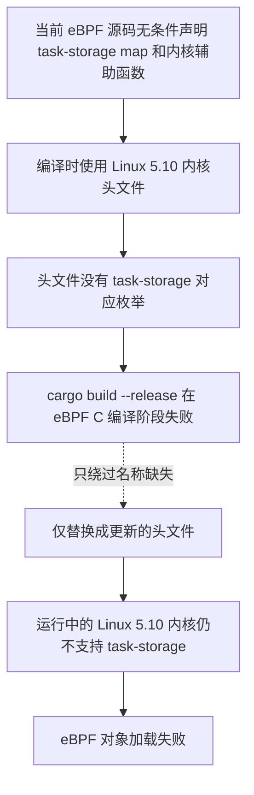
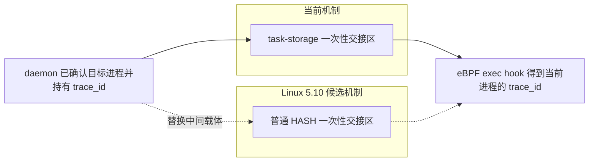
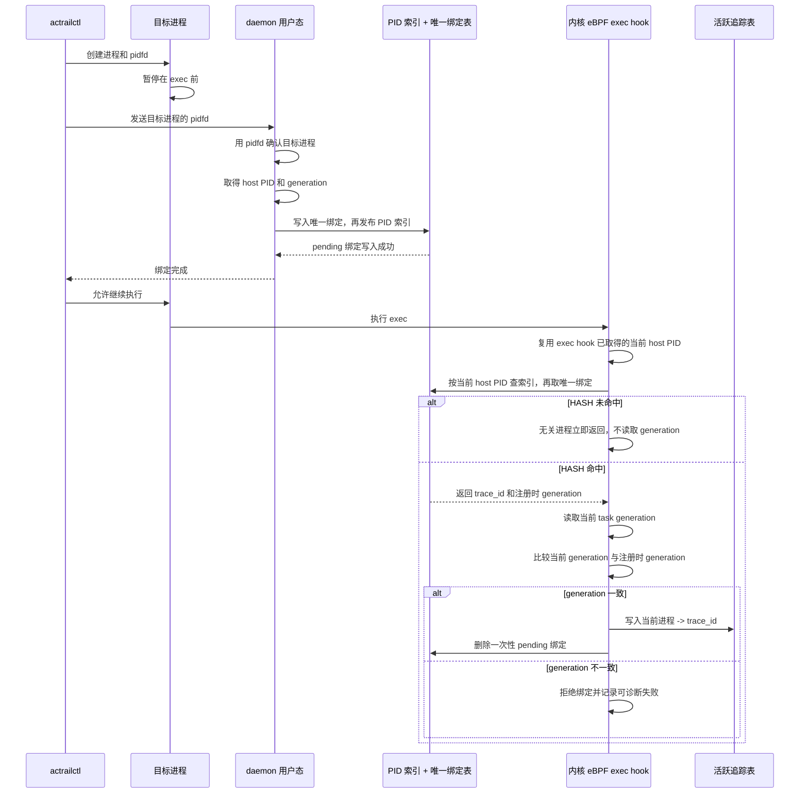
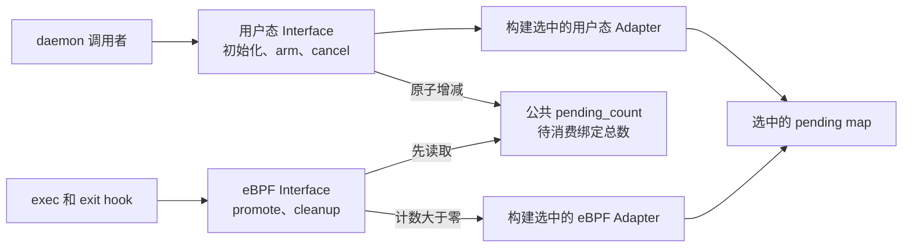
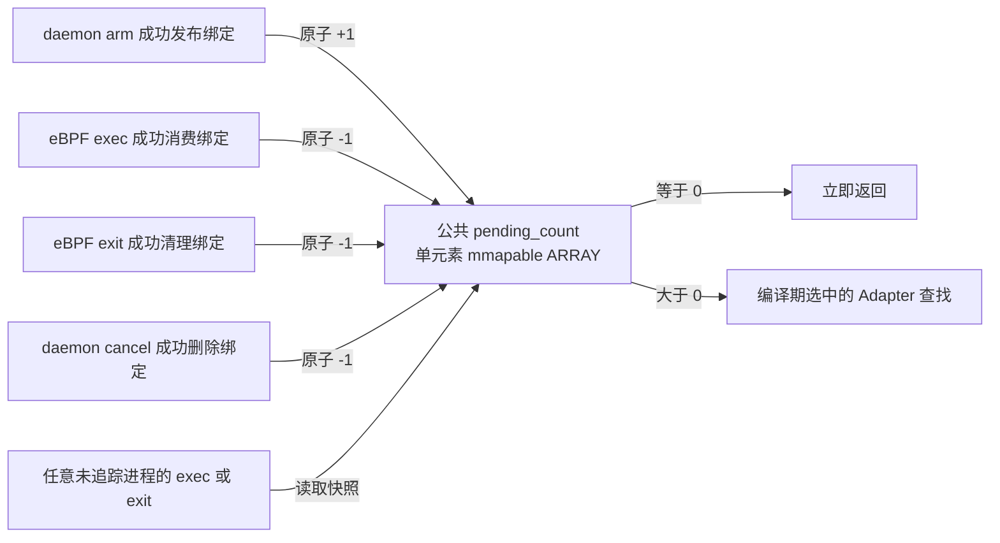
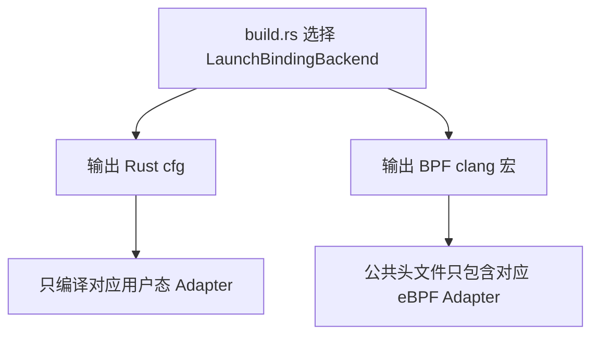
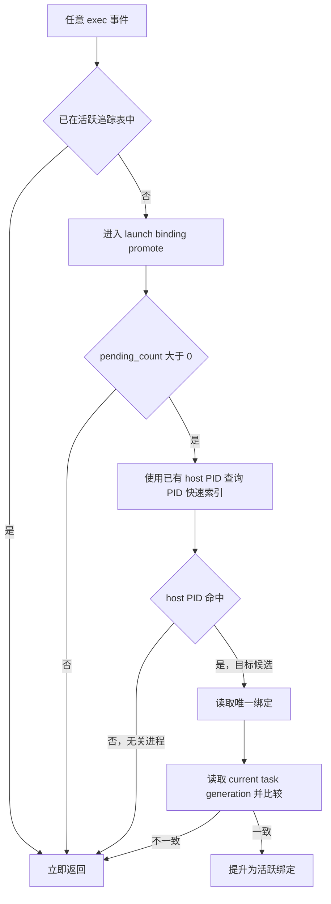

# Linux 5.10 下的 Launch Trace 注册

> 状态：架构约束已经确认，兼容实现及后续修改必须遵守。
>
> `fallback` 不是忽略错误后静默降级，而是在 Linux 5.10 上实现与现有机制相同的职责。
> PID-generation HASH 仍须通过下列正确性和性能验证，
> 才能成为可实施的兼容 Adapter。

## 目的与读者

目标是解释 `actrailctl launch` 启动一个进程时，`trace_id` 如何从 daemon 用户态传递给
内核中的 eBPF exec hook，以及 Linux 5.10 为什么无法使用当前的传递机制，使开发者能够
据此实现和审查兼容 Adapter。

目标读者是不熟悉该实现、但需要评审 Linux 5.10 兼容逻辑的开发者。

trace 是 AcTrail 用来归集一个目标进程及其后续行为的观测记录，`trace_id` 是该记录的
唯一编号。exec hook 是进程执行新程序时自动运行的 eBPF 处理逻辑。

## 已确认的设计决策

后续实现必须遵守以下边界：

1. launch trace 的一次性交接由统一的 `LaunchExecBinding` Module 封装，daemon 调用者以及
   外部 exec/exit hook 不接触具体存储机制；
2. 一个 release 在编译期只包含一个成对的用户态/eBPF Adapter，不携带两份实现，也不在
   运行时切换；
3. TaskStorage 与 PID-generation HASH Adapter 共用 Module 所有的 `pending_count` 快速门；
4. `pending_count` 直接表示待消费绑定数，由 daemon 与 eBPF 原子增减，不使用锁，也不使用
   produced-consumed 差值作为热路径门控；
5. HASH Adapter 复用 hook 已有的 host PID 先查询，只有 PID 命中后才读取和验证
   generation；
6. HASH Adapter 内部使用 PID 快速索引和唯一绑定表，旧生命周期的取消操作不能按 PID
   删除后来发布的新绑定；
7. Module 将具体 binding 的内核异常作为固定长度事件上报，事件只包含 `trace_id` 和身份、
   提升、清理三个大环节之一的状态码；daemon 只处理对应 trace，不阻塞无关事件；
8. pidfd 目标确认、exec 前暂停屏障、一次性消费和 exec 后活跃追踪语义保持不变。

这些决策不等于 PID-generation HASH 已经满足准入条件。generation 的跨用户态/内核一致性、
并发消费正确性和真实运行开销仍须验证；任一条件失败都必须停止采用该 Adapter，不能静默
弱化进程身份验证。

## 系统首先要完成什么

一次 launch 涉及三个参与者：

| 参与者 | 职责 |
|---|---|
| `actrailctl` | 创建目标进程，并控制它什么时候开始执行用户指定的程序 |
| daemon 用户态 | 为目标进程创建 trace，得到唯一的 `trace_id` |
| 内核 eBPF | 在目标进程执行 `exec` 时采集第一条进程事件，并将后续行为归入对应 trace |

完整目标只有一条主线：



这里存在一个必须解决的数据交接问题：

```text
daemon 用户态知道 trace_id
            ↓
但是 exec 发生在将来，并由内核中的 eBPF hook 处理
            ↓
daemon 必须提前把 trace_id 留给“这个目标进程”的 exec hook
```

daemon 不能等看到 exec 事件以后再注册，否则第一条 exec 事件已经没有正确的 trace 归属。
它也不能让目标进程自己传递 `trace_id`，因为目标程序不应知道或参与观测系统内部协议。

因此系统需要一个位于 daemon 与 eBPF exec hook 之间的“一次性交接区”：

```text
daemon 写入                  目标进程 exec 时读取
   trace_id  ───────▶  一次性交接区  ───────▶  eBPF exec hook
```

## 为什么引入 pidfd 和 task-storage

### 原来的直接 PID 绑定有什么问题

早期流程将目标进程解析成一个数值 PID，然后由 daemon 直接写入 eBPF 的活跃追踪表：

```text
actrailctl 创建目标进程
          ↓
daemon 将目标解析成数值 PID
          ↓
活跃追踪表[PID] = trace_id
          ↓
目标进程 exec，eBPF 按当前 PID 查找 trace_id
```

PID 只是一个可以复用的数字。容器中的进程还同时具有容器内 PID 和 host PID；host PID
是宿主机和 daemon 看到的 PID。系统必须保证注册的是 actrailctl 刚刚创建的那个进程，
而不是另一个命名空间中的同号进程，或 PID 复用后的新进程。

因此新的 launch 注册流程引入了 pidfd：

- pidfd 是内核提供的进程句柄，稳定指向某一个具体进程；
- 即使数值 PID 后来被复用，原 pidfd 也不会改为指向新进程；
- actrailctl 创建目标进程时取得 pidfd，再把 pidfd 传给 daemon。

pidfd 解决“daemon 如何确认是哪个进程”，但还没有解决“如何把 `trace_id` 留给未来的
eBPF exec hook”。当前实现使用 BPF task-storage 完成后一项职责。

### task-storage 是什么

Linux 内核使用 task 表示一个正在运行的进程或线程。BPF task-storage 允许将一小段 BPF
数据直接附着到某个 task 上。

在当前流程中，它相当于挂在目标进程上的一次性信箱：



pidfd 不会被发送给目标进程。目标进程也不会主动读取任何数据。实际动作是：

1. actrailctl 将 pidfd 发送给 daemon；
2. daemon 使用 pidfd 指定目标 task，把 `trace_id` 写入该 task 的 task-storage；
3. 目标进程发生 exec；
4. eBPF hook 正运行在目标进程的上下文中，因此可以取得 current task；
5. eBPF 从 current task 的 task-storage 读取 `trace_id`；
6. eBPF 将该进程加入正常的活跃追踪表，并删除一次性 task-storage 数据。

task-storage 的职责可以概括为：

> 将 daemon 已经为目标进程分配的 `trace_id`，准确交给该目标进程未来的 exec hook。

它只用于 exec 前后的这次交接。交接完成以后，文件、网络、TLS、stdio 和后续进程事件
仍使用原有活跃追踪表，不再访问 task-storage。

## Linux 5.10 真正不兼容的地方

真正不兼容的地方就是：

> Linux 5.10 没有 BPF task-storage 及其配套内核辅助函数。

当前流程依赖以下内核能力：

| 能力 | Linux 5.10 |
|---|---|
| 创建和传递 pidfd | 可用，不是当前失败点 |
| 让目标进程暂停在 exec 前 | 可用 |
| eBPF exec hook | 可用 |
| 普通 BPF HASH map | 可用 |
| BPF task-storage map | 不可用 |
| 从 eBPF 读取或删除 task-storage 的内核辅助函数 | 不可用 |

所以当前构建失败的因果关系是：



因此，硬编码缺少的枚举或只安装新版本 header 不能解决兼容问题。真正需要替换的是
task-storage 承担的“一次性交接区”职责。

## 候选兼容逻辑要替换什么

候选逻辑保持两端不变，只替换中间的交接区：



保持不变的是：

- actrailctl 创建目标进程和 pidfd；
- 目标进程保持在 exec 前暂停；
- actrailctl 将 pidfd 传给 daemon；
- daemon 使用 pidfd 确认具体目标进程；
- daemon 完成绑定后，actrailctl 才释放目标进程；
- eBPF 在 exec 后继续使用原有活跃追踪表。

需要替换的是：

```text
当前：daemon 使用 pidfd 将 trace_id 写到目标 task 的 task-storage

候选：daemon 将 trace_id 写到普通 BPF HASH，
      eBPF exec hook 使用双方都能验证的进程身份领取它
```

## 候选数据流

task-storage 使用“内核 task 对象”证明写入者和领取者指向同一个进程。普通 HASH 没有
task 对象关系。普通 BPF HASH 是内核中的键值表，因此必须为它选择一份 daemon 和 eBPF
都能得到、并且可以防止 PID 复用的身份：

```text
进程身份 = host PID + generation
```

其中：

- host PID 是 daemon 和内核 eBPF 看到的同一个 PID；
- generation 来自进程启动时间，用来区分同一个 PID 的不同生命周期。

完整候选流程如下：



这个候选机制有可能保持原语义，是因为它同时保留了三项保证：

1. **目标确认**：daemon 仍通过 pidfd 确认 actrailctl 创建的具体进程；
2. **执行顺序**：pending 写入成功前，目标进程不能进入 exec；
3. **防止 PID 复用**：exec hook 必须同时匹配 host PID 和 generation。

缺少任意一项，都不能认为普通 HASH 与 task-storage 等价。

### HASH 内部为什么使用两张表

对 exec hook 暴露的逻辑仍然是“按当前 host PID 查询一次性交接数据”，但 Module 内部不能只用
一张 `host PID -> pending` 表。daemon 取消旧绑定与内核消费旧绑定可能并发发生；如果内核
刚删除旧值、同一个数值 PID 又发布了新值，旧取消操作再按 PID 删除就可能误删新值。

HASH Adapter 因此使用两张普通 BPF HASH map：

```text
PID 快速索引
  host PID -> 唯一绑定 key

唯一绑定表
  唯一绑定 key(host PID, generation, trace_id) -> pending 数据
```

`arm` 先创建唯一绑定，再以 `BPF_NOEXIST` 发布 PID 索引。exec、exit 和 daemon cancel 都先
删除自己持有的唯一绑定；只有成功删除者才拥有消费权并减少 `pending_count`，随后再清理 PID
索引。旧的 `ArmedLaunchBinding` 保存的是旧唯一 key，因此不能删除新生命周期的绑定。PID
索引清理失败必须明确报错并阻止同 PID 的下一次 `arm`，不能通过覆盖索引继续运行。

这两张表是 HASH Adapter 的私有数据组织。daemon 调用者和外部 eBPF hook 仍只调用统一
Interface，不接触唯一 key 或删除顺序。

### generation 的来源和单位

launch 根进程的用户态 generation 是 `/proc/<host PID>/stat` 第 22 个字段
`start_time`，单位为 `USER_HZ` tick。HASH Adapter 在写入前同时验证：pidfd 指向请求中的
host PID、目标仍存活，并且目标当前的 procfs `start_time` 与待写入 generation 相同。

eBPF 侧只在 PID 索引命中后读取 current task 的 `start_boottime` 纳秒值，再除以一个 tick
对应的纳秒数，得到相同的 procfs tick generation。用户态从 `_SC_CLK_TCK` 取得每秒 tick
数并初始化该换算值；如果一秒纳秒数不能被 tick 数整除，加载必须失败，不能使用近似值。

因此 HASH Adapter 不接受含义不明的启动时间。上游如果误把纳秒 generation 传给 `arm`，
必须在目标进程仍暂停时失败，而不是等到 exec hook 比较不一致后静默丢失 trace。

## 三方分别负责什么

```text
actrailctl
  创建目标进程和 pidfd
  保持目标进程暂停
  将 pidfd 交给 daemon
  等待绑定成功后释放目标进程

daemon 用户态
  使用 pidfd 确认目标进程
  为目标进程分配 trace_id
  在目标 exec 前写入一次性 pending 绑定
  写入失败时拒绝 launch 注册

内核 eBPF
  在目标进程执行 exec 时查找 pending 绑定
  验证领取者是原目标进程
  将一次性绑定提升为正常活跃追踪绑定
  删除已经消费的 pending 数据
```

三者之间不存在“daemon 把 pidfd 发给目标进程”的步骤。pidfd 只在 actrailctl 和 daemon
之间传递；目标进程与 eBPF 之间的关联来自 exec hook 的当前进程上下文。

## 实现组织决策

### 统一 Module 的职责

实现必须抽成 `LaunchExecBinding` Module。这个 Module 跨越 daemon 用户态和 eBPF
内核态，但只承担一个完整职责：管理 launch trace 从 exec 前 pending 状态到 exec 后
active 状态的一次性交接。

这里的 Module 是聚合这项职责的代码模块；Interface 是外部调用者能够使用的少量行为；
Adapter 是 task-storage 或 PID-generation HASH 的具体实现。



构建系统必须成对选择用户态和 eBPF Adapter：

```text
TaskStorage 用户态 Adapter
    +
TaskStorage eBPF Adapter

或者

PID-generation HASH 用户态 Adapter
    +
PID-generation HASH eBPF Adapter
```

不能出现用户态按 task-storage 编码数据、eBPF 却按普通 HASH 查找的组合。

### 原有步骤如何进入统一 Interface

| 原有阶段 | 统一后的归属 |
|---|---|
| 加载 BPF 对象并初始化 map 句柄 | 用户态 `LaunchExecBindings::from_object`，包括公共计数和选中 Adapter 的 map |
| daemon 为目标写入 pending 绑定 | 用户态 `arm`，负责公共计数协议和 Adapter 写入顺序 |
| daemon 在后续失败时撤销绑定 | 用户态 `cancel`，只在 Adapter 成功删除绑定后减少公共计数 |
| exec hook 判断系统中是否可能有 pending 绑定 | 公共 `pending_count` 门控 |
| exec hook 读取并验证 pending 数据 | eBPF `promote_current` 内部行为 |
| exec 前退出时删除 pending 数据 | eBPF `cleanup_current`，只在成功删除绑定后减少公共计数 |

“是否存在”和“尝试读取”不应成为两个公共函数。如果外部先调用 `exists` 再调用 `read`，
调用者就必须了解查询顺序、pending count 和 Adapter 差异，还可能产生重复 map 查询。
`promote_current` 应在一次调用中完成快速判断、读取、身份验证、活跃绑定写入和 pending
消费。

这里的 eBPF 行为发生在 exec hook 中，准确名称是 exec-time promotion。pre-exec 指的是
actrailctl 仍保持目标进程暂停、daemon 提前执行 `arm` 的阶段。

### `pending_count` 是公共协议状态

`pending_count` 表示当前已经完成计数、尚未被 exec、exit 或 daemon 取消路径消费的 launch
绑定数量。它回答的是“系统里是否可能存在待消费绑定”，不回答“当前进程是否为目标”。

因此它属于 `LaunchExecBinding` 的公共协议，而不属于 TaskStorage Adapter 或
PID-generation HASH Adapter：



具体绑定仍由选中的 Adapter 保存和验证：TaskStorage Adapter 查询 current task 上的数据；
PID-generation HASH Adapter 先按 current host PID 查询，命中后再验证 generation。
`pending_count` 只允许跳过一次不必要的 Adapter 查询，不能证明某个绑定存在，也不能授权
trace 提升。

公共计数使用一个元素的 `BPF_MAP_TYPE_ARRAY`，值为 8 字节对齐的 `u64`，并使用
`BPF_F_MMAPABLE` 让 daemon 和 eBPF 访问同一份存储。daemon 通过 `AtomicU64` 更新；eBPF
只依赖不要求返回旧值的基础原子加法，以 `+1` 或 `-1` 完成增减。实现不得引入 mutex 或
`bpf_spin_lock`：锁不会减少共享状态，反而会把不同 CPU 上的 exec 和 exit 串行化。

生产侧即使当前只有一个 daemon 写入者，也不能把单写者当成协议条件。消费侧明确是多写者：
多个 CPU 可以同时运行不同进程的 exec 或 exit hook，daemon 的 cancel 也可能与 exec 竞争。
所有增减都必须是原子读改写；只有成功取得并删除具体绑定的一方可以减少计数。

#### 发布与消费顺序

`arm` 必须按照以下顺序发布一个绑定：

```text
1. Adapter 写入尚未计数的 pending 数据
2. 公共 pending_count 原子 +1
3. Adapter 将 pending 数据发布为已计数、可消费状态
4. daemon 才向 actrailctl 报告 arm 成功
5. actrailctl 才允许目标进程继续 exec
```

如果第 2 步之后的发布失败，`arm` 必须删除残留 pending 数据并原子减回计数，然后明确返回
失败。尚未计数的数据即使被 exit 清理，也不能减少计数。这个中间状态使“绑定记录”和“公共
计数”的跨用户态/eBPF 更新不需要锁，同时保证目标进程被释放时计数已经可见。

exec 提升事务必须遵循以下计数规则：

```text
1. 读取 pending_count；等于 0 时立即返回
2. 通过选中的 Adapter 定位并验证当前进程的 pending 数据
3. 写入正常活跃追踪绑定
4. 通过 Adapter 成功删除 pending 数据；失败时回滚本次活跃绑定
5. 只有删除成功的执行者原子执行 pending_count -1
```

exit 清理和 daemon cancel 同样只在成功删除一个“已计数”绑定后执行 `-1`。查找未命中、
generation 不一致、删除竞争失败或清理尚未计数的数据，都不得减少计数。

计数在并发更新期间可以暂时偏大；结果只是无关进程多进行一次 Adapter miss。已经允许 exec
的 pending 绑定存在期间，计数不得偏小，否则目标进程可能被快速门错误跳过。实现不得通过
饱和、归零或静默重算来掩盖计数不变量被破坏。

#### 不使用“产生数减消费数”作为门控

分别维护单调递增的 produced 和 consumed，再用 `produced - consumed` 判断是否存在 pending，
不能消除原子操作。consumed 仍由多个 CPU 上的 exec/exit 和 daemon cancel 并发修改，必须
原子增加；热路径还需要读取两个计数，并处理两个读数不是同一时刻快照以及整数回绕的问题。

produced 和 consumed 可以作为额外的诊断统计，但不得替代单一的 `pending_count` 快速门，
也不得参与具体绑定的所有权判断。

### eBPF 公共 Interface

exec 和 exit hook 只应看到两个行为：

```c
static __always_inline __u64
actrail_launch_binding_promote_current(void *hook_ctx, __u32 current_host_tgid);

static __always_inline void
actrail_launch_binding_cleanup_current(void *hook_ctx, __u32 current_host_tgid);
```

`actrail_launch_binding_promote_current` 内部负责：

```text
读取公共 pending_count，检查系统中是否可能存在 pending
        ↓
使用 exec hook 已取得的 host PID，通过选中的 Adapter 查找当前进程绑定
        ↓
未命中立即返回；HASH Adapter 命中后才读取并验证 generation
        ↓
写入 generation、suppressed FD 和活跃追踪表
        ↓
通过选中的 Adapter 删除 pending
        ↓
返回 trace_id
```

exec 和 exit hook 的现有逻辑都已经取得 current host TGID，因此将它传给 Module 可以避免
再次调用 PID helper。外部 eBPF 代码仍不接触 task-storage helper、HASH key、generation
比较或 pending count。
`hook_ctx` 只用于通过现有 ring/perf 通道提交异常事件，不参与绑定查找或身份判断。
TaskStorage Adapter 和 PID-generation HASH Adapter 只在 Module 内部提供查找、提交和退出
清理所需的私有行为。

#### 异常事件

内核只能在已经定位到具体 pending binding 后上报异常。事件复用现有 eBPF 事件通道，使用
固定长度字段：

| 字段 | 类型 | 含义 |
|---|---|---|
| `trace_id` | `u64` | 失败 binding 所属 trace |
| `status` | `u32` | `IDENTITY_FAILURE`、`PROMOTION_FAILURE` 或 `CLEANUP_FAILURE` |

同一大环节内的底层错误共用一个状态码；事件不携带错误字符串、map 名称或 helper 细节。
daemon 按 `trace_id` 将对应 trace 标记为 degraded，并记录同一个短状态码；其他 trace 继续正常
处理。普通 Adapter miss 不上报；
事件传输丢失沿用现有 ring/perf 丢失检测，不增加失败计数 map。

### daemon 用户态公共 Interface

用户态建议由一个 struct 聚合初始化、写入和取消逻辑，而不是让 loader 调用散落的函数：

```rust
pub(super) struct LaunchExecBindings {
    // 构建时选中的私有 Adapter
}

impl LaunchExecBindings {
    pub(super) fn from_object(
        object: &libbpf_rs::Object,
        config: &LaunchBindingConfig,
    ) -> Result<Self, LoaderError>;

    pub(super) fn arm(
        &self,
        target: LaunchBindingTarget,
        pending: &PendingLaunchBinding<'_>,
    ) -> Result<ArmedLaunchBinding, LoaderError>;

    pub(super) fn cancel(
        &self,
        armed: &ArmedLaunchBinding,
    ) -> Result<bool, LoaderError>;
}
```

`LaunchBindingTarget` 拥有 daemon 已经掌握的 pidfd，并保存 host PID 和 generation；
不同 Adapter 只使用自己需要的字段。`PendingLaunchBinding` 保存 `trace_id` 和初始
suppressed FD 等待交接数据。

`arm` 返回字段私有的 `ArmedLaunchBinding`，即已经写入 pending 后的结果对象。
TaskStorage Adapter 可以在其中保留 pidfd，HASH Adapter 可以保留 pidfd、host PID 和
generation。外部调用者取消绑定时只交还该结果对象，不需要知道 pending map 的 key。

`LaunchExecBindings` 同时持有公共计数 map 和构建时选中的私有 Adapter。`arm` 与 `cancel`
方法负责公共计数事务，Adapter 只负责具体绑定的定位、写入、状态发布和删除。这样两种实现
不会各自复制一套计数协议，也不会让 daemon 调用者直接修改 `pending_count`。

由于构建产物只包含一个选中的 Adapter，用户态不需要为了抽象而引入动态分发。公共 struct
可以通过私有编译条件选择具体字段和实现。

### 文件规划

```text
crates/adapters/collectors/ebpf/
├── bpf/
│   ├── live_observation.bpf.c
│   └── launch_binding/
│       ├── actrail_launch_binding.h
│       └── impl/
│           ├── task_storage.h
│           └── pid_generation_hash.h
│
├── src/loader/
│   ├── launch_binding.rs
│   ├── ring_decode.rs
│   └── launch_binding/
│       ├── task_storage.rs
│       └── pid_generation_hash.rs
│
└── build.rs
```

| 文件 | 职责 |
|---|---|
| `bpf/launch_binding/actrail_launch_binding.h` | 声明公共 `pending_count`，定义共用 pending 状态、阶段状态码和 eBPF 公共 Interface；完成门控、计数、异常上报及与 Adapter 无关的提升事务 |
| `bpf/launch_binding/impl/task_storage.h` | 声明 task-storage map，并实现按 current task 查找、消费和退出清理 |
| `bpf/launch_binding/impl/pid_generation_hash.h` | 声明 PID 快速索引、唯一绑定表和 generation 换算配置，并实现按 host PID 查找、generation 验证、消费和退出清理 |
| `src/loader/launch_binding.rs` | 定义 `LaunchExecBindings`、输入数据和 armed handle；持有公共计数、执行计数事务并隐藏具体 Adapter |
| `src/loader/ring_decode.rs` | 将固定长度的 launch binding 异常事件解码为 `trace_id` 和阶段状态码 |
| `src/loader/launch_binding/task_storage.rs` | 使用 pidfd 编码 task-storage arm/cancel，并验证所选 map 结构 |
| `src/loader/launch_binding/pid_generation_hash.rs` | 通过 pidfd 验证 host PID 和 procfs tick generation，完成两张 HASH 的 arm/cancel，并初始化 generation 换算配置 |
| `build.rs` | 选择一个 backend，并把同一个选择同步传给 Rust 和 BPF clang |

BPF 侧建议使用头文件 Adapter，而不是分别编译 `.c` 文件。当前构建只把
`live_observation.bpf.c` 编译为一个 eBPF 对象；头文件中的 map 声明和
`static __always_inline` 行为可以直接进入这个单一 C 编译单元，不需要额外的 BPF 链接
步骤。

### 构建时选择 Adapter

`build.rs` 应产生一个唯一的 backend（所选 Adapter），并同时驱动两种语言：



例如 task-storage 选择应同时生成：

```text
Rust:
  cfg(actrail_launch_binding_task_storage)

BPF clang:
  -DACTRAIL_LAUNCH_BINDING_TASK_STORAGE
```

PID-generation HASH 则生成另一组互斥的正向 cfg 和宏。公共头文件与 Rust 入口都必须检查
“恰好选择一个”；零个或同时选择两个都应在构建阶段失败。

建议提供一个有文档的显式构建入口：

```text
ACTRAIL_LAUNCH_BINDING_BACKEND=auto
ACTRAIL_LAUNCH_BINDING_BACKEND=task-storage
ACTRAIL_LAUNCH_BINDING_BACKEND=pid-generation-hash
```

`auto` 只有在构建环境能够明确证明内核能力时才允许选择。探测结果不明确时应中止构建并
要求显式指定，不能根据 header 中是否存在枚举静默猜测运行内核能力。

### 不新增 Makefile

现有 eBPF 对象由 Cargo `build.rs` 统一编译。新增 Makefile 会形成第二套构建入口，使
Cargo cfg、BPF 宏、输入依赖和交叉编译参数更容易失配。因此 Adapter 选择、clang 参数和
重新构建触发条件都应继续由 `build.rs` 管理。

### 构建环境与部署环境

本设计采用编译期单实现决策：一个 release 只包含一个用户态 Adapter 和与之匹配的一个
eBPF Adapter，不携带第二份实现，也不在 daemon 启动时做双实现选择。

按环境自动编译只适用于构建机器就是目标运行环境的情况：

```text
在 Linux 5.10 目标机执行 cargo build --release
    -> 选择 PID-generation HASH

在明确支持 task-storage 的目标机执行 cargo build --release
    -> 选择 TaskStorage
```

交叉编译或发行构建必须通过显式配置声明目标内核使用哪个 Adapter。编译后的产物属于对应
内核能力档位，不保证复制到另一种内核能力环境后仍可运行。启动时仍应验证已编译 Adapter
所需的内核能力；不满足时明确失败，但不会在运行时切换到另一份实现。

如果 HASH 实现最终在所有目标环境中都满足正确性和性能要求，可以在后续决策中统一编译
HASH；这仍然是编译期单实现，不改变“一个 release 只携带一份实现”的规则。

## 影响与约束

### 不受影响的路径

绑定提升完成后，正常热路径仍然是：

```text
当前进程 PID -> 活跃追踪表 -> trace_id -> 文件、网络、TLS、stdio 等事件
```

因此候选修改不应改变已追踪进程的正常事件查询逻辑。

### 发生变化的路径

变化仅发生在：

```text
daemon 完成 pidfd 验证
        ↓
保存 exec 前的一次性 pending 绑定
        ↓
exec hook 领取并删除 pending 绑定
```

### 无关进程的额外开销

task-storage 只把数据附着到目标 task，但它不是向目标进程主动推送通知。exec hook 仍需要
判断 current task 是否带有 pending 数据。统一 Module 使用公共 `pending_count` 作为快速门，
只有至少存在一个待绑定 launch 时，未追踪进程才继续尝试所选 Adapter 的 lookup。

exit hook 也需要清理“尚未 exec 就退出”的目标，因此所有 exit 都会先经过同一个
`pending_count` 门；只有计数大于零时才继续查找 current task 或 host PID。

HASH Adapter 必须保留相同的门控顺序，并保证 generation 只在 PID 命中以后读取：



exec hook 在进入 launch binding Module 前已经为正常 trace 查询取得 host PID。
`promote_current(current_host_tgid)` 复用该值，因此 HASH Adapter 不应再次调用 PID helper。
异常事件只在已经定位到具体 binding 后上报，不得为正常命中、HASH miss 或
`pending_count == 0` 路径增加工作。

两种 Adapter 对无关且未追踪进程的实际额外工作为：

| 运行状态 | TaskStorage Adapter | PID-generation HASH Adapter |
|---|---|---|
| `pending_count == 0` | 一次 pending count 快速检查后返回 | 相同 |
| `pending_count > 0`，无关进程 exec | 取得 current task，并执行一次 task-storage miss | 使用已有 host PID，执行一次 HASH miss |
| 目标进程 exec | task-storage 命中并提升 | HASH 命中后才读取 generation、验证并提升 |
| 已经活跃追踪的进程 exec | 不进入 pending promotion | 相同 |
| 无关进程 exit | count 为零时立即返回；非零时执行一次 task-storage miss | count 为零时立即返回；非零时使用已有 host PID 执行一次 HASH miss |

因此 HASH 候选不能按“先读取 host PID 和 generation，再查询 HASH”的顺序实现。正确顺序是：

```text
复用已有 host PID
    -> pending count 门控
    -> HASH lookup
    -> 只有命中后读取 generation
```

HASH miss 与 task-storage miss 的实际开销不能只凭机制名称判断。实现验收需要覆盖无 pending、
一个长时间 pending、并发 launch、高频无关 exec 和高频无关 exit 五种真实运行状态，并
确认 release 构建下的 daemon CPU、exec 延迟和真实 agent 端到端行为没有不可接受的回归。

### 必须先证明的正确性条件

- daemon 使用 procfs `start_time` tick；eBPF 使用 current task `start_boottime` 除以精确
  tick 纳秒数，二者必须具有相同单位和进程身份语义；
- exec、exec 前退出和 daemon 取消三条路径只能消费一次 pending 绑定；
- HASH 取消必须使用唯一绑定 key，不能仅按 PID 删除；旧生命周期的取消不能删除新绑定；
- `pending_count` 必须由公共 Module 原子维护，具体 Adapter 和外部调用者不得直接拥有计数协议；
- 目标进程被允许 exec 前，pending 数据必须处于已计数、可消费状态；
- 只有成功删除已计数 pending 数据的一方可以减少计数，计数不得静默饱和、归零或重算；
- generation 不一致、HASH 容量耗尽或内核能力不足时必须明确失败；
- 具体 binding 的内核侧身份、提升或清理异常必须携带其 `trace_id` 和阶段状态码上报；
  不得因单个 binding 异常阻塞无关 trace 的事件处理；
- 不能使用会自动淘汰旧记录的 map，因为它可能删除尚未被目标 exec 消费的绑定；
- 失败时不能把 `trace_id` 留给 PID 复用后的其他进程；
- actrailctl 只能在 pending 绑定完全写入后释放目标进程。

generation 规范化是候选逻辑能否成立的关键验证项。在该条件被实际证明之前，普通 HASH
只能视为候选方案，不能视为已经与 task-storage 等价。

## 结论

```text
需要解决的业务问题：
daemon 必须把 trace_id 留给目标进程未来的 eBPF exec hook

当前交接方式：
pidfd 指定目标 task，task-storage 保存 trace_id，exec hook 从 current task 领取

Linux 5.10 不兼容点：
没有 BPF task-storage map 和对应内核辅助函数

候选兼容边界：
保留 pidfd、暂停屏障和 exec 后活跃追踪，只替换 exec 前的一次性交接区

候选证明方式：
daemon 与 eBPF 使用 host PID + generation 确认写入者和领取者指向同一进程

构建决策：
一个 release 在编译期只选择一个用户态/eBPF Adapter 组合，不携带第二份实现

门控决策：
TaskStorage 与 PID-generation HASH 共用 Module 所有的单一 pending_count；
daemon 与 eBPF 对它执行原子增减，不使用锁，也不以 produced-consumed 差值替代热路径门控

异常决策：
具体 binding 的异常通过固定长度事件上报 `trace_id` 和大环节状态码；
不使用失败计数控制全局事件处理，也不在事件中携带长错误字符串
```

当前 task-storage 流程的原始时序说明见
[`pidfd-exec-registration.zh.md`](pidfd-exec-registration.zh.md)。
