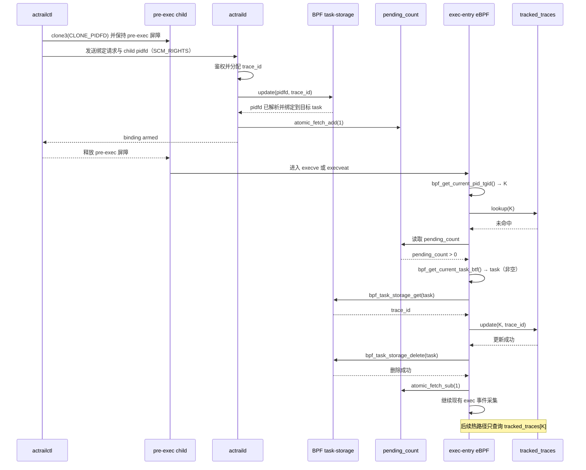

# Pidfd 驱动的 Launch 追踪注册流程

## 目标与范围

本文定义 `actrailctl launch` 创建的子进程在 `exec` 前完成追踪注册的目标流程，供
control plane 与 eBPF collector 的维护者实现和评审。已有进程的 `track-add` 不在
本文范围内。

`pidfd` 是稳定指向目标进程的内核句柄；BPF task-storage 只用于把 `trace_id`
一次性绑定到该进程，注册完成后由 `tracked_traces` 承担后续热路径查询。
`pending_count` 是尚未被 exec hook 消费的一次性绑定数量，由 daemon 原子加一，
由 exec hook 在完成绑定提升后原子减一。

## 运行流程



## Exec Hook 查找路径

```text
exec hook
   │
   ├─ bpf_get_current_pid_tgid() → K
   │
   └─ tracked_traces[K] lookup
          │
          ├─ 命中 → 正常处理
          │
          └─ 未命中
                 │
                 └─ 读取 pending_count
                        │
                        ├─ pending_count == 0 → 立即返回
                        │
                        └─ pending_count > 0
                               │
                               ├─ bpf_get_current_task_btf() → task（非空）
                               │
                               └─ bpf_task_storage_get(task)
                                      │
                                      ├─ 为空 → 无关进程，立即返回
                                      │
                                      └─ trace_id
                                             │
                                             ├─ tracked_traces[K] = trace_id
                                             ├─ bpf_task_storage_delete(task)
                                             ├─ atomic_fetch_sub(pending_count, 1)
                                             └─ 正常处理
```

## 必须保持的顺序

- daemon 必须在 task-storage 写入和 `pending_count` 原子加一成功后回复
  `binding armed`；daemon 的本次绑定任务到此完成。
- `actrailctl` 收到 `binding armed` 后才能释放子进程进入 `exec`。
- exec hook 必须依次完成 `tracked_traces[K]` 更新、task-storage 删除和
  `pending_count` 原子减一。

# fallback情况

`clone3(CLONE_PIDFD)` 是首选的子进程创建方式。但容器运行时的默认 seccomp
profile 可能主动让 `clone3` 返回 `ENOSYS`，即使宿主机内核实际支持该系统调用。
为了让 `seccomp-notify = "auto"` 能在这种环境中正确降级，启动流程需要提供仍然
原子返回 pidfd 的兼容路径。

目标流程如下：

```text
clone3(CLONE_PIDFD)
   │
   ├─ 成功 → 使用 clone3 返回的 child pidfd
   │
   └─ ENOSYS → clone(CLONE_PIDFD | SIGCHLD)
                    │
                    ├─ 成功 → 使用 clone 返回的 child pidfd
                    └─ 失败或未返回 pidfd → 终止本次启动并报告具体错误

获得 child pidfd
   │
   ├─ 保持 child 停在 pre-exec 屏障
   ├─ 通过 SCM_RIGHTS 将 pidfd 发送给 daemon
   ├─ daemon 完成身份校验和追踪绑定
   └─ 收到 binding armed 后释放 child 进入 exec
```

fallback 只替换创建子进程的系统调用，不改变后续身份注册流程。旧的 `clone`
路径必须使用 `CLONE_PIDFD` 原子取得 pidfd；不得退回只传递数值 PID 的注册方式，
也不得取消 pre-exec 屏障、daemon 的 pidfd 校验或 `binding armed` 的顺序约束。

当启动需要 seccomp-notify 时，取得 pidfd 后仍需执行 `pidfd_getfd`，复制 child
安装的 seccomp listener。后续行为由配置决定：

- `seccomp-notify = "auto"`：`pidfd_getfd` 不可用时，将 seccomp-notify 标记为
  不可用，重新选择不依赖 seccomp-notify 的能力组合；实际命令仍通过上述 pidfd
  fallback 路径启动。
- `seccomp-notify = "required"`：`pidfd_getfd` 不可用时直接终止启动，不能静默
  降级。

fallback 仅在 `clone3` 返回 `ENOSYS` 时触发。`EPERM`、`EACCES`、参数错误以及
其他异常不得统一解释为兼容性问题；如果旧的 `clone(CLONE_PIDFD)` 也不可用，
则说明当前环境无法满足 launch 追踪注册的 pidfd 要求，启动必须失败并保留原始
错误信息。
