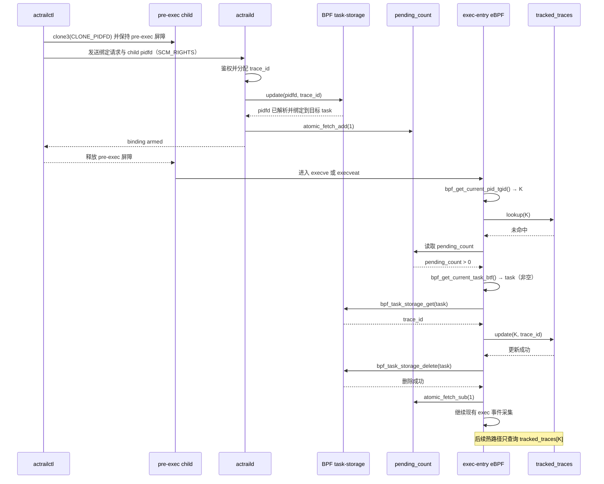

# Pidfd 驱动的 Launch 追踪注册流程

## 目标与范围

本文定义 `actrailctl launch` 创建的子进程在 `exec` 前完成追踪注册的目标流程，供
control plane 与 eBPF collector 的维护者实现和评审。已有进程的 `track-add` 不在
本文范围内。

`pidfd` 是稳定指向目标进程的内核句柄；BPF task-storage 只用于把 `trace_id`
一次性绑定到该进程，注册完成后由 `tracked_traces` 承担后续热路径查询。
`pending_count` 是尚未被 exec hook 消费的一次性绑定数量，由 daemon 原子加一，
由 exec hook 在完成绑定提升后原子减一。

## 运行流程



## Exec Hook 查找路径

```text
exec hook
   │
   ├─ bpf_get_current_pid_tgid() → K
   │
   └─ tracked_traces[K] lookup
          │
          ├─ 命中 → 正常处理
          │
          └─ 未命中
                 │
                 └─ 读取 pending_count
                        │
                        ├─ pending_count == 0 → 立即返回
                        │
                        └─ pending_count > 0
                               │
                               ├─ bpf_get_current_task_btf() → task（非空）
                               │
                               └─ bpf_task_storage_get(task)
                                      │
                                      ├─ 为空 → 无关进程，立即返回
                                      │
                                      └─ trace_id
                                             │
                                             ├─ tracked_traces[K] = trace_id
                                             ├─ bpf_task_storage_delete(task)
                                             ├─ atomic_fetch_sub(pending_count, 1)
                                             └─ 正常处理
```

## 必须保持的顺序

- daemon 必须在 task-storage 写入和 `pending_count` 原子加一成功后回复
  `binding armed`；daemon 的本次绑定任务到此完成。
- `actrailctl` 收到 `binding armed` 后才能释放子进程进入 `exec`。
- exec hook 必须依次完成 `tracked_traces[K]` 更新、task-storage 删除和
  `pending_count` 原子减一。
