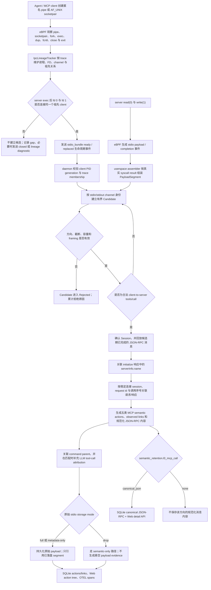
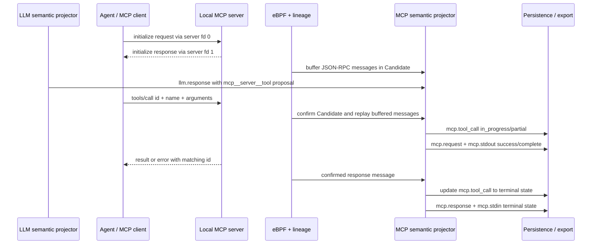
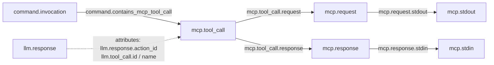

# MCP stdio 工具调用观测实现

## 1. 状态与目标

本功能在不注入 MCP client 或 server 的前提下，从 Linux 进程、匿名 IPC 和 stdio
payload 事实中识别本地 MCP `tools/call`，并把一次调用投影为可持久化、可查询和
可导出的语义图。实现遵循两个准入原则：

1. 只有能证明 server 的 fd 0、fd 1 与同一个祖先 client 进程相连时，才允许该
   stdio bundle 进入协议候选状态。
2. 只有候选流中出现合法的客户端到服务端 JSON-RPC 2.0 `tools/call` 时，才确认
   MCP 会话。`initialize`、`tools/list` 或形似 JSON 的普通 stdio 都不能单独确认。

当前只支持本地 stdio transport。远程 MCP 和没有进入 AcTrail trace 的进程链路不属于本实现范围。

## 2. 端到端实现流程图



流程中有两条相互独立但按内核时间合流的事实链：

- IPC 生命周期链负责证明“哪一个进程是 MCP server、它的 fd 0/1 连接到哪一个
  client”。
- stdio payload 链负责提供 JSON-RPC 字节、方向、时间和 payload evidence。

使用 perf buffer transport 时，不同 CPU 的 callback 不保证全局因果顺序，因此
userspace 会先按 `observed_ktime_ns` 排序，再更新 lineage 和处理 payload。ring
buffer transport 直接使用内核保留的事件顺序。

## 3. IPC lineage 与 stdio bundle

### 3.1 被观察的生命周期

| 类别 | 观察点 | 对 lineage 的影响 |
| --- | --- | --- |
| channel 创建 | `pipe`、`pipe2`、`AF_UNIX socketpair` | 建立稳定 channel id，并登记两个 endpoint 的方向、owner 与 `CLOEXEC` 状态。 |
| 进程传播 | `sched_process_fork` | child 继承 parent 的 FD binding，并记录祖先关系。 |
| FD 变更 | `dup`、`dup2`、`dup3`、`fcntl` | 复制 binding，处理目标 FD replacement 和 `CLOEXEC`。 |
| FD 关闭 | `close`、`close_range` | 移除 binding；`CLOSE_RANGE_CLOEXEC` 只更新 exec 时关闭标志。 |
| 执行边界 | `sched_process_exec` | 清理 `CLOEXEC` FD，记录 server exec 时间并重新计算 bundle。 |
| 退出边界 | `sched_process_exit` | 关闭 server bundle，移除进程，并刷新受 peer 退出影响的 bundle。 |

进程身份使用 host PID 加非零 generation，避免 PID 复用把不同进程拼接到同一个
lineage。channel id 同时包含创建进程身份、创建时的内核时间和两个初始 FD。MCP
runtime 使用 stdin/stdout channel id 对作为稳定连接身份，因此 fork、exec、dup 产生
的新进程观察别名不会重置同一连接的 Candidate；每条消息仍记录实际 server emitter
进程，用于 MCP server command 标记。

### 3.2 bundle 的准入条件

一个进程只有同时满足以下条件，才会产生 `channel=stdio_bundle`、
`operation=ready` 的 IPC 生命周期事件：

- 已观察到该进程的 `exec`；
- fd 0 对 server 是可读 endpoint；
- fd 1 对 server 是可写 endpoint；
- fd 0 和 fd 1 的对端 owner 都能落到同一个祖先进程；
- 可选 fd 2 若被纳入 bundle，也必须是连接到同一 client 的可写 endpoint；
- 当前 trace 未触发 lineage 的容量停用。

已存在 bundle 的 channel 或 FD 发生变化时发送 `replaced`，失去完整性或进程退出时
发送 `closed`。生命周期事件携带 `bundle_id`、stdin/stdout channel id 与 kind、
server 进程、client host PID/generation 和 exec 时间。

daemon 只有在 client PID 仍处于活动注册表、generation 一致且 client 属于同一
trace 时，才写入 `mcp.client.process_id`。语义投影优先使用该身份建立
`command.contains_mcp_tool_call`；缺少 enrichment 时才使用已观察到的 exec parent。
lineage 不把 trace root 当作唯一 client，也不使用 Agent 启动后的固定时间窗口过滤
连接：subagent 复用既有 fd 时共享同一 channel session；subagent 新建 MCP server
连接时按新的 channel 对建立独立 Candidate，并使用实际 endpoint owner 与 server
emitter 归属。

## 4. stdio payload 捕获与组装

当前 payload 路径观察 MCP server 的：

- `read(0, ...)`：syscall 成功返回后复制实际读到的字节，标记为 server stdin、
  `PayloadDirection::Inbound`；
- `write(1, ...)`：syscall 进入时暂存用户缓冲区，退出时按真实返回值裁剪，标记为
  server stdout、`PayloadDirection::Outbound`。

fd 2 的 stderr 可以被普通 stdio payload 配置捕获，但不会进入 MCP JSON-RPC
framing。

write 在 syscall 进入时先生成 staged 事件，在退出时生成 completion 事件。userspace
先用 trace、host PID/TID 和 process generation 定位 pending operation，再严格核对
sequence、namespace PID/TID、stream、fd、syscall 和 direction：

- 部分 write 只保留内核实际接受的前缀；
- 失败或零长度 write 不生成成功 payload；
- pending 容量耗尽、重复 stage、找不到 stage 的成功 completion 或字段配对冲突会
  生成截断 loss marker，并累计 `ebpf_stdio_payload_assembly_loss:*` drop counter；
- process exit 或 trace release 时仍未收到 completion 的 stage 只累计
  `abandoned_on_process_exit` / `abandoned_on_trace_release` drop counter，无法再构造可靠
  completion payload，因此不生成伪造的 loss marker；
- 单个 segment 的 eBPF ABI 上限为 4095 bytes，超过时标记 truncated。

候选期在 stdin 看到 truncated segment 会拒绝整个 candidate，因为缺失字节可能改变
`tools/call` 的准入内容。stdout 不可能承载 client-to-server 准入消息，因此 stdout
截断只清空该 stream 的候选 framing buffer，Candidate 继续等待后续完整 stdin
`tools/call`。会话确认后遇到截断、非法或超限 framing 时，也只丢弃当前 stream
buffer，不会把已确认会话重新当成候选。上述丢弃和拒绝都会持久化 trace 诊断。

## 5. MCP candidate、framing 与确认

`McpStdioSessionRegistry` 以 `(trace_id, stdin_channel_id, stdout_channel_id)` 为
session key。收到合法 `ready` 或 `replaced` 后，把实际 server 进程绑定为该连接的
别名；同一 channel 对不会重建状态。只有最后一个进程别名关闭、process exit 或 trace
finalize 时才清理连接状态。相同进程改绑到不同 channel 对时，旧连接与新连接严格
分离。

Candidate 同时维护 stdin 与 stdout 两个 framer，但先只路由 client-to-server 的
stdin。观察到第一条合法 JSON-RPC 2.0 客户端消息后，才开启该候选的 stdout 路由。
这样普通 stdio bundle 的 server 输出不会进入 JSON 解析，同时初始化后的完整双向
JSON-RPC 仍会被缓存并在确认时回放。framer 接受：

- 一行一个 JSON 值的 JSON Lines framing；
- `Content-Length: N\r\n...\r\n\r\n<body>` framing；
- JSON-RPC batch；数组中的每个 JSON-RPC 2.0 对象独立处理。

以下消息才是确认条件：

- 方向为 client-to-server，即 server fd 0 上的 inbound payload；
- `jsonrpc` 精确为 `"2.0"`；
- `method` 精确为 `"tools/call"`；
- `id` 是 string 或 number；
- `params.name` 是非空 string；
- `params.arguments` 缺省或为 object。

`initialize` request/response 会在候选确认后被回放，用相同 request id 从
`result.serverInfo.name` 提取 server name，但它不参与候选准入。普通通知、
`tools/list` 和无效 JSON-RPC 不生成 MCP action。

候选会话在以下任一条件发生时会被拒绝或无法建立：

- 超过候选累计字节上限；
- 同时等待确认的 candidate 数量达到上限；
- payload 方向与 server stdin/stdout 约定不一致；
- stdin segment 已截断；stdout 截断只重置 stdout framer，不改变 Candidate 状态；
- JSON、UTF-8、JSON Lines 或 `Content-Length` framing 非法；
- 生命周期事件缺少 bundle/channel/process 必需字段。

Rejected 状态不会继续解析 payload；新的 `replaced` 生命周期会为新 bundle 建立新
Candidate，但仅 exec 或 wrapper 变化且 stdin/stdout channel 对未变时会保留原状态。
Candidate 没有时间准入条件：Agent 启动时建立的连接可以空闲任意时长，直到合法
`tools/call`、明确拒绝条件、连接关闭或 trace 结束。

## 6. 一次 `tools/call` 的语义时序



请求和响应使用 `(稳定连接 session, request_id)` 关联。相同 request id 被再次
使用时，单调递增的 invocation sequence 保证 action id 不冲突；待响应调用按 FIFO
消费。

响应满足以下规则：

- 存在 JSON-RPC `error` 时，root、response 和 stdin 的 status 为 `error`；
- `result.isError=true` 时同样为 `error`；
- 其余带匹配 id 的 `result` 为 `success`；
- trace finalize 时仍留在 correlation state 的未响应 root 会被收口为
  `error/partial`，并设置 `actrail.action.finalized_on_trace_close=true`，不会伪造
  response 或 stdin；
- 如果最后一个 stdio bundle alias 在 trace finalize 前已关闭，当前 session 清理会先
  删除该连接的 correlation state，不会生成虚假的终态 action；此前已持久化的 root
  会保持 `in_progress/partial`。这是当前实现的生命周期边界，排查未闭合调用时不能把
  “缺少 error 终态”解释为调用成功。

## 7. 语义动作图



这里的 `mcp.stdout` 与 `mcp.stdin` 按 MCP client 视角命名：

- server fd 0 上的 client-to-server 请求被标记为 `outbound`，投影为
  `mcp.request -> mcp.stdout`；
- server fd 1 上的 server-to-client 响应被标记为 `inbound`，投影为
  `mcp.response -> mcp.stdin`。

| Action kind | 生成时机 | 状态 | Evidence role |
| --- | --- | --- | --- |
| `mcp.tool_call` | 合法 `tools/call` request | 先 `in_progress/partial`；匹配响应后为 `success/complete` 或 `error/complete` | `mcp.tool_call.payload` |
| `mcp.request` | 合法 `tools/call` request | `success/complete` | `mcp.request.payload` |
| `mcp.stdout` | 合法 `tools/call` request | `success/complete`，包含 method、direction 和 message/request id | `mcp.stdout.payload` |
| `mcp.response` | 匹配 JSON-RPC response | 与响应结果一致、`complete` | `mcp.response.payload` |
| `mcp.stdin` | 匹配 JSON-RPC response | 与响应结果一致、`complete`，包含 direction 和 message/request id | `mcp.stdin.payload` |

四条 MCP 内部 link 和 command parent link 都使用 `valid=true`、
`confidence=observed`。LLM response 与 MCP root 当前不建立独立 link，而是通过
以下属性关联：

- `llm.response.action_id`
- `llm.tool_call.id`
- `llm.tool_call.name`

LLM attribution 不是 MCP 会话确认条件；没有匹配 proposal 时仍会生成 MCP 动作图。
proposal 来自 `llm.response.tool_calls_json` 中形如
`mcp__<server>__<tool>` 的 function name。投影器同时支持“先看到 LLM proposal”和
“先看到 MCP call、稍后补到 LLM response”两种到达顺序。

SQLite codebook 保存五类 action 和五类层级 link；Web action tree 把 MCP root
挂到 command 下并展示四个 child；OTEL codec 将这些 action 编码为 span，并按上述
link role 选择父 span。

规范化 JSON-RPC 内容只关联到 `mcp.request` 和 `mcp.response`。Web 查看
`mcp.stdout` / `mcp.stdin` 时，通过 `mcp.request.action_id` /
`mcp.response.action_id` 读取同一份 request/response 内容，不为 stdio leaf 重复保存
消息。

## 8. payload 留存与 evidence

MCP 解析发生在 payload transaction 内、最终持久化之前。stdio storage mode 不改变
候选和已确认会话的语义解析资格：

| Storage mode | 原始 payload row | 原始 payload body | MCP semantic actions | Payload evidence |
| --- | --- | --- | --- | --- |
| `full` | 持久化 | 按 retention/redaction 策略保留 | 持久化 | 引用已持久化 segment |
| `metadata-only` | 持久化 | 清空 | 持久化 | 引用已持久化 segment |
| `drop` | 不持久化 | 不持久化 | 通过 semantic-only 路径持久化 | 不生成 segment evidence |

默认 `stdin_storage_mode="full"`、`stdout_storage_mode="drop"`。因此默认可保留
`tools/call` request evidence，同时仍可利用不写入原始 payload 表的 stdout response
完成 root 和 response/inbound action；semantic-only 路径不会写入指向不存在
payload row 的 evidence。

### 8.1 规范化 JSON-RPC 内容

原始 payload storage mode 与 L0 MCP 语义内容留存开关相互独立：

| `semantic_retention.l0_mcp_call` 值 | 行为 |
| --- | --- |
| `request_content="canonical_json"` | 把已准入 `tools/call` request 的完整 JSON-RPC object 关联到 `mcp.request`。 |
| `response_content="canonical_json"` | 把匹配 response 的完整 JSON-RPC object 关联到 `mcp.response`，即使原始 stdout storage mode 为 `drop`。 |
| 任一方向设为 `"none"` | 不写该方向的规范化内容；action、link、状态和允许存在的 payload evidence 不受影响。 |

`canonical_json` 使用 format version 1，递归排序 object key、保持 array 顺序，以
SHA-256 在单个 trace 内去重，并通过 action reference 关联消息。SQLite 读写时会校验
JSON-RPC 2.0 object、字节数和 hash；完整内容不会进入 OTEL span。

Web detail panel 对 `mcp.request` / `mcp.response` 优先读取规范化内容，对
`mcp.stdout` / `mcp.stdin` 则解引用对应 request/response action。未配置语义内容时，
只有存在原始 payload evidence 且 segment body 仍被保留的 action 才能回退显示原始
内容；在默认 `stdout_storage_mode="drop"` 下，response 方向通常没有该回退。Web
单次默认最多读取
4 MiB 规范化内容，超过限制时显示截断错误，不自动分页。

MCP tool arguments 和结果可能包含敏感数据。默认 stdio redaction 为 `disabled`，
且 request/response 的 L0 MCP 语义内容默认都是 `canonical_json`。部署时应根据数据
治理要求同时选择原始 stdio storage mode、每 trace retention 上限、redaction policy
和 `semantic_retention.l0_mcp_call`。关闭原始 payload 不会自动关闭规范化 JSON-RPC
内容；stdio redaction 则发生在 MCP framing 之前，规范化内容基于 redaction 后仍能
成功解析的消息。当前 `authorization-header` 是面向整行 HTTP header 的策略，不是
针对 MCP JSON 字段的脱敏规则。

### 8.2 Web action tree 可见性

后端按 `(start_time, action_id)` 组织同一 parent 下的 child，前端每页读取 100 条，
不会把 `mcp.tool_call` 提升到高于同级 file/process action 的优先级。因此一个 command
包含大量更早的文件动作时，MCP root 可能不在首个 child page，需要继续加载后续页；
这只影响 Web 可见性，不代表 SQLite、viewer action 列表或 OTEL 中缺少 MCP 语义。

## 9. 配置

以下片段列出完成本地 stdio MCP 工具调用观测所需的关键配置及当前默认值。它假设
使用默认 `default-full-monitor` capture profile；自定义 profile 还必须请求
`proc-lifecycle`、`stdio-chunk`，以及 `ipc-pipe-fifo`、`ipc-unix-socket` 中与
实际 server 启动方式对应的 capability。配置文档使用 `deny_unknown_fields`；
字段拼写错误会在加载时失败。

```toml
[ebpf.ipc_lineage]
max_processes_per_trace = 8192
max_candidate_fds_per_trace = 65536
max_stdio_bundles_per_trace = 8192

[payload.stdio]
enabled = true
capture_stdin = true
capture_stdout = true
stdin_storage_mode = "full"
stdout_storage_mode = "drop"
max_segment_bytes = 4095
pending_operation_max_entries = 8192

[payload.mcp]
enabled = true
parse_buffer_max_bytes = 4194304
stdio_candidate_max_bytes = 65536
pending_stdio_candidate_max_entries = 1024

[semantic_retention.l0_mcp_call]
request_content = "canonical_json"
response_content = "canonical_json"
```

### 9.1 MCP session 限制

| 配置项 | 默认值 | 约束与作用 |
| --- | ---: | --- |
| `payload.mcp.enabled` | `true` | 关闭后不建立 MCP stdio session，也不运行 MCP lineage admission。 |
| `payload.mcp.parse_buffer_max_bytes` | 4194304 | 已确认会话中，每个 stdin/stdout framer 可保留的最大不完整消息字节数；必须为正并能转换为平台 `usize`。 |
| `payload.mcp.stdio_candidate_max_bytes` | 65536 | 单个 Candidate 在确认前实际扫描的 stdin 与已开启 stdout 累计字节上限；必须为正且不得超过 parse buffer 上限。 |
| `payload.mcp.pending_stdio_candidate_max_entries` | 1024 | 全局同时等待确认的 stdio Candidate 上限；必须为正。 |

### 9.2 MCP 语义内容留存

| 配置项 | 默认值 | 可选值与作用 |
| --- | --- | --- |
| `semantic_retention.l0_mcp_call.request_content` | `"canonical_json"` | `"canonical_json"` 保存完整规范化 request；`"none"` 不保存。 |
| `semantic_retention.l0_mcp_call.response_content` | `"canonical_json"` | `"canonical_json"` 保存完整规范化 response；`"none"` 不保存。 |

未知值或字段会在配置加载时失败。这里没有“跟随 stdio storage mode”的隐式值，必须
显式按数据治理目标配置两层留存。

### 9.3 IPC lineage 限制

| 配置项 | 默认值 | 容量达到时的行为 |
| --- | ---: | --- |
| `ebpf.ipc_lineage.max_processes_per_trace` | 8192 | 停用该 trace 的 lineage，发送 `lineage_disabled`。 |
| `ebpf.ipc_lineage.max_candidate_fds_per_trace` | 65536 | 停用该 trace 的 lineage，关闭活跃 bundle 并发送诊断。 |
| `ebpf.ipc_lineage.max_stdio_bundles_per_trace` | 8192 | 不接纳新的受影响 bundle，发送 `lineage_capacity_exhausted`，不伪造 MCP session。 |

三个值都必须为正。lineage 容量耗尽不会回退到“解析所有 stdio”，因为那会把普通
终端输出误识别为协议流。

### 9.4 stdio 开关的组合语义

- eBPF collector、`payload.stdio.enabled`、`payload.mcp.enabled` 和
  `payload.stdio.capture_stdin` 必须同时启用，collector 才建立 MCP IPC lineage。
- 完整的 request/response 五动作图还要求 `payload.stdio.capture_stdout=true`。
- `capture_stdout=false` 时仍可能确认 request，但无法观察 response；未闭合 root
  只有在 correlation state 保留到 trace finalize 时才按 `error/partial` 收口；若最后
  一个 bundle alias 先关闭，则保持 `in_progress/partial`，详见第 6 节。
- `capture_stderr` 与 MCP framing 无关。
- `max_segment_bytes` 必须为正；实际 copy 上限是
  `min(payload.stdio.max_segment_bytes, 4095)`。配置大于 4095 不会扩大 eBPF ABI，
  更大的 JSON-RPC 消息可以由多个完整 segment 组装。Candidate 的 stdin segment
  截断会拒绝候选；Candidate 的 stdout segment 截断只重置 stdout framer，让后续
  完整 stdin `tools/call` 仍可完成准入；已确认会话的截断只重置受影响 stream。

## 10. 诊断与拒绝语义

实现不会在协议证据不足时猜测或回退。排查时应按实际链路逐层定位：

| 层级 | 代表性诊断或计数 | 含义 |
| --- | --- | --- |
| kernel transport | `stdio_pending_update_fail`、`stdio_read_user_fail` | eBPF 无法登记 pending operation 或复制用户内存。 |
| userspace assembly | `ebpf_stdio_payload_assembly_loss:*` | stage/completion 容量、缺失、冲突或进程/trace 提前结束。 |
| IPC lineage | `ebpf_stdio_bundle_lineage_gap:<reason>` | 缺少进程身份、祖先 peer、stdin/stdout、方向，或 lineage 容量耗尽。 |
| MCP lifecycle/capacity | `mcp_stdio_lifecycle_contract_gap`、`mcp_stdio_capacity_exhausted` | bundle contract 缺失、lineage 被停用，或 bundle/Candidate 容量达到上限；不回退解析普通 stdio。 |
| MCP Candidate | `mcp_stdio_candidate_rejected`；reason 为 `candidate_size_limit`、`candidate_truncated`、`stdio_direction_mismatch` 等 | 候选未满足可靠协议准入条件；诊断不可恢复。 |
| MCP Candidate stream | `mcp_stdio_candidate_stream_discarded`；reason=`candidate_truncated`、stream=`stdout` | 候选 stdout 出现 ABI 截断；只重置 stdout framer，候选仍可由后续完整 stdin `tools/call` 确认。 |
| MCP framing | `invalid_json`、`invalid_utf8_framing`、`invalid_content_length*`、`framing_size_limit` | JSON-RPC framing 非法或超出配置。 |
| confirmed session | `mcp_stdio_confirmed_stream_discarded`、`confirmed_parse_discards` | 已确认会话丢弃非法、截断或超限的当前 stream buffer；诊断标记为可恢复。 |

`ready` 之前出现的 stdio 会累计为 `untracked_stdio`，不会被补解析。出现问题时应先
确认实际运行路径是否依次产生 IPC creation、fork/exec、`stdio_bundle ready`、
stdin/stdout payload 和 `tools/call`，再调整容量；不存在可放大的 Candidate timeout，
长期空闲连接应继续保持 Candidate。MCP runtime 诊断以 `RuntimeDropped/Warning`
写入对应 trace，metadata 包含 `code`、`component=mcp_stdio`、`stage`、`reason`、
`recoverable`，有明确 stream 时还包含 `stream`。

## 11. 真实 Agent 端到端验证

仓库提供两个真实 Agent 测例，都会启动仓库自带的本地 stdio MCP probe server，
让 Agent 真实发现并调用 `emit_marker`，再核验 trace、payload、LLM attribution 和
五动作语义图。

```bash
sudo -E python3 tests/v2/regression/test_all.py --case probe_claude_mcp
sudo -E python3 tests/v2/regression/test_all.py --case probe_codex_mcp
```

单测例入口和环境变量见：

- [Probe Claude MCP](../../../tests/v2/regression/probe_claude_mcp/README.zh.md)
- [Probe Codex MCP](../../../tests/v2/regression/probe_codex_mcp/README.zh.md)

验收至少包括：

- probe server 只执行一次预期 `tools/call` 并返回成功；
- trace 最终为 `Exited/Clean`；
- 恰好一个 `mcp.tool_call` 和四个预期 child，全部为终态；
- command parent、四条 MCP 内部 link、action id 交叉引用唯一且有效；
- root 关联真实 `llm.response` 及精确 LLM tool-call id/name；
- `stdout_storage_mode=drop` 时不持久化 stdout payload，且所有实际存在的 evidence
  都引用已持久化 segment。

当前两个真实 Agent 测例还会让 `tools/list` response 超过 4095-byte capture ABI
上限，断言 `mcp_stdio_candidate_stream_discarded` / `candidate_truncated` 已持久化，并
验证后续完整 `tools/call` 仍可确认 Candidate。

当前真实 Agent 测例不覆盖 `Content-Length` framing、JSON-RPC batch、socketpair、
error response、无响应关闭、request id 复用、`metadata-only`/非默认留存组合，也不
直接断言 canonical JSON-RPC SQLite 表或 Web detail API。没有这些 E2E 证据时，不能
把源码支持说明扩展为相应场景已经完成真实 Agent 验收。

## 12. 主要实现路径

| 层级 | 路径 | 职责 |
| --- | --- | --- |
| eBPF ABI 与 tracepoints | `crates/adapters/collectors/ebpf/bpf/actrail_file.h`、`live_observation.bpf.c`、`payload/actrail_stdio_payload.h` | 捕获 IPC/FD 生命周期及 read/write payload/completion。 |
| collector assembly | `crates/adapters/collectors/ebpf/src/collector/stdio_payload.rs` | 有界配对 staged write 和 completion，生成完整或显式截断的 payload。 |
| IPC lineage | `crates/adapters/collectors/ebpf/src/decode/file_path/lineage/` | 跟踪进程、FD、channel、bundle 生命周期和降级诊断。 |
| 配置解析 | `crates/core/config/src/daemon/payload.rs`、`daemon/agent.rs`、`daemon/operator/document/payload.rs`、`daemon/operator/document/semantic.rs` | 定义 MCP 容量、stdio 原始留存和 L0 canonical JSON-RPC 留存。 |
| MCP session/framing | `crates/core/semantic_action_runtime/src/live/mcp/session.rs`、`session/`、`framing.rs`、`model.rs` | Candidate 生命周期、双流 framing、准入和 request id/session identity。 |
| MCP action/attribution/content | `crates/core/semantic_action_runtime/src/live/mcp/action.rs`、`attribution.rs`、`content/mod.rs` | correlation、五动作图、LLM proposal 归因和 canonical JSON-RPC 投影。 |
| daemon enrichment/diagnostics | `crates/apps/daemon/src/services/live/batch.rs`、`live/mcp_diagnostics.rs` | 校验 client generation/trace membership，并把 runtime 诊断写入 trace。 |
| daemon payload persistence | `crates/apps/daemon/src/services/payload/transaction.rs`、`payload/transaction/semantic_persistence.rs` | 协调 retained 与 semantic-only stdio 投影，避免悬空 evidence。 |
| semantic contract | `crates/contracts/semantic_action/src/` | MCP action kind、attribute、evidence role 和 link role。 |
| SQLite action/content | `crates/storage/adapters/sqlite/src/semantic_actions/`、`semantic_actions/mcp_jsonrpc_content/` | 保存 action/link 及内容寻址的 canonical JSON-RPC，并在读取时校验完整性。 |
| OTEL export | `crates/export/adapters/otel_codec/src/service.rs` | 导出 MCP action spans 和父子关系；不导出 canonical JSON-RPC body。 |
| Web backend/frontend | `crates/apps/web/src/view/actions.rs`、`crates/apps/web/src/http.rs`、`crates/apps/web/frontend/src/mcp/`、`components/McpInsightPanel.vue` | action tree、canonical content API、client/server stdio 视角与 MCP detail 展示。 |
| real-agent regression | `tests/v2/regression/probe_claude_mcp/`、`probe_codex_mcp/`、`tests/v2/common/mcp_test_support/` | 使用真实 Claude/Codex 验证完整行为。 |
