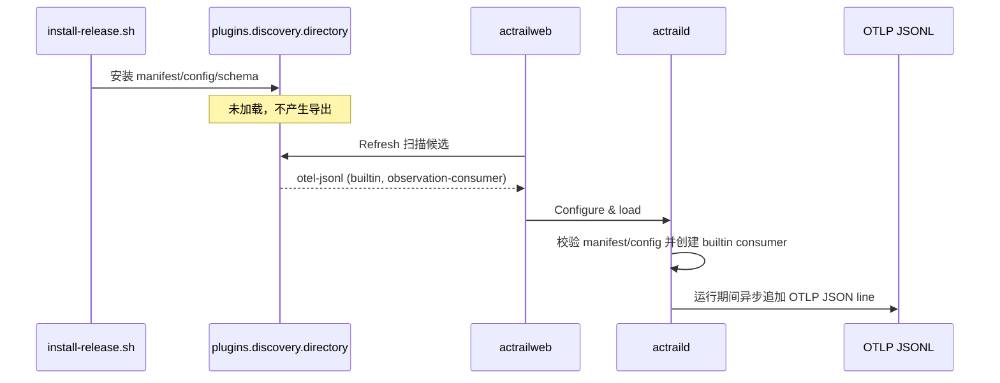

# 内置 OTEL JSONL 插件候选发现设计

## 状态

候选发现已采纳并实现；静态入口移除与 action kind 配置待实现。

## 背景

AcTrail 已有 `otel-jsonl` builtin observation consumer。它在 trace 运行期间异步消费
semantic action，并将选中的 action 编码成一行 OTLP JSON。该能力通过
manifest/config 和统一插件生命周期加载，不提供独立的 operator export route。

Web 的 **Plugin candidates** 不枚举 `actraild` 内部注册的 builtin。它只扫描 `plugins.discovery.directory` 的直接子目录，并要求每个包恰好包含一个 `*.plugin.toml`。原有 `examples/plugins/builtin/otel-jsonl` 使用 `plugin.toml`，缺少 README 所引用的 `config.toml`，release 安装器也不复制这个目录。因此，正常安装后的用户无法从候选列表发现已有导出能力。

## 目标

- release 安装后，`otel-jsonl` 出现在 Web 的 **Plugin candidates**。
- 候选默认不加载，不因安装而创建文件或开始导出。
- Web、CLI 和 `[plugins.startup]` 继续走同一套 manifest/config/plugin lifecycle。
- builtin 实现继续位于 `actraild`，候选包不复制代码或引入伪 artifact。
- 给出可直接使用且通过 schema 校验的默认配置。

## 非目标

- 不新增 Wasm exporter。
- 不新增 OTLP/HTTP exporter。
- 不改变 JSONL 编码、异步队列、覆盖或 flush 语义。
- 不让 Web 自动加载任何导出插件。
- 不新增独立的 builtin catalog API。

## 方案

release 安装器将以下描述包复制到 `${ACTRAIL_PLUGIN_DIR:-$HOME/.actrail/plugins}/otel-jsonl`：

```text
otel-jsonl/
├── otel-jsonl.plugin.toml
├── otel-jsonl.config.toml
└── otel-jsonl.config.v1.schema.json
```

`otel-jsonl.plugin.toml` 声明：

- `id = "otel-jsonl"`
- `role = "observation-consumer"`
- `runtime = "builtin"`
- 无 host capability
- TOML 配置为必需

manifest 基名与配置基名一致，因此现有目录发现器可直接解析配置。schema 与 manifest 位于同一包内，符合候选资产不能逃逸包目录的约束。

默认配置为：

```toml
path = "/var/lib/actrail/export/live-spans.otlp.jsonl"
overwrite_enabled = true
queue_capacity = 1024
flush_every_spans = 1

[action_kinds]
default = false
"process.exec" = true
"process.exit" = true
"agent.identity" = true
"agent.exit" = true
"file.modify" = false
"file.read" = false
"file.write" = false
"file.bulk_read" = false
"fs.enumerate" = false
"http.message" = false
"llm.call" = true
"llm.request" = true
"llm.response" = true
"sse.stream" = false
"sse.event" = false
"enforcement.decision" = true
"process.fork_attempt" = false
"agent.invocation" = true
"command.invocation" = true
```

`file.tty_io` 由 recording 层在上游永久过滤，不出现在插件 schema 或默认配置中。
安装只写入描述包；只有插件实例成功加载后才读取配置、创建 exporter 队列并打开
输出文件。

## 生命周期



## 启动入口

`[export.runtime]` 不保留为兼容入口。启动时加载和运行期动态加载统一使用：

```text
otel-jsonl/otel-jsonl.plugin.toml
otel-jsonl/otel-jsonl.config.toml
```

候选包仅安装而未加载时，不要求校验其运行期配置，不创建输出文件，也不启动
exporter。

## 验收

1. `install-release.sh` 将三个描述文件安装到同一 `otel-jsonl` 包目录。
2. 目录扫描将该包识别为 activation-ready：
   - plugin ID 为 `otel-jsonl`
   - runtime 为 `builtin`
   - purpose 为 `observation-consumer`
   - config 路径存在
   - 无 capability/grant 阻塞
3. 未加载时不会创建默认输出文件。
4. Web 加载成功后实例出现在 loaded instances，不再出现在 candidates。
5. 运行 trace 后，输出文件出现 OTLP JSONL，实例 `observed_records` 增长。
6. 卸载后停止接收新 batch；刷新后候选重新出现。
