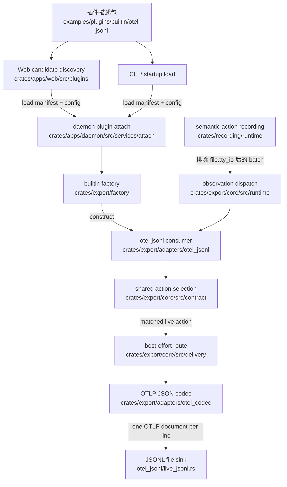

# OTEL JSONL 插件关键文件路径

## 文档目的

本文索引整个 `otel-jsonl` 插件从配置资产、候选发现、加载、semantic action 交付、
OTLP 编码到 JSONL 写出的关键文件路径。

本文只说明：

- 文件或目录在哪里；
- 每个路径承担什么职责；
- 路径之间如何依赖；
- 目标设计落在哪些文件。

具体配置协议、过滤语义和验收规则见
[Semantic action kind 选择策略设计](action-kind-selection.zh.md)。候选包的安装与发现
方案见 [内置插件候选发现设计](builtin-candidate-discovery.zh.md)。

## 端到端路径



上半部分是插件发现与实例构造链路，下半部分是 live JSONL 数据流。本次只实现
live 插件筛选；`actrailviewer export-otel` 不在本次修改范围内。

## 插件描述包与安装

| 路径 | 职责 |
| --- | --- |
| `examples/plugins/builtin/otel-jsonl/otel-jsonl.plugin.toml` | 声明插件 ID、role、builtin runtime 和 config schema 引用。 |
| `examples/plugins/builtin/otel-jsonl/otel-jsonl.config.toml` | 官方默认插件配置。 |
| `examples/plugins/builtin/otel-jsonl/otel-jsonl.config.v1.schema.json` | 校验官方 TOML 配置对应的数据结构。 |
| `examples/plugins/builtin/otel-jsonl/README.zh.md` | 面向使用者的加载与配置示例。 |
| `examples/plugins/README.zh.md` | 官方示例插件总索引。 |
| `scripts/install-release.sh` | 把 manifest、config 和 schema 安装到插件发现目录。 |

安装后的目标包布局：

```text
${ACTRAIL_PLUGIN_DIR}/otel-jsonl/
├── otel-jsonl.plugin.toml
├── otel-jsonl.config.toml
└── otel-jsonl.config.v1.schema.json
```

该目录不包含 WASM artifact。插件执行代码编译在 `actraild` 依赖的 Rust crate 中。

## 插件 contract 与 manifest

| 路径 | 职责 |
| --- | --- |
| `crates/core/plugin_system/src/observation.rs` | 定义 observation consumer、batch、event family 和消费报告。 |
| `crates/core/plugin_system/src/manifest/declarations.rs` | 定义 manifest 中 observation role、subscription 和 plugin config 字段。 |
| `crates/core/plugin_system/src/manifest/validation.rs` | 校验 builtin observation consumer manifest，并解析订阅范围。 |
| `crates/core/plugin_system/src/lib.rs` | 对其他 crate 暴露 plugin system contract。 |

`otel-jsonl` 使用这些公共 contract，但不得在 `plugin_system` 中放置 OTEL 或 JSONL
专用逻辑。

## Web 候选发现

| 路径 | 职责 |
| --- | --- |
| `crates/apps/web/src/plugins/package.rs` | 扫描插件目录、解析候选包资产并判断是否可加载。 |
| `crates/apps/web/src/plugins/` | Web 插件工作区后端的候选与生命周期逻辑。 |
| `crates/apps/web/frontend/src/workspaces/plugins/PluginConfigItem.vue` | 递归渲染 JSON Schema 声明的通用插件配置字段。 |
| `crates/apps/web/frontend/src/workspaces/plugins/PluginConfigPanel.vue` | 展示、校验并提交 schema-driven 插件配置。 |

Web 使用 manifest、config 和 schema 完成发现与配置交互，配置校验和更新仍通过
daemon 插件接口执行。Web 不执行 OTEL 编码，也不包含 builtin exporter 实现。

## Daemon 加载与配置校验

| 路径 | 职责 |
| --- | --- |
| `crates/apps/daemon/src/services/attach/plugin_config.rs` | 读取插件 config/schema，执行格式解析与 JSON Schema 校验。 |
| `crates/apps/daemon/src/services/attach/plugins.rs` | 处理插件加载、配置、状态和卸载流程。 |
| `crates/apps/daemon/src/services/attach/` | daemon 插件 attach 服务边界。 |

daemon attach 层负责通用插件生命周期，不在这里实现 action kind 匹配或 JSONL
写入。

## Builtin 插件构造

| 路径 | 职责 |
| --- | --- |
| `crates/export/factory/src/builder.rs` | 根据 builtin plugin ID 构造 `otel-jsonl` observation consumer。 |
| `crates/export/factory/src/lib.rs` | 暴露 export factory 入口。 |
| `crates/export/factory/Cargo.toml` | 声明 factory 对 plugin system、export core 和 OTEL JSONL adapter 的依赖。 |

这里是 `runtime = "builtin"` manifest 与 Rust 实现连接的位置。旧 operator
`[export.runtime]` route 构造入口已删除，不再与插件加载共用配置类型。

## OTEL JSONL adapter

| 路径 | 职责 |
| --- | --- |
| `crates/export/adapters/otel_jsonl/src/config.rs` | 定义并解析 `OtelJsonlExporterConfig`。 |
| `crates/export/adapters/otel_jsonl/src/live_jsonl.rs` | 实现 builtin observation consumer、异步 route adapter 和 JSONL file sink。 |
| `crates/export/adapters/otel_jsonl/src/lib.rs` | 暴露 config、builder 和插件解析入口。 |
| `crates/export/adapters/otel_jsonl/Cargo.toml` | 声明 adapter 对 export core、OTLP codec 和 plugin system 的依赖。 |

action kind 选择设计主要修改 `config.rs` 与 `live_jsonl.rs`。配置在前者进入类型系统，
选择在后者进入异步 route 前执行。

## Export core

| 路径 | 职责 |
| --- | --- |
| `crates/export/core/src/contract/action_kind_selection.rs` | 放置 live exporter 使用的共享 action kind selection contract。 |
| `crates/export/core/src/contract/adaptor.rs` | 定义 semantic action export adapter 接口。 |
| `crates/export/core/src/contract/record.rs` | 定义交给 exporter 的 semantic action record。 |
| `crates/export/core/src/contract/error.rs` | 定义 export error。 |
| `crates/export/core/src/contract/mod.rs` | 聚合 export contract。 |
| `crates/export/core/src/delivery/best_effort.rs` | 实现有界队列与 best-effort delivery。 |
| `crates/export/core/src/runtime/route.rs` | 定义 semantic action export route。 |
| `crates/export/core/src/runtime/subscription.rs` | 把 semantic action batch 分发给 observation consumers。 |
| `crates/export/core/src/runtime/subscription_slot.rs` | 管理 consumer slot、订阅和生命周期状态。 |
| `crates/export/core/src/runtime/subscription_worker.rs` | 在线程中执行 observation consumer。 |
| `crates/export/core/src/lib.rs` | 暴露共享 export contract 与 runtime。 |
| `crates/export/core/Cargo.toml` | 声明 export core 的依赖边界。 |

共享 selection contract 位于 `export_core`，避免匹配语义沉入 JSONL sink；未来
viewer 如需筛选必须复用该 contract，但本次不修改 viewer。

## Semantic action 来源

| 路径 | 职责 |
| --- | --- |
| `crates/contracts/semantic_action/src/model.rs` | 定义 `SemanticActionKind`、canonical 字符串和 action 模型。 |
| `crates/contracts/semantic_action/src/lib.rs` | 暴露 semantic action contract。 |
| `crates/recording/runtime/src/semantic/export.rs` | 把 recording 产生的 semantic action batch 交给 export runtime。 |

action kind 的唯一枚举来源是 `SemanticActionKind`。recording 层在
`crates/recording/runtime/src/semantic/export.rs` 中排除高频 `file.tty_io`；该保护
必须原样保留，禁止移动到 consumer 或 exporter queue 之后。

## OTLP 编码

| 路径 | 职责 |
| --- | --- |
| `crates/export/adapters/otel_codec/src/service.rs` | 把 semantic action 与 links 渲染成 OTLP JSON document 或 JSON line。 |
| `crates/export/adapters/otel_codec/src/serialize.rs` | 提供 OTLP JSON 属性与值序列化工具。 |
| `crates/export/adapters/otel_codec/src/lib.rs` | 暴露 OTLP renderer。 |
| `crates/export/adapters/otel_codec/Cargo.toml` | 声明 codec 依赖。 |

codec 只编码已经选中的 action，不拥有插件配置和 action kind policy。

## Operator 配置

| 路径 | 职责 |
| --- | --- |
| `crates/core/config/src/daemon/operator/document/base.rs` | 删除 operator document 中的 runtime OTEL JSONL route。 |
| `crates/apps/daemon/src/services/wiring.rs` | 创建空 export runtime，等待插件生命周期注册 consumer。 |
| `crates/apps/ctl/src/clean.rs` | 删除从静态 route 配置读取 OTEL JSONL 输出路径的逻辑。 |

`[export.runtime]` 不保留为兼容入口。插件未加载时不解析 `otel-jsonl` plugin
config，也不创建 exporter。

## 离线 OTEL 导出

| 路径 | 职责 |
| --- | --- |
| `crates/apps/view/src/command.rs` | 定义当前 `actrailviewer export-otel` 命令参数。 |
| `crates/apps/view/src/storage/export_otel.rs` | 当前从 storage 读取完整 actions 和 links，并直接调用 OTLP renderer。 |
| `crates/apps/view/Cargo.toml` | 声明 viewer 当前导出路径的依赖。 |
| `crates/adapters/export/otel/src/lib.rs` | 暴露 storage-backed viewer 使用的 OTLP export API。 |

这些路径本次不修改。未来 viewer 增加筛选时必须复用 export core 的 selection
contract。

## 插件测试

| 路径 | 职责 |
| --- | --- |
| `tests/v2/regression/plugins/otel-jsonl/` | 端到端覆盖：通过 Web API 更新选择配置，并验证实际 OTEL JSONL kind 集合。 |
| `tests/plugins/otel-jsonl/` | 既有 builtin 插件生命周期覆盖，按新必填配置做必要适配。 |
| `tests/plugins/dynamic-builtin/` | 既有动态加载覆盖，按新必填配置做必要适配。 |
| `tests/plugins/persistent-load/` | 既有持久化恢复覆盖，按新必填配置做必要适配。 |
| `crates/export/adapters/otel_jsonl/src/config.rs` | 保留并调整现有 config parsing 测试。 |

禁止新增 schema 与 enum 逐项相等的一致性单元测试，禁止为每个 boolean 组合增加
单元测试，也不为现有通用 Web checkbox 新建测试框架。

以下目录包含旧 live OTEL route 配置，需要随静态入口删除而清理：

```text
deploy/container-auto/
examples/plugins/
examples/traces/
tests/agent-trace/
tests/enforcement/
tests/payload/
tests/process/
tests/performance/
tests/plugins/
docs/examples/
docs/llm-capture/
```

真正依赖 live OTEL 的场景迁移到插件加载；未启用 exporter 的配置只删除失效 route，
不得添加 `action_kinds`。

## 用户与设计文档

| 路径 | 职责 |
| --- | --- |
| `docs/designs/plugins/otel-jsonl/README.zh.md` | 本设计目录索引。 |
| `docs/designs/plugins/otel-jsonl/builtin-candidate-discovery.zh.md` | builtin 候选发现与安装设计。 |
| `docs/designs/plugins/otel-jsonl/action-kind-selection.zh.md` | action kind selection 的配置与运行语义。 |
| `docs/designs/plugins/otel-jsonl/targeted-file-paths.zh.md` | 整个插件及关键邻接模块的路径索引。 |
| `docs/plugins/operator-manual.zh.md` | 插件运维手册。 |
| `docs/usage.md` | live 与 offline OTEL 导出使用说明。 |
| `docs/deployment.md` | release 安装和部署说明。 |

## 变更落点

action kind selection 设计涉及的改动只在这里列路径，不重复具体方案：

```text
新增
└── crates/export/core/src/contract/action_kind_selection.rs

删除
├── crates/export/factory/src/config.rs
└── crates/export/factory/src/parser.rs

修改
├── crates/contracts/semantic_action/src/model.rs
├── crates/export/core/src/contract/mod.rs
├── crates/export/core/src/lib.rs
├── crates/export/adapters/otel_jsonl/src/config.rs
├── crates/export/adapters/otel_jsonl/src/live_jsonl.rs
├── crates/export/adapters/otel_jsonl/src/lib.rs
├── crates/export/factory/src/builder.rs
├── crates/export/factory/src/lib.rs
├── crates/core/config/Cargo.toml
├── crates/core/config/src/daemon.rs
├── crates/core/config/src/daemon/operator.rs
├── crates/core/config/src/daemon/operator/document.rs
├── crates/core/config/src/daemon/operator/document/base.rs
├── crates/apps/daemon/src/bin/actraild/entry.rs
├── crates/apps/daemon/src/bootstrap.rs
├── crates/apps/daemon/src/services/wiring.rs
├── crates/apps/ctl/src/clean.rs
├── crates/apps/web/frontend/src/workspaces/plugins/PluginConfigItem.vue
├── examples/plugins/builtin/otel-jsonl/otel-jsonl.config.toml
├── examples/plugins/builtin/otel-jsonl/otel-jsonl.config.v1.schema.json
├── deploy/container-auto/
├── docs/examples/container-agent-minimal/
├── docs/examples/container-agent-restricted/
├── tests/v2/regression/plugins/otel-jsonl/
├── 受新必填插件配置影响的既有 lifecycle fixtures
└── 旧 [export.runtime] operator configs 与相关文档
```

## 维护约束

- 本文件新增内容必须以真实文件路径或目标文件路径为中心。
- 配置字段语义、算法、接口草案和验收标准不得复制到本文件。
- 新增插件子模块时更新对应路径与一句话职责。
- 文件移动或删除时同步更新本索引。
- 具体设计发生变化时修改对应设计文件，不在本文件追加第二份设计。
