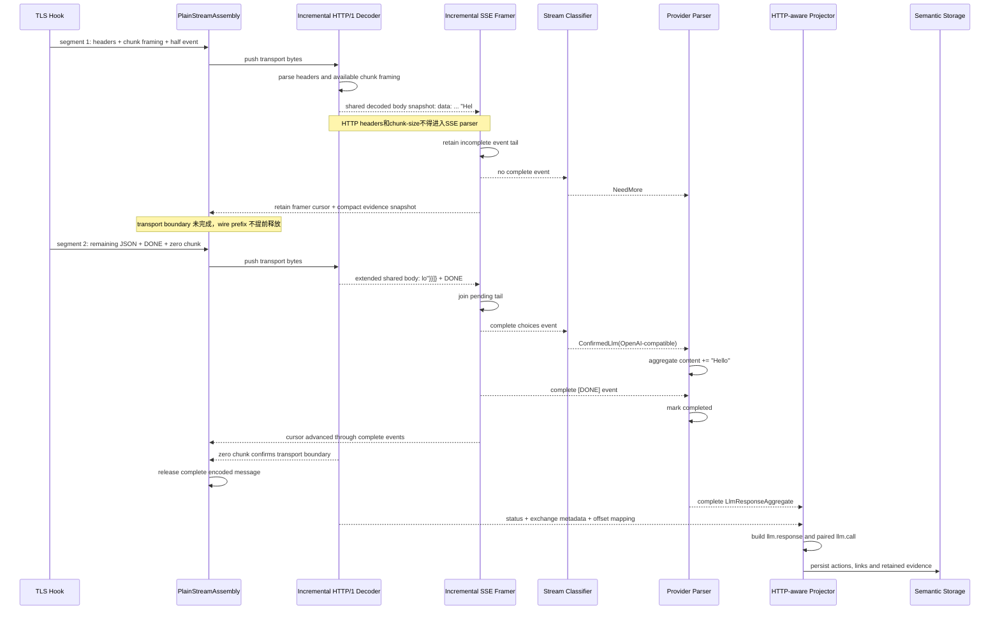
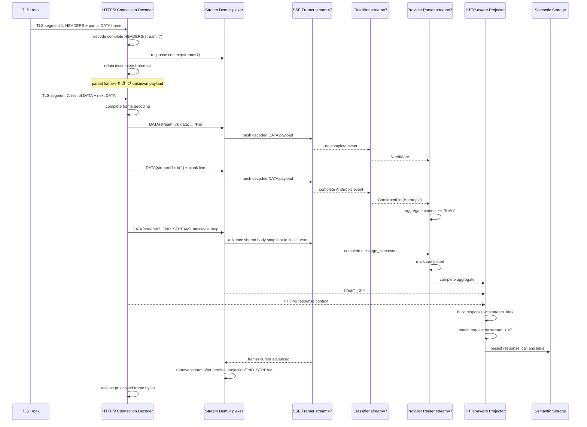
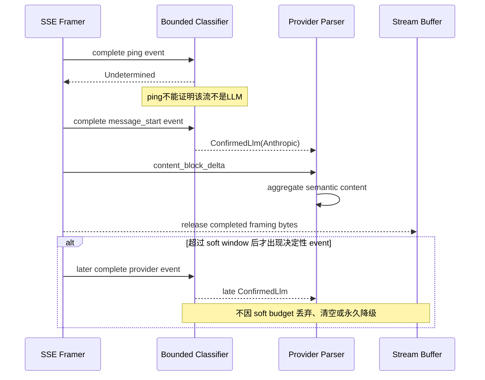
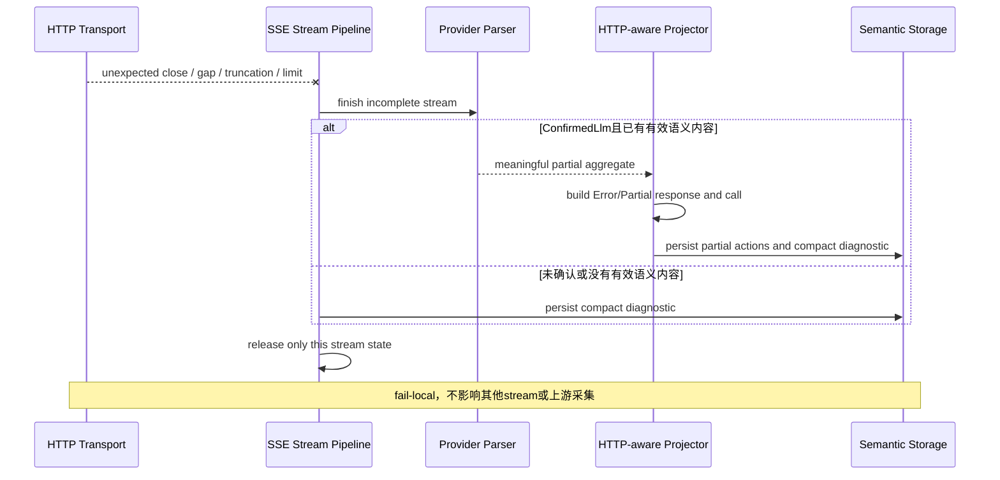

# Streaming parser 数据流时序

本文定义 LLM 流式响应的目标数据处理流程。配套文档包括 [容器图](container.puml)、[组件图](component.puml) 和 [分层职责](layer.md)。

核心约束是：HTTP transport 必须先归一化，SSE framer 只能消费连续的 decoded body；provider parser 只聚合语义，`SemanticAction` 必须由掌握 HTTP exchange context 的 projector 生成。

## HTTP/1.1 chunked SSE

下面的响应在一个 SSE JSON event 中间发生 TLS 分片：

```text
TLS segment 1:
HTTP/1.1 200 OK\r\n
Transfer-Encoding: chunked\r\n
Content-Type: text/event-stream\r\n
\r\n
31\r\n
data: {"choices":[{"delta":{"content":"Hel

TLS segment 2:
lo"}}]}\n\n
12\r\n
data: [DONE]\n\n
0\r\n\r\n
```



第一段的半个事件只能进入 `SseFramer.pending_event`，不能参与 provider 分类。第二段补全空行终止符后，framer 才交付完整 event。

目标接口形态：

```rust
fn push_http1_transport(bytes: &[u8]) {
    assembly.append(bytes);
    if let Some(message) = http1_decoder.advance(assembly.remaining(), false)? {
        let events = sse_framer.advance(&message.body)?;
        provider.observe(events);
        if message.complete { assembly.release(message.encoded_len); }
    }
}
```

## HTTP/2 SSE

HTTP/2 同时存在 frame 跨 TLS callback 和 SSE event 跨 DATA frame 两种边界。connection decoder 必须先拼出完整 frame，再按 `stream_id` 解复用。



每个 HTTP/2 stream 必须拥有独立 pipeline：

```rust
struct Http2StreamPipeline {
    stream_id: u32,
    response_context: Http2ResponseContext,
    sse: IncrementalSseFramer,
    classification: StreamClassification,
    provider: Option<Box<dyn ProviderStreamParser>>,
    aggregate: LlmResponseAggregate,
}
```

`stream_id` 由 transport/projector 层持有，不能依赖 SSE parser 重建。

## LLM SSE soft-window 分类

首个完整 event 可能只是 Anthropic `ping`，因此一次未识别不能进入永久 fallback。16 KiB 是初始识别 soft window，不是数据保留或丢弃阈值。



建议状态模型：

```rust
enum StreamClassification { Undetermined, ConfirmedLlm }
```

`Undetermined` 的 raw assembly 仍受 `max_buffer_bytes` 与 `max_segment_ranges` 硬限制。达到硬限制时只 fail-local 当前 stream；不得让故障传播到 payload ingestion、其他 HTTP/2 stream 或 daemon。

## 关闭、截断与超限

DONE、HTTP/2 `END_STREAM`、trace close、capture gap、payload truncation 和配置上限都必须进入同一个 finalizer。



## 每次推进后的资源不变量

每次 `push` 返回前必须满足：

1. transport decoder 使用 cursor，已完成 frame 会及时释放；HTTP/1 wire message 在边界确认后整体释放。
2. SSE framer 只扫描累计 body 的新增后缀，不重复复制或全量解析既有 event。
3. provider parser 只保留聚合语义与协议状态，不保留所有 raw events。
4. 只有证明完整的 encoded message/frame prefix 才从 assembly buffer 释放。
5. evidence 使用 compact span mapping；是否保留原 payload 由 retention 配置决定。
6. 任一 stream 的 malformed/limit/close 只终止该 stream，并尽可能生成 partial action。
