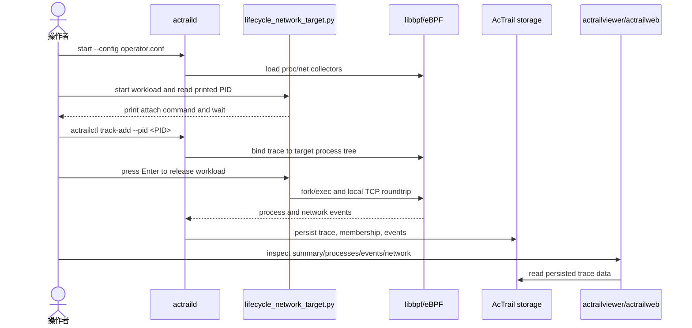

# AcTrail Quick Start

这份文档用于手动端到端验证：

```text
actraild -> libbpf eBPF collector -> ingest -> AcTrail storage -> actrailviewer/actrailweb
```

当前验证目标是 Linux/WSL 下的真实采集路径，不是 mock 测试。`actraild` 预期由管理员或 root 运行。

如果目标是最大化打开进程、网络、文件、stdio、socket、TLS 明文、HTTP/HTTP2/SSE 和资源指标采集，请参考全量采集示例：[08.full-monitor-validation](../08.full-monitor-validation/README.md)。

测试流程：



## 1. 构建

在仓库根目录执行：

```bash
cargo build --release
```

构建完成后使用这些二进制：

```text
./target/release/actraild
./target/release/actrailctl
./target/release/actrailviewer
./target/release/actrailweb
```

这些入口都支持顶层和子命令帮助，不需要先启动 daemon：

```bash
./target/release/actraild -h
./target/release/actraild start -h
./target/release/actrailctl track-add -h
./target/release/actrailviewer network -h
./target/release/actrailviewer payloads -h
./target/release/actrailviewer payload -h
./target/release/actrailviewer export-json -h
./target/release/actrailweb -h
```

## 2. 使用本例配置

本例的 operator config 已放在同一目录，后续命令都直接使用这份配置：

```text
docs/examples/01.quick-start/operator.conf
```

这份配置会使用这些关键路径：

```text
socket_path = /tmp/actrail.sock
pid_file = /tmp/actraild.pid
storage_path = /tmp/actrail.sqlite
web_listen_addr = 127.0.0.1:18080
web_request_read_timeout_ms = 1000
export_directory = /tmp/actrail-export
log_path = /tmp/actraild.log
diagnostic_log_level = info
```

这些路径分别承担不同职责：

| Key | 用途 | 生命周期 |
| --- | --- | --- |
| `socket_path` | `actraild` 控制面 Unix Domain Socket；`actrailctl` 通过它发送 `doctor`、`track-add`、`track-remove`、`list-traces` 等控制命令 | 运行态文件；`actraild stop` 会删除 |
| `pid_file` | `actraild start/stop/status/restart` 用来判断 daemon 进程状态的 PID 文件 | 运行态文件；`actraild stop` 会删除 |
| `storage_path` | AcTrail storage 路径；当前实现使用 SQLite，采集到的 trace、membership、event、diagnostic 会写入这里 | 验证数据；`actraild stop` 不删除 |
| `web_listen_addr` | `actrailweb --config` 使用的只读 Web UI 监听地址；可用 `--addr` 和 `--port` 临时覆盖 | 运行参数；来自配置文件 |
| `web_request_read_timeout_ms` | `actrailweb` 等待单个 HTTP connection 发出请求行的最长时间；示例值 `1000` 用于避免浏览器空闲预连接阻塞 UI | 运行参数；来自配置文件 |
| `export_directory` | `actrailviewer export-json` 未显式传 `--output` 时，导出 JSON graph 的默认目录 | 验证产物；`actraild stop` 不删除 |
| `otel_live_export_*` | 默认关闭的实时 OTEL JSONL span sink；开启时每行写一个 OTLP span document | 验证产物；`actrailctl clean` 会清理启用时的输出文件 |
| `log_path` | `actraild start` 后台运行时 stdout/stderr 的追加写入位置，用来排查启动和运行失败 | 日志文件；`actraild stop` 不删除 |
| `diagnostic_log_level` | daemon 诊断日志级别：`off`、`info`、`debug`；排查采集失败时临时设为 `debug` | 运行参数；来自配置文件 |

如果这些路径已经被其他运行中的 AcTrail 使用，请先换成一组新的 `/tmp/...` 路径。`actraild start` 会 fail-fast，不会自动删除已有 socket 或 stale pid file。

JSON export 默认不包含 payload 原文。需要把 retained payload 直接带进 JSON graph 时，显式设置 `export_payload_bytes_enabled = true` 和/或 `export_payload_text_enabled = true`；前者写入 `bytes_base64`，后者写入 UTF-8 text 视图。

配置中的 `file_path_capture_enabled` 控制是否 attach path-carrying file syscall tracepoints，例如 `openat`、`unlinkat`、`renameat` 和 `mkdirat`。开启后 AcTrail 的 BPF 程序只发送 raw enter/exit 事实，路径解析、fd/cwd 跟踪和事件语义在 userspace 完成。`file_path_max_bytes` 控制这类事件最多复制的可见路径字节数；默认 `255`，也是当前 eBPF file-path ABI 的编译上限。

配置还包含默认关闭的 TLS plaintext payload 采集配置：

| Key | 用途 |
| --- | --- |
| `payload_tls_enabled` | 是否启用 TLS plaintext payload 采集；默认 `false` |
| `payload_tls_capture_backend` | TLS 捕获后端；当前 LLM TLS plaintext 推荐 `tls-sync`，由 `actrailctl launch` 在 exec 前准备 preload runtime、sync event socket 和 finder fast probe plan。Go `go-pclntab` 使用 `bpf-copy-seccomp-fallback` 的 entry direct-copy 路径。旧的 `seccomp-user-read` / `bpf-copy-seccomp-fallback` TLS 后端用于特定调试或历史配置，不作为 examples 的默认 LLM TLS 路径 |
| `payload_tls_source` | `shared-library` 表示 attach 动态 TLS shared library；`executable` 表示 attach 目标可执行文件 |
| `payload_tls_resolver` | `openssl-symbols` 按 TLS 符号 attach；`boringssl-patterns` 按外部 pattern 文件解析 executable offset；`bun-static-boringssl` 按带 build-id 的 Bun/BoringSSL symbol map 解析 executable offset；`boringssl-static` 按内置 x86_64/aarch64 BoringSSL read/write 关联入口检测 executable offset；`rustls-symbol-map` 按带 build-id 的 rustls symbol map 解析 executable offset；`go-pclntab` 按 Go `.gopclntab` 解析 `crypto/tls.(*Conn).Write`、`crypto/tls.(*Conn).Read` 和 `runtime.memmove` executable offset |
| `payload_tls_library` | 当前支持 `openssl`、`boringssl`、`rustls` 和 `go` |
| `payload_tls_library_path` | `shared-library` 模式下的 libssl 路径；`auto` 表示通过 `ldconfig -p` 确定，找不到会 fail-fast |
| `payload_tls_binary_path` | `executable` 模式下的目标 binary 路径；未使用时写 `disabled` |
| `payload_tls_pattern_path` | `boringssl-patterns` resolver 的 pattern 文件路径；`bun-static-boringssl` 和 `rustls-symbol-map` resolver 的 symbol map 路径；`boringssl-static`、`go-pclntab` 和未使用时写 `disabled` |
| `payload_tls_max_segment_bytes` | 非 sync TLS 后端的单个 BPF direct-copy segment 最大复制字节数；`tls-sync` 下保留该 key 以保持配置面完整 |
| `payload_tls_max_operation_bytes` | 单次 TLS plaintext operation 最大保留字节数；默认 `4194304`，用于完整保留 4MB 以内的常见 LLM request |
| `payload_tls_ring_buffer_bytes` | payload 启用时 eBPF ring buffer 容量 |
| `payload_tls_pending_operation_max_entries` | TLS 函数 enter/exit pending map 容量 |
| `payload_tls_seccomp_syscall` | 旧 TLS seccomp 后端监听的 syscall 集合；`tls-sync` 不依赖这些 syscall，但宽采集配置可能仍因 socket fallback 或 process exec context 启用 seccomp |
| `seccomp_notify_reserved_listener_fd` | seccomp notify 路径使用的 reserved fd；`tls-sync` 本身不需要它，socket large-payload fallback 或 process seccomp 配置仍可能使用 |
| `payload_tls_retention_max_bytes_per_trace` | 单个 trace 可保留的 payload 字节上限；超过会 fail-fast |
| `payload_tls_redaction_policy` | 默认 `authorization-header`，入库前改写 Authorization header |
| `payload_tls_sync_runtime_library_path` | TLS sync backend 的 preload runtime 路径；`auto` 使用构建产物 |
| `payload_tls_sync_event_socket_path` | TLS sync runtime 上报 payload event 的 Unix socket 路径 |
| `payload_tls_sync_socket_mode_octal` | TLS sync event socket 的八进制权限模式 |
| `payload_tls_sync_match_limit` | `actrailctl launch` 调 finder fast 检测 TLS 点位时允许返回的最大匹配数 |

配置还包含默认关闭的 stdio payload 采集配置：

| Key | 用途 |
| --- | --- |
| `payload_stdio_enabled` | 是否启用 stdin/stdout/stderr syscall payload 采集；默认 `false` |
| `payload_stdio_capture_stdin` | 启用后是否采集 fd `0` 的 read bytes；默认 `false` |
| `payload_stdio_capture_stdout` | 启用后是否采集 fd `1` 的 write bytes；默认 `true` |
| `payload_stdio_capture_stderr` | 启用后是否采集 fd `2` 的 write bytes；默认 `true` |
| `payload_stdio_max_segment_bytes` | 单个 stdio payload segment 最大复制字节数；默认 `4095`，也是当前 eBPF stdio payload ABI 的编译上限 |
| `payload_stdio_ring_buffer_bytes` | stdio payload 启用时参与计算的 eBPF ring buffer 容量；实际 ring buffer 取基础事件、TLS payload、stdio payload 配置中的最大值 |
| `payload_stdio_pending_operation_max_entries` | stdio read/write enter/exit pending map 容量 |
| `payload_stdio_stream_state_max_entries` | stdio stream sequence map 容量 |
| `payload_stdio_retention_max_bytes_per_trace` | 单个 trace 可保留的 stdio payload 字节上限；超过会 fail-fast |
| `payload_stdio_redaction_policy` | 入库前应用的 payload redaction policy；默认 `authorization-header` |

配置还包含默认关闭的 HTTP socket plaintext payload 采集配置：

| Key | 用途 |
| --- | --- |
| `payload_socket_enabled` | 是否启用 socket syscall plaintext payload 采集；默认 `false` |
| `payload_socket_capture_backend` | socket payload 搬运后端；默认 `bpf-copy-seccomp-fallback`，不超过 `payload_socket_max_segment_bytes` 的 payload 走 BPF direct-copy，更大的 outbound HTTP 候选走 seccomp user-read |
| `payload_socket_max_segment_bytes` | 单个 socket payload BPF direct-copy 最大复制字节数；默认 `4095`，也是当前稳定 socket payload event ABI 上限 |
| `payload_socket_max_operation_bytes` | socket user-read 单次 operation 最大读取字节数；默认 `4194304`，因此 4MB 以内的 HTTP LLM request 可完整保留，超过该值会标记为 partial/truncated |
| `payload_socket_ring_buffer_bytes` | socket payload 启用时参与计算的 eBPF ring buffer 容量；默认 `2097152`；实际 ring buffer 取基础事件、TLS payload、stdio payload、socket payload 配置中的最大值 |
| `payload_socket_pending_operation_max_entries` | socket send/recv/read/write enter/exit pending map 容量 |
| `payload_socket_stream_state_max_entries` | socket fd generation、stream sequence 和 userspace HTTP sniffing 状态容量 |
| `payload_socket_retention_max_bytes_per_trace` | 单个 trace 可保留的 socket payload 字节上限；超过会 fail-fast |
| `payload_socket_redaction_policy` | 入库前应用的 payload redaction policy；默认 `authorization-header` |
| `payload_socket_http_sniff_max_bytes` | 单条 socket stream 在被判定为 HTTP 或非 HTTP 前最多暂存的字节数；非 HTTP bytes 不进入 payload storage |
| `payload_socket_seccomp_syscall` | socket large-payload user-read 监听 syscall；默认重复配置 `write` 和 `sendto` |

配置还包含默认关闭的 application protocol analyzer 配置：

| Key | 用途 |
| --- | --- |
| `application_protocol_enabled` | 是否启用从已保留 plaintext payload 派生应用层事件的总开关；默认 `false` |
| `application_protocol_http1_enabled` | 是否解析 HTTP/1.x request/response/SSE semantic events；默认 `false` |
| `application_protocol_http2_enabled` | 是否解析 HTTP/2 connection preface、frame 和 DATA frame facts；默认 `false` |
| `application_http_capture_host` | 是否把 HTTP/1.x `Host` header 写入 semantic event metadata |
| `application_http_sse_enabled` | 是否从 `text/event-stream` response body 中派生 SSE event rows |
| `application_http_sse_data_policy` | SSE `data:` 字段保留策略；`disabled` 不保留预览，`preview` 只保留配置长度内的预览 |
| `application_http_sse_max_buffer_bytes` | 单个 trace/stream/direction 的 HTTP/SSE 解析缓冲上限 |
| `application_http_sse_max_data_bytes` | `application_http_sse_data_policy = preview` 时单条 SSE data preview 的最大字节数 |
| `application_http2_max_frame_bytes` | 单个 HTTP/2 frame payload 的最大解析长度；超过会清理当前方向的 HTTP/2 解析缓存，daemon 继续运行 |
| `application_http2_max_connection_buffer_bytes` | 单个 trace/process/stream 的 HTTP/2 connection buffer 上限；超过会清理当前方向的 HTTP/2 解析缓存，daemon 继续运行 |
| `application_http2_emit_data_preview` | 是否把 UTF-8 HTTP/2 DATA frame body 预览写入 Application event metadata；默认 `false` |
| `application_http2_max_data_preview_bytes` | 启用 DATA preview 时单条 preview 的最大字节数；同时作为 HTTP/2 body retention 的 LLM 分类探测窗口，窗口内仍不能证明是 LLM 的 stream 会进入 summary-only |

配置还包含默认关闭的资源采样配置：

| Key | 用途 |
| --- | --- |
| `resource_metrics_enabled` | 是否为请求了 `resource-metrics` 的 trace 启用 `/proc` 周期采样；默认 `false` |
| `resource_metrics_interval_ms` | 采样间隔，必须为正数 |
| `resource_metrics_include_children` | 是否把 trace membership 中的子进程 RSS/VSZ/CPU 累计到 root process tree |
| `resource_metrics_include_system` | 是否在 Resource event metadata 中加入 `/proc/meminfo` 和 `/proc/loadavg` 的 host-side 指标 |
| `resource_metrics_cpu_alert_percent_millis` | CPU 使用率告警阈值，单位是 percent * 1000；`disabled` 表示不启用 |
| `resource_metrics_memory_alert_rss_kb` | RSS 告警阈值，单位 KiB；`disabled` 表示不启用 |

## 3. 启动 Daemon

终端 A：

```bash
./target/release/actraild --config docs/examples/01.quick-start/operator.conf start
./target/release/actraild --config docs/examples/01.quick-start/operator.conf status
```

期望看到类似输出：

```text
actraild started pid=<PID> socket=/tmp/actrail.sock
actraild running pid=<PID> socket=/tmp/actrail.sock
```

检查控制面：

```bash
./target/release/actrailctl doctor --config docs/examples/01.quick-start/operator.conf
```

期望看到：

```text
collectors=ebpf plugins= storage_ready=true
```

如果要清理上一次运行留下的 socket、pid、SQLite、log 和导出目录，可以直接按配置执行本地清理命令：

```bash
./target/release/actrailctl clean --config docs/examples/01.quick-start/operator.conf
```

## 4. 启动 Workload

终端 B：

```bash
python3 docs/examples/01.quick-start/lifecycle_network_target.py
```

程序会打印一条可直接复制到另一个终端的 attach 命令，然后停住等待：

```text
copy this command in another terminal:
./target/release/actrailctl track-add --config docs/examples/01.quick-start/operator.conf --pid <PID>
press Enter after actrailctl reports the trace is Active...
```

这表示目标进程已经启动，但还没有执行子进程和网络 workload；此时先不要按 Enter，切到终端 C attach。

## 5. Attach Trace

终端 C：

```bash
./target/release/actrailctl track-add --config docs/examples/01.quick-start/operator.conf --pid <PID>
```

期望看到：

```text
trace trace-<N> entered Active
```

记录这里的 `<N>`。下面示例用 `<N>` 表示实际 trace id 数字。

`--name` 是可选项；不传时 `actrailctl` 会使用 `pid-<PID>` 作为 trace 显示名。

确认 trace 已进入列表：

```bash
./target/release/actrailctl list-traces --config docs/examples/01.quick-start/operator.conf
```

## 6. 释放 Workload

回到终端 B，按 Enter。期望看到：

```text
server_pid=<SERVER_PID> listen=127.0.0.1:<SERVER_PORT>
client_pid=<CLIENT_PID>
workload complete
```

这个 workload 会由 root 目标进程 fork/exec 两个子进程：server 子进程负责 `accept/recv/send`，client 子进程负责 `connect/send/recv`。server 使用 `127.0.0.1:0` 监听，端口由内核分配；client 连接到这个 server 端口，所以 `connect` 的远端端口和 `accept` 里看到的客户端临时端口不是同一个值，这是同一条 TCP 连接的两个方向。

再回到终端 C：

```bash
./target/release/actrailctl list-traces --config docs/examples/01.quick-start/operator.conf
```

期望 trace 进入 `Completed`。当前健康状态可能显示 `Degraded`，端到端验证重点是采集事件已经写入 AcTrail storage。

## 7. 查看采集结果

`actrailviewer` 通过配置里的 `storage_path` 读取 AcTrail storage，不需要先导出 JSON。把 `<N>` 替换为 `track-add` 返回的 trace id 数字：

```bash
./target/release/actrailviewer traces --config docs/examples/01.quick-start/operator.conf
./target/release/actrailviewer summary --config docs/examples/01.quick-start/operator.conf --trace-id <N>
./target/release/actrailviewer processes --config docs/examples/01.quick-start/operator.conf --trace-id <N>
./target/release/actrailviewer events --config docs/examples/01.quick-start/operator.conf --trace-id <N>
./target/release/actrailviewer network --config docs/examples/01.quick-start/operator.conf --trace-id <N>
./target/release/actrailviewer diagnostics --config docs/examples/01.quick-start/operator.conf --trace-id <N>
```

`events` 应能看到 `fork`、`exec`、`exit`、`connect`、`accept`、`send`、`recv`。`network` 应能看到 `SIDE`、`LOCAL`、`REMOTE` 和 syscall 结果；例如 `connect` 的 `REMOTE` 是 server 监听端口，`accept` 的 `REMOTE` 是 client 的临时端口。

数据量较大时，用 `--head <n>` 或 `--tail <n>` 限制输出：

```bash
./target/release/actrailviewer events --config docs/examples/01.quick-start/operator.conf --trace-id <N> --tail 20
./target/release/actrailviewer network --config docs/examples/01.quick-start/operator.conf --trace-id <N> --head 20
```

如果使用默认 `/etc/actrail/actraild.conf`，上面的 `--config docs/examples/01.quick-start/operator.conf` 可以省略。`--storage-path <PATH>` 只用于临时覆盖配置中的 storage 路径。

## 8. 可选：打开 Web UI

`actrailweb` 是只读 UI，通过配置里的 `storage_path` 读取 AcTrail storage，不需要先导出 JSON：

```bash
./target/release/actrailweb --config docs/examples/01.quick-start/operator.conf
```

如果默认端口已被占用，不要改代码，直接用 CLI 覆盖配置里的监听地址或端口：

```bash
./target/release/actrailweb --config docs/examples/01.quick-start/operator.conf --addr <ADDR> --port <PORT>
```

`actrailweb` 是前台只读服务，启动成功后终端会停留在运行状态，并打印：

```text
actrailweb listening on http://<ADDR>:<PORT> storage=/tmp/actrail.sqlite
actrailweb is running; press Ctrl-C to stop
```

然后打开：

```text
http://<ADDR>:<PORT>
```

UI 会展示 trace 列表、指标摘要、agent-centered action swimlane/tree、搜索过滤和右侧详情面板。当前 Web 主视图以存储中的 semantic action/action-link 为中心；低层事件、payload 和 process snapshot 作为被选节点的 evidence/detail 展示。点击带 payload evidence 的节点会读取对应 payload segment 文本。

## 9. 可选：启用 Resource Metrics

如果要观察 trace 进程树的 CPU/RSS/VSZ 周期样本，在 `docs/examples/01.quick-start/operator.conf` 中加入 capability 并启用 sampler：

```text
required_capability = resource-metrics

resource_metrics_enabled = true
resource_metrics_interval_ms = 1000
resource_metrics_include_children = true
resource_metrics_include_system = true
resource_metrics_cpu_alert_percent_millis = disabled
resource_metrics_memory_alert_rss_kb = disabled
```

重新启动 daemon 后，在第 5 步 attach 成功后先等待至少一个 `resource_metrics_interval_ms`，再回到 workload 按 Enter。之后用同一份配置查看：

```bash
./target/release/actrailviewer events --config docs/examples/01.quick-start/operator.conf --trace-id <N> --tail 20
./target/release/actrailweb --config docs/examples/01.quick-start/operator.conf
```

`actrailviewer events` 应出现 `Resource process_tree pid:<PID>`。Web UI 会在 trace 指标和选中节点的详情/JSON 中展示同一份资源采样数据；资源采样没有独立的旧版 Resources tab。

## 10. 可选：验证 Payload

HTTPS/TLS plaintext、HTTP/1.x semantic events 和 HTTP/2 frame/DATA payload 有独立示例，配置和脚本都放在 `docs/examples/02.llm-http-payload-capture/` 下。非 TLS HTTP socket plaintext payload 使用同一套 viewer 结果面，对应示例在 `docs/examples/05.http-payload-unified/`。quick-start 保持为进程生命周期和本地网络采集的最小路径。

## 11. 可选：导出 Trace

把 `<N>` 替换为 `track-add` 返回的 trace id 数字：

```bash
./target/release/actrailviewer export-json --config docs/examples/01.quick-start/operator.conf --trace-id <N> --output local/quick-start.json
```

期望看到：

```text
exported trace-<N> to local/quick-start.json
```

导出 JSON 是数据交换能力，不属于 `actrailctl` 控制面，也不是 `actrailviewer` 查看采集结果的前置步骤。`actrailviewer export-json` 通过配置读取 AcTrail storage；如果目标文件已经存在会 fail-fast，不会覆盖。

## 12. 停止 Daemon

终端 A 或 C：

```bash
./target/release/actraild --config docs/examples/01.quick-start/operator.conf stop
./target/release/actraild --config docs/examples/01.quick-start/operator.conf status
```

期望看到：

```text
actraild stopped pid=<PID>
actraild stopped
```

`stop` 会清理运行态的 pid file 和 socket。AcTrail storage、导出 JSON 和 log 是验证产物，不会被自动删除。

## 13. 常见失败

### daemon `bind: Address already in use`

说明 `socket_path` 已存在或仍被 daemon 使用。先执行：

```bash
./target/release/actraild --config docs/examples/01.quick-start/operator.conf status
```

如果确认没有 daemon 正在使用该 socket，再显式处理残留文件，或改用新的 `socket_path`。

### actrailweb bind failed

说明 `web_listen_addr` 或 CLI 覆盖后的地址端口已经被另一个进程占用。停止旧的 `actrailweb`，或用 `--addr <ADDR> --port <PORT>` 临时换一个监听地址端口后重新启动。

### `stale pid_file`

说明 pid file 指向的进程已经不存在。AcTrail 不会自动删除 stale pid file；确认没有 daemon 正在运行后再显式处理，或改用新的 `pid_file`。

### `Operation not permitted`

通常是 eBPF 权限问题。确认你是在管理员/root 环境运行 `actraild`，并且当前 WSL/Linux 内核支持所需 eBPF 能力。

### `payload_tls_library_path`

启用 `payload_tls_enabled = true` 且 `payload_tls_source = shared-library` 后，`auto` 会通过 `ldconfig -p` 查找 `libssl.so`。如果目标把 TLS 库静态链接进 executable，应切换到 `payload_tls_source = executable` 并显式配置 `payload_tls_binary_path` 和相应 resolver。

### `storage path does not exist`

说明配置里的 `storage_path` 还没有生成，或者你用的 `--config` 不是启动 daemon 时的同一份配置。先确认 `actraild start` 使用的配置文件，再运行：

```bash
./target/release/actrailviewer traces --config docs/examples/01.quick-start/operator.conf
```
