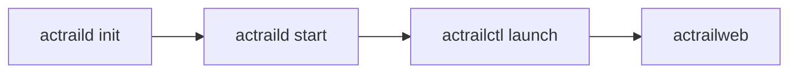

# AcTrail Quick Start

This quick start takes a source checkout to a visible trace in `actrailweb` using the default operator config:



Use a disposable development host or workload. The default config enables broad collection and can persist plaintext payloads, including prompts, API keys, Authorization headers, and model responses.

## Prerequisites

- Linux or WSL with the kernel support required by AcTrail collectors.
- Root or equivalent privileges for `actraild` and traced launches.
- Release binaries under `target/release/`.

From a source checkout, build the release binaries first:

```bash
cargo build --release
```

If the build fails because native packages, frontend assets, or the Java JSSE payload agent are missing, install the prerequisites described in the repository README and platform documentation, then rerun the release build.

## 1. Initialize The Default Config

Generate the default operator config:

```bash
sudo ./target/release/actraild init
```

This writes `/etc/actrail/actraild.conf`. The default config uses:

- `/run/actrail/` for daemon runtime files and control sockets.
- `/var/lib/actrail/` for SQLite storage and exports.
- `/var/log/actrail/` for daemon logs.

If a previous local run already created the config and you want to regenerate it:

```bash
sudo ./target/release/actraild init --force
```

## 2. Start The Daemon

Start `actraild` with the default config:

```bash
sudo ./target/release/actraild start
sudo ./target/release/actraild status
```

Expected status:

```text
actraild running pid=<PID> socket=/run/actrail/control.sock
```

Check the control plane:

```bash
sudo ./target/release/actrailctl doctor
```

Expected output includes:

```text
storage_ready=true
```

## 3. Launch A Traced Command

Use `actrailctl launch` so AcTrail prepares trace membership, TLS sync, seccomp integration, and capability selection before the child process starts:

```bash
sudo ./target/release/actrailctl launch --name quickstart -- \
  bash -lc 'echo ACTRAIL_QUICKSTART_OK; id >/dev/null; ls /etc/hosts >/dev/null'
```

Expected output includes:

```text
trace trace-<N> entered Active
ACTRAIL_QUICKSTART_OK
```

The command exits quickly. AcTrail finalizes the trace after the launched process tree exits.

## 4. Open The Web UI

Start the read-only Web UI:

```bash
sudo ./target/release/actrailweb
```

`actrailweb` runs in the foreground. Keep this terminal open while using the UI; press `Ctrl-C` when finished.

Open:

```text
http://127.0.0.1:18080
```

Select the `quickstart` trace. You should be able to inspect the traced process tree, derived actions, file evidence for `/etc/hosts`, diagnostics, and raw details.

If port `18080` is already in use, keep the default storage/config and only change the Web listener:

```bash
sudo ./target/release/actrailweb --addr 127.0.0.1 --port 18081
```

## 5. Optional CLI Check

The Web UI is the fastest inspection path. For a terminal check, list traces from the same default storage:

```bash
sudo ./target/release/actrailctl list-traces
sudo ./target/release/actrailviewer traces
sudo ./target/release/actrailviewer actions --trace-id <N> --head 40
sudo ./target/release/actrailviewer diagnostics --trace-id <N> --head 40
```

Replace `<N>` with the trace number printed by `actrailctl launch`, for example `1` for `trace-1`.

## 6. Stop And Clean Up

In another terminal, stop the daemon:

```bash
sudo ./target/release/actraild stop
```

`stop` removes daemon runtime files such as the pid file and control socket. It does not delete SQLite storage, exports, or logs.

To remove the local runtime artifacts configured by `/etc/actrail/actraild.conf`:

```bash
sudo ./target/release/actrailctl clean
```

## Next Steps

- For daily CLI usage, see [`docs/usage.md`](../../usage.md).
- For platform requirements and kernel permission checks, see [`docs/platform-requirements.md`](../../platform-requirements.md).
- For persistent host deployment, see [`docs/deployment.md`](../../deployment.md).
- For full LLM HTTP/TLS payload capture examples, see [`docs/examples/02.llm-http-payload-capture/README.md`](../02.llm-http-payload-capture/README.md).
- For a full-monitor validation run, see [`docs/examples/08.full-monitor-validation/README.md`](../08.full-monitor-validation/README.md).
