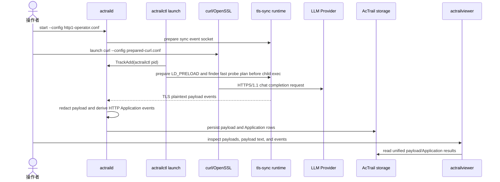
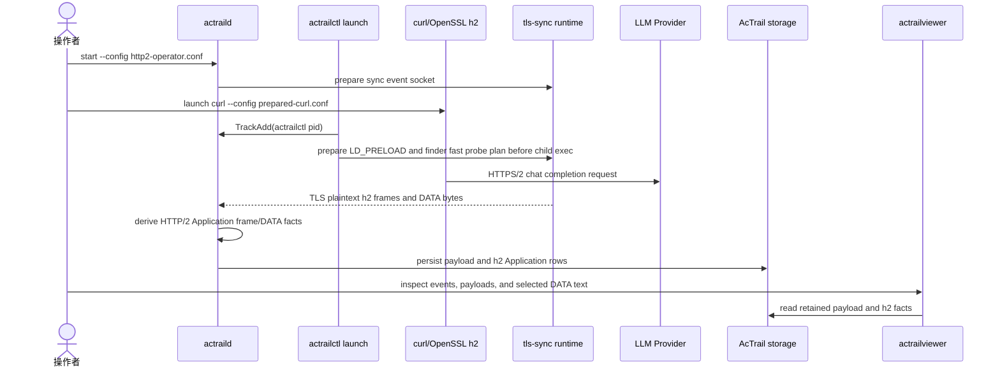
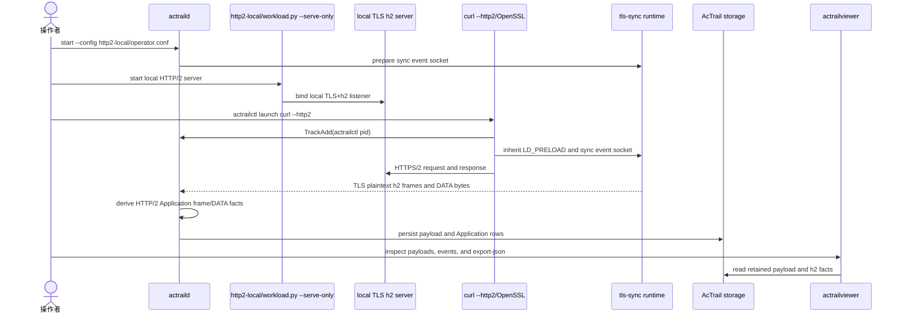

# LLM HTTP Payload And Semantics Example

这份示例用于验证：

```text
http1.sh prepare -> actrailctl launch -> curl/OpenSSL -> tls-sync runtime -> AcTrail storage -> actrailviewer
                                                                      -> HTTP/1.x semantic Application events
```

验证目标是捕捉真实发往 OpenAI-compatible LLM provider 的 outbound TLS plaintext request，并让 AcTrail 从保留的 plaintext 中派生 HTTP/1.x semantic request event。DeepSeek 只是本例的默认 provider；可以通过环境变量改成别的兼容 endpoint。服务端是否返回业务成功不是本例重点；只要 `curl` 发出了 HTTPS 请求，`actrailviewer` 就应该能看到发出的 HTTP request、JSON body，以及 `Application` domain 的 request row。`actraild` 预期由管理员或 root 运行。

HTTPS/1.1 测试流程：



## 1. 构建

在仓库根目录执行：

```bash
cargo build --release
```

本例使用这些二进制：

```text
./target/release/actraild
./target/release/actrailctl
./target/release/actrailviewer
```

## 2. 准备 Provider 环境变量

`docs/examples/02.llm-http-payload-capture/external-openai-compatible/http1.sh` 和 `http2.sh` 默认使用 DeepSeek 的 OpenAI-compatible endpoint，但这些默认值都可以用环境变量覆盖：

```bash
export DEEPSEEK_API_KEY='<your-deepseek-api-key>'
```

确认默认 key 变量存在即可，不要把真实 key 打印到终端：

```bash
test -n "${DEEPSEEK_API_KEY:-}"
```

可覆盖的环境变量如下：

| 环境变量 | 默认值 | 用途 |
| --- | --- | --- |
| `ACTRAIL_LLM_BASE_URL` | `https://api.deepseek.com` | Provider base URL，不包含 path |
| `ACTRAIL_LLM_CHAT_PATH` | `/chat/completions` | Chat completions path，必须以 `/` 开头 |
| `ACTRAIL_LLM_MODEL` | `deepseek-v4-pro` | 默认 request body 中的 `model` |
| `ACTRAIL_LLM_PROMPT` | `Hello!` 或 `Hello over HTTP/2!` | 默认 request body 中的 user prompt |
| `ACTRAIL_LLM_API_KEY_ENV` | `DEEPSEEK_API_KEY` | 保存 API key 的环境变量名 |
| `ACTRAIL_LLM_AUTH_HEADER_NAME` | `Authorization` | 认证 header 名 |
| `ACTRAIL_LLM_AUTH_SCHEME` | `Bearer` | 认证 scheme；设为空字符串时直接发送 key |
| `ACTRAIL_LLM_REQUEST_JSON` | unset | 完整覆盖 JSON request body |

如果 provider 不接受默认 OpenAI-compatible body，设置 `ACTRAIL_LLM_REQUEST_JSON` 传入完整请求体。这个变量是 workload 请求体，不是 AcTrail runtime 配置；AcTrail 本身不依赖 DeepSeek 特有字段。

`docs/examples/02.llm-http-payload-capture/external-openai-compatible/http1.sh prepare` 会生成临时 curl config 和 JSON body 文件。后续 `actrailctl launch -- curl --config "$ACTRAIL_CURL_CONFIG" --data-binary @"$ACTRAIL_CURL_BODY"` 直接观测 `curl`，同时避免把 bearer token 放进进程 argv。脚本里保留 `http1.1`，这样捕获到的 TLS plaintext 是可读 HTTP/1.1 request，而不是 HTTP/2 binary frame。

不强制 `http1.1` 时也能捕获 TLS plaintext bytes；区别是 curl 可能通过 ALPN 协商 HTTP/2。`http2.sh` 使用的是 curl 的 HTTP/2 协商模式，不是“只允许 HTTP/2”的强制模式；如果 provider、CDN 或代理路径最终协商为 HTTP/1.1，regression 会把 external HTTP/2 子检查标记为 `SKIP`，并依赖前面的 external HTTP/1.1 子检查覆盖 provider 路径。真正可重复的 HTTP/2 捕获能力由本地 `http2-local/` workload 验证。

当 ALPN 协商为 HTTP/2 时，payload 里会出现 HTTP/2 connection preface、HEADERS/DATA frames 和 JSON DATA frame body。AcTrail 可以按配置记录 HTTP/2 frame/DATA facts，但 header 仍是 HPACK 编码，当前不声明 HTTP/2 header-level semantic redaction。

## 3. 检查本例配置

本例使用同目录归档的 operator config：

```text
docs/examples/02.llm-http-payload-capture/external-openai-compatible/http1-operator.conf
```

它使用单独 `/tmp` 路径，避免和 quick start 或其他手动验证冲突。至少确认这些 key：

```text
socket_path = /tmp/actrail-llm-http-http1.sock
pid_file = /tmp/actrail-llm-http-http1.pid
storage_backend = sqlite
storage_sqlite_path = /tmp/actrail-llm-http-http1.sqlite
storage_sqlite_busy_timeout_ms = 5000
web_listen_addr = 127.0.0.1:18080
web_request_read_timeout_ms = 1000
export_directory = /tmp/actrail-llm-http-http1-export
log_path = /tmp/actrail-llm-http-http1.log
diagnostic_log_level = info

required_capability = proc-lifecycle
required_capability = net-transport
required_capability = tls-plaintext-payload
required_capability = socket-plaintext-payload
required_capability = stdio-chunk
required_capability = net-application-plaintext-http
required_capability = net-application-http2-frames

file_path_capture_enabled = false

payload_tls_enabled = true
payload_tls_capture_backend = tls-sync
payload_tls_source = shared-library
payload_tls_resolver = openssl-symbols
payload_tls_library = openssl
payload_tls_library_path = auto
payload_tls_binary_path = disabled
payload_tls_pattern_path = disabled
payload_tls_max_segment_bytes = 4095
payload_tls_max_operation_bytes = 4194304
payload_tls_ring_buffer_bytes = 1048576
payload_tls_pending_operation_max_entries = 4096
payload_tls_diagnostics_enabled = false
payload_tls_retention_max_bytes_per_trace = 10485760
payload_tls_redaction_policy = authorization-header
payload_tls_sync_runtime_library_path = auto
payload_tls_sync_event_socket_path = /tmp/actrail-http2-payload-tls-sync.sock
payload_tls_sync_socket_mode_octal = 660
payload_tls_sync_match_limit = 8

payload_stdio_enabled = true
payload_stdio_capture_stdin = false
payload_stdio_capture_stdout = true
payload_stdio_capture_stderr = true
payload_stdio_stdin_storage_mode = full
payload_stdio_stdout_storage_mode = drop
payload_stdio_stderr_storage_mode = metadata-only
payload_stdio_max_segment_bytes = 4095
payload_stdio_ring_buffer_bytes = 1048576
payload_stdio_pending_operation_max_entries = 4096
payload_stdio_stream_state_max_entries = 4096
payload_stdio_retention_max_bytes_per_trace = 10485760
payload_stdio_redaction_policy = authorization-header

payload_socket_enabled = true
payload_socket_capture_backend = bpf-copy-seccomp-fallback
payload_socket_max_segment_bytes = 4095
payload_socket_max_operation_bytes = 4194304
payload_socket_ring_buffer_bytes = 2097152
payload_socket_pending_operation_max_entries = 4096
payload_socket_stream_state_max_entries = 4096
payload_socket_retention_max_bytes_per_trace = 10485760
payload_socket_redaction_policy = authorization-header
payload_socket_http_sniff_max_bytes = 8192
payload_socket_seccomp_syscall = write
payload_socket_seccomp_syscall = sendto

application_protocol_enabled = true
application_protocol_http1_enabled = true
application_protocol_http2_enabled = true
application_http_capture_host = true
application_http_sse_enabled = false
application_http_sse_data_policy = disabled
application_http_sse_max_buffer_bytes = 1048576
application_http_sse_max_data_bytes = 4096
application_http2_max_frame_bytes = 16384
application_http2_max_connection_buffer_bytes = 1048576
application_http2_emit_data_preview = false
application_http2_max_data_preview_bytes = 4096

resource_metrics_enabled = false
resource_metrics_interval_ms = 1000
resource_metrics_include_children = true
resource_metrics_include_system = true
resource_metrics_cpu_alert_percent_millis = disabled
resource_metrics_memory_alert_rss_kb = disabled
```

关键路径含义：

| Key | 用途 |
| --- | --- |
| `socket_path` | `actraild` 控制面 Unix Domain Socket；`actrailctl` 通过它 attach trace |
| `pid_file` | `actraild start/stop/status/restart` 的进程状态依据 |
| `storage_backend` | Storage backend 实现；当前支持值为 `sqlite` |
| `storage_sqlite_path` | AcTrail storage 路径；当 `storage_backend = sqlite` 时，payload segments 会写入这里 |
| `storage_sqlite_busy_timeout_ms` | daemon 写 SQLite 时等待临时锁释放的最长时间 |
| `web_listen_addr` | `actrailweb --config` 使用的只读 Web UI 监听地址；可用 `--addr` 和 `--port` 临时覆盖 |
| `web_request_read_timeout_ms` | `actrailweb` 等待单个 HTTP connection 发出请求行的最长时间；示例值 `1000` 用于避免浏览器空闲预连接阻塞 UI |
| `export_directory` | JSON export 默认目录；本例查看 payload 不需要 JSON export |
| `[export]` / `[[export.routes]]` | 默认关闭的实时 `otel-jsonl` span sink；需要实时消费 semantic action span 时显式开启 |
| `log_path` | `actraild start` 后台运行时 stdout/stderr 追加写入位置 |
| `diagnostic_log_level` | 默认 `info`，避免逐 payload segment 打印调试日志；排查采集失败时临时改成 `debug`。`actraild start` 写入 `log_path`，`actraild ... run` 写入前台 stdout/stderr |

本例默认不把 payload 原文写入 JSON graph，也不启用实时 OTEL JSONL。如果要通过 `actrailviewer export-json` 直接导出 payload 内容，显式设置 `export_payload_bytes_enabled = true` 和/或 `export_payload_text_enabled = true`。

TLS payload 相关配置含义：

| Key | 用途 |
| --- | --- |
| `required_capability = tls-plaintext-payload` | launch 时要求 eBPF collector 支持 TLS plaintext payload |
| `required_capability = socket-plaintext-payload` | 同时启用 socket syscall payload 侧证据；HTTPS 场景下这通常是代理 CONNECT 或 TLS 密文，不替代 TLS plaintext |
| `required_capability = stdio-chunk` | 同时记录 curl stdout/stderr，证明 provider 请求真实返回了响应 |
| `required_capability = net-application-plaintext-http` | 要求 daemon 从 TLS plaintext payload 派生 HTTP/1.x semantic events |
| `payload_tls_enabled` | 启用 TLS uprobe/uretprobe payload capture |
| `payload_tls_capture_backend` | 固定为 `tls-sync`；TLS plaintext 由 preload runtime 在 TLS 明文边界同步上报 |
| `payload_tls_source` | 本例使用 `shared-library`，即动态 OpenSSL libssl |
| `payload_tls_resolver` | 本例使用 `openssl-symbols`，按 `SSL_read`/`SSL_write` 等符号 attach |
| `payload_tls_library_path` | `auto` 表示通过 `ldconfig -p` 查找 `libssl.so`；找不到会 fail-fast |
| `payload_tls_binary_path` / `payload_tls_pattern_path` | 本例不 attach executable，固定写 `disabled` |
| `payload_tls_max_segment_bytes` | 非 sync TLS 后端的单个 payload segment 最大复制字节数；`tls-sync` 下保留该 key 以保持配置面完整 |
| `payload_tls_max_operation_bytes` | 单次 TLS plaintext operation 最大保留字节数；LLM 请求超过该值会显示截断 |
| `payload_tls_seccomp_syscall` / `seccomp_notify_reserved_listener_fd` | 旧 TLS seccomp 后端和 socket large-payload fallback 的 seccomp 配置；`tls-sync` 不依赖这些 syscall 捕获 TLS plaintext |
| `payload_tls_diagnostics_enabled` | TLS payload 内部计数和元数据事件开关；常规验证保持 `false`，排查时再开启 |
| `payload_tls_retention_max_bytes_per_trace` | 单个 trace 可保留的 payload 字节上限 |
| `payload_tls_redaction_policy` | `authorization-header` 会在入库前改写 Authorization header |
| `application_protocol_enabled` | 启用应用层 analyzer；它只处理已保留的 plaintext payload，不读取密文 syscall bytes |
| `application_protocol_http1_enabled` | 启用 HTTP/1.x request/response semantic analyzer |
| `application_protocol_http2_enabled` | external provider 配置同时启用 HTTP/2 frame/DATA facts，避免协议协商和代理路径变化时只剩单通道证据 |
| `application_http_capture_host` | 把 HTTP/1.x `Host` header 写入 semantic metadata，便于 viewer/web 过滤 |
| `application_http_sse_enabled` | 本例关闭；需要观察 streaming response 时可启用 SSE event 派生 |
| `application_http_sse_max_buffer_bytes` | 单个 trace/stream/direction 的 HTTP/SSE 解析缓冲上限 |
| `application_http_sse_max_data_bytes` | SSE preview 模式下单条 `data:` 预览最大字节数；本例关闭 preview 但仍显式配置 |
| `application_http2_max_frame_bytes` | 单个 HTTP/2 frame payload 的最大解析长度；本例保留显式值以避免隐藏默认 |
| `application_http2_max_connection_buffer_bytes` | 单个 trace/process/stream 的 HTTP/2 connection buffer 上限 |
| `application_http2_emit_data_preview` | 本例关闭；启用后可把 UTF-8 DATA frame body preview 写入 metadata |
| `application_http2_max_data_preview_bytes` | 启用 DATA preview 时单条 preview 的最大字节数；同时作为 HTTP/2 body retention 的 LLM 分类探测窗口，窗口内仍不能证明是 LLM 的 stream 会进入 summary-only |

external provider 配置使用宽采集面：`payload_tls_enabled = true`、`payload_socket_enabled = true`、`payload_stdio_enabled = true`。通过条件仍然是 TLS plaintext payload 和从 plaintext 派生的 Application rows；socket payload 和 stdio payload 是排障侧证据，不能替代 `POST /chat/completions` plaintext 捕获。HTTPS 经过 HTTP proxy 时，socket payload 常见内容是 `CONNECT` 或 TLS 密文；stdio payload 只能证明 curl 收到了 provider 响应。

如果只想做最小 TLS plaintext 验证，可以关闭 socket/stdio capability 和对应 `payload_socket_*`、`payload_stdio_*` 开关；但 regression 和跨环境排障应保留宽采集面，避免 TLS join 失败时缺少证据。

本例不验证资源采样，因此 `resource_metrics_enabled = false`。这些 `resource_metrics_*` key 仍显式保留在配置里，避免运行时行为依赖隐藏默认值。

## 4. 启动 Daemon

终端 A：

```bash
./target/release/actraild --config docs/examples/02.llm-http-payload-capture/external-openai-compatible/http1-operator.conf start
./target/release/actraild --config docs/examples/02.llm-http-payload-capture/external-openai-compatible/http1-operator.conf status
```

期望看到类似输出：

```text
actraild started pid=<PID> socket=/tmp/actrail-llm-http-http1.sock
actraild running pid=<PID> socket=/tmp/actrail-llm-http-http1.sock
```

检查控制面：

```bash
./target/release/actrailctl doctor --config docs/examples/02.llm-http-payload-capture/external-openai-compatible/http1-operator.conf
```

期望看到：

```text
collectors=ebpf plugins= storage_ready=true
```

## 5. 通过 actrailctl launch 启动外部 LLM HTTP Workload

TLS plaintext payload capture uses `payload_tls_capture_backend = tls-sync`, so this example must run the workload through `actrailctl launch`. Do not use `track-add` for an already-running TLS workload; `launch` is responsible for preparing `LD_PRELOAD`, the sync event socket, and the finder fast probe plan before the child `exec`.

```bash
eval "$(bash docs/examples/02.llm-http-payload-capture/external-openai-compatible/http1.sh prepare)"
trap 'rm -rf "$ACTRAIL_CURL_TMPDIR"' EXIT
./target/release/actrailctl launch \
  --config docs/examples/02.llm-http-payload-capture/external-openai-compatible/http1-operator.conf \
  --name llm-http1 \
  -- \
  curl --config "$ACTRAIL_CURL_CONFIG" --data-binary @"$ACTRAIL_CURL_BODY"
rm -rf "$ACTRAIL_CURL_TMPDIR"
trap - EXIT
```

期望看到：

```text
trace trace-<N> entered Active
```

记录 `<N>`。下面命令都用 `<N>` 表示实际 trace id 数字。如果 API key 无效，provider 可能返回认证错误；这不影响 outbound payload 验证，本例关注的是发出的 request 是否被捕获和入库。

确认 trace 已进入列表：

```bash
./target/release/actrailctl list-traces --config docs/examples/02.llm-http-payload-capture/external-openai-compatible/http1-operator.conf
```

## 8. 查看 Payload

先看 payload 元数据：

```bash
./target/release/actrailviewer payloads --config docs/examples/02.llm-http-payload-capture/external-openai-compatible/http1-operator.conf --trace-id <N> --direction outbound --tail 5
```

期望至少看到一条 outbound `Plaintext` segment，来源是 `TlsUserSpace`，symbol 通常是 `SSL_write`：

```text
SEGMENT     PID     DIRECTION  STATE      SIZE     FLAGS                SOURCE        SYMBOL
----------  ------  ---------  ---------  -------  -------------------  ------------  ---------
payload-<M> <PID>   outbound   Plaintext  ...      Complete/Redacted    TlsUserSpace  SSL_write
```

查看该 segment 的文本，把 `<M>` 替换为上一步看到的 payload id：

```bash
./target/release/actrailviewer payload --config docs/examples/02.llm-http-payload-capture/external-openai-compatible/http1-operator.conf --trace-id <N> --segment-id <M> --format text
```

期望看到发往配置 provider 的 HTTP request。默认设置下 host 和 model 如下；如果覆盖了环境变量，按实际配置检查：

```text
POST /chat/completions HTTP/1.1
Host: api.deepseek.com
Content-Type: application/json
Authorization: <redacted>
Content-Length: ...

{"model":"deepseek-v4-pro","messages":[ ... "Hello!" ... ],"stream":false}
```

验证 bearer token 没有以原文展示：`actrailviewer payload --format text` 的输出应包含 `Authorization: <redacted>`，且不应出现 `Authorization: Bearer`。

查看 HTTP semantic events：

```bash
./target/release/actrailviewer events --config docs/examples/02.llm-http-payload-capture/external-openai-compatible/http1-operator.conf --trace-id <N> --tail 20
```

期望看到 `Application` domain rows：

```text
EVENT      DOMAIN       PID     OPERATION  DETAIL
---------  -----------  ------  ---------  --------------------------------
event-...  Application  <PID>   request    http/1.1 POST /chat/completions
```

本例的转测验收只看 outbound request payload 和 request semantic event。不要把 inbound response row 作为本例通过条件。

如果需要查看同一 trace 的生命周期和网络元数据：

```bash
./target/release/actrailviewer processes --config docs/examples/02.llm-http-payload-capture/external-openai-compatible/http1-operator.conf --trace-id <N>
./target/release/actrailviewer network --config docs/examples/02.llm-http-payload-capture/external-openai-compatible/http1-operator.conf --trace-id <N> --tail 20
```

如果此前出现过 `original_size = 4294967295` 这类错误 segment，用 viewer 的 payload 列表确认当前数据没有该问题：

```bash
./target/release/actrailviewer payloads --config docs/examples/02.llm-http-payload-capture/external-openai-compatible/http1-operator.conf --trace-id <N> --tail 20
```

期望 `SIZE` 列是正常的 `captured/original` 字节数，不应出现 `4294967295`。

## 9. 停止 Daemon

终端 A 或 C：

```bash
./target/release/actraild --config docs/examples/02.llm-http-payload-capture/external-openai-compatible/http1-operator.conf stop
./target/release/actraild --config docs/examples/02.llm-http-payload-capture/external-openai-compatible/http1-operator.conf status
```

期望看到：

```text
actraild stopped pid=<PID>
actraild stopped
```

`stop` 会清理运行态的 pid file 和 socket。AcTrail storage 和 log 是验证产物，不会被自动删除。

## 10. 常见失败

### API key 环境变量缺失

说明环境变量没有传给 `actrailctl launch` 启动的 workload shell 脚本。默认配置读取 `DEEPSEEK_API_KEY`；如果设置了 `ACTRAIL_LLM_API_KEY_ENV`，则读取该变量指向的环境变量名。在启动 `actraild` 和 `actrailctl launch` 的同一个 shell 中执行：

```bash
export DEEPSEEK_API_KEY='<your-deepseek-api-key>'
```

### `payload_tls_library_path`

启用 `payload_tls_enabled = true` 且 `payload_tls_source = shared-library` 后，`auto` 会通过 `ldconfig -p` 查找 `libssl.so`。如果当前系统没有动态链接的 OpenSSL libssl，应显式配置：

```text
payload_tls_library_path = /path/to/libssl.so
```

### 看到服务端认证错误

这通常是 API key 无效或权限不足。只要 `actrailviewer payload` 能看到 outbound `POST /chat/completions HTTP/1.1` 和 JSON body，payload capture case 就已经打通。

### HTTPS/2 Payload 示例

真实外部 provider HTTPS/2 使用同目录的 HTTP/2 operator config 和脚本，运行流程与前面的 HTTPS/1.1 相同，只替换 `--config` 和 `--script`：

真实外部 provider HTTPS/2 测试流程：



```bash
eval "$(bash docs/examples/02.llm-http-payload-capture/external-openai-compatible/http2.sh prepare)"
trap 'rm -rf "$ACTRAIL_CURL_TMPDIR"' EXIT
./target/release/actrailctl launch \
  --config docs/examples/02.llm-http-payload-capture/external-openai-compatible/http2-operator.conf \
  --name llm-http2 \
  -- \
  curl --config "$ACTRAIL_CURL_CONFIG" --data-binary @"$ACTRAIL_CURL_BODY"
rm -rf "$ACTRAIL_CURL_TMPDIR"
trap - EXIT
```

这条路径依赖当前 `curl` 支持 HTTP/2、provider API key 可用，并且 provider/CDN/代理路径实际通过 ALPN 协商到 HTTP/2。默认配置读取 `DEEPSEEK_API_KEY`；如果外部路径协商到 HTTP/1.1，regression 会跳过 external HTTP/2 子检查，而不是把 AcTrail HTTP/2 analyzer 判为失败。如果要验证一个可重复、不依赖外网或 API key 的 HTTPS/2 payload E2E，使用专门的本地 HTTPS/2 配置和 workload：

本地 HTTPS/2 测试流程：



| 文件 | 用途 |
| --- | --- |
| `docs/examples/02.llm-http-payload-capture/http2-local/operator.conf` | AcTrail operator config，启用 OpenSSL TLS plaintext payload 和 HTTP/2 frame/DATA analyzer。 |
| `docs/examples/02.llm-http-payload-capture/http2-local/workload.conf` | 本地 workload config，定义监听地址、listen backlog、证书参数、request path/body、response body 和等待时间。 |
| `docs/examples/02.llm-http-payload-capture/http2-local/workload.py` | 最薄的 server 入口：读取配置、启动本地 TLS+h2 server，并打印实际监听端口。 |

终端 A 启动 daemon：

```bash
./target/release/actraild --config docs/examples/02.llm-http-payload-capture/http2-local/operator.conf start
./target/release/actraild --config docs/examples/02.llm-http-payload-capture/http2-local/operator.conf status
```

终端 B 启动本地 TLS+h2 server。它会打印一个端口号并等待一次请求：

```bash
python3 docs/examples/02.llm-http-payload-capture/http2-local/workload.py \
  --target-config docs/examples/02.llm-http-payload-capture/http2-local/workload.conf \
  --serve-only
```

通过 `actrailctl launch` 启动 `curl`，把 `<PORT>` 替换为终端 B 打印的端口：

```bash
./target/release/actrailctl launch \
  --config docs/examples/02.llm-http-payload-capture/http2-local/operator.conf \
  --name actrail-http2-live \
  -- \
  curl --http2 --silent --show-error --insecure \
  --request POST \
  --header "Content-Type: application/json" \
  --data '{"model":"actrail-http2","messages":[{"role":"user","content":"payload capture over h2"}],"stream":false}' \
  "https://127.0.0.1:<PORT>/v1/chat/completions"
```

记录 `trace trace-<N> entered Active` 中的 `<N>`。成功时 workload 会打印：

```text
{"ok":true,"source":"actrail-http2"}
```

用 viewer 查看 HTTP/2 application events：

```bash
./target/release/actrailviewer events \
  --config docs/examples/02.llm-http-payload-capture/http2-local/operator.conf \
  --trace-id <N> \
  --tail 80
```

期望至少看到 request DATA frame 和 data row。`SETTINGS`、`HEADERS`、`GOAWAY` 或 `connection_preface` 是否出现取决于当前 TLS write 边界；不要把它们作为通过条件：

```text
Application  ...  frame               h2 DATA stream=1 len=...
Application  ...  data                h2 DATA stream=1 len=...
```

再查看 TLS plaintext payload。先列出 payload metadata：

```bash
./target/release/actrailviewer payloads \
  --config docs/examples/02.llm-http-payload-capture/http2-local/operator.conf \
  --trace-id <N> \
  --head 40
```

从列表里找到包含 request JSON 的 `TlsUserSpace` segment，再查看文本：

```bash
./target/release/actrailviewer payload \
  --config docs/examples/02.llm-http-payload-capture/http2-local/operator.conf \
  --trace-id <N> \
  --segment-id <REQUEST_JSON_SEGMENT_ID> \
  --format text
```

期望看到配置中的 HTTP/2 DATA body：

```text
{"model":"actrail-http2","messages":[{"role":"user","content":"payload capture over h2"}],"stream":false}
```

如果需要检查 `Application` event metadata 中的 DATA preview，通过 viewer 导出 JSON，不要直接读 storage：

```bash
./target/release/actrailviewer export-json \
  --config docs/examples/02.llm-http-payload-capture/http2-local/operator.conf \
  --trace-id <N> \
  --output /tmp/actrail-http2-trace.json
rg '"metadata.data_preview"' /tmp/actrail-http2-trace.json
```

期望能看到 request body 的 `metadata.data_preview`。HTTP/2 header 使用 HPACK 编码，当前 AcTrail 只声明 frame/DATA facts 和 DATA body preview；还不声明 HTTP/2 header semantic parsing 或 Authorization header redaction。

### 看不到 payload segment

先确认 trace 不是在 workload 执行后才 attach：

```bash
./target/release/actrailctl list-traces --config docs/examples/02.llm-http-payload-capture/external-openai-compatible/http1-operator.conf
./target/release/actrailviewer processes --config docs/examples/02.llm-http-payload-capture/external-openai-compatible/http1-operator.conf --trace-id <N>
```

如果只看到 `actrailctl` root 进程、没有 curl 子进程，说明 `actrailctl launch` 的 child 没有成功进入 workload。先看 `actrailctl launch` 的 stderr 和 daemon 的实际 stdout/stderr：`actraild start` 才会写 `log_path`，`actraild --config ... run` 是前台模式，输出在启动它的终端或 regression artifact 中。不要改用 `track-add`，`tls-sync` 需要在 exec 前准备 preload runtime、sync event socket 和 probe plan。

如果本地 HTTPS/2 路径报 `no supported TLS payload probe points found`，先确认 `actrailctl launch` 后面的可执行文件是 `curl`，不是 `python3 workload.py`。本地 server 只负责提供目标端口；被观测的 TLS 客户端必须是 `curl`。
