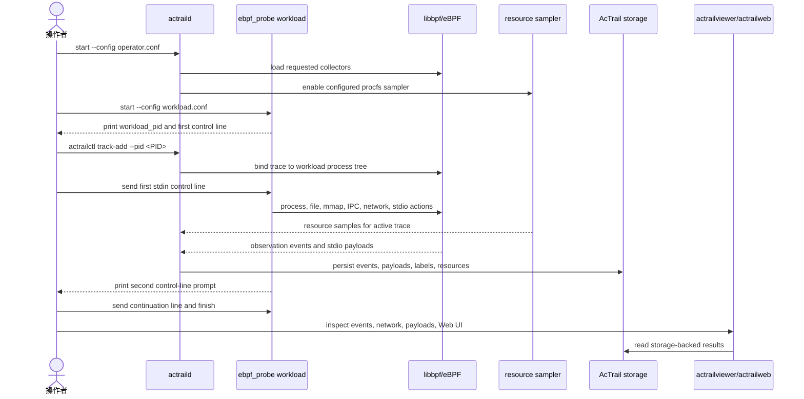

# AcTrail Extended Observation E2E Example

这份示例按用户实际操作路径验证 AcTrail 的扩展观测能力：

```text
actraild -> libbpf eBPF collector -> ingest -> AcTrail storage -> actrailviewer/actrailweb
```

主流程不使用 `verify-live` 测试 harness。读者会手动启动 daemon、启动真实 workload、attach trace、释放 workload，然后用 `actrailviewer` 和 `actrailweb` 查看采集结果。

测试流程：



## 1. 示例文件

| 文件 | 用途 |
| --- | --- |
| `docs/examples/03.extended-observation-e2e/operator.conf` | AcTrail operator config，供 `actraild`、`actrailctl`、`actrailviewer`、`actrailweb` 共用。 |
| `docs/examples/03.extended-observation-e2e/workload.conf` | workload config，供 `ebpf_probe workload` 使用，定义实际要触发的进程、网络、文件、IPC 和 stdio 行为。 |
| `docs/examples/03.extended-observation-e2e/provider-rules.conf` | provider classification 规则文件。 |

workload 会做这些真实动作：

| 行为 | 观测目标 |
| --- | --- |
| 启动 `/bin/cat` 子进程 | fork/exec/exit、process group/session 元数据 |
| 给自身发送被忽略的 signal `10` | process signal event |
| 对 anonymous pipe、FIFO、Unix socketpair 做 read/write roundtrip | IPC events |
| 对 regular file 做 read/write | 默认 operator config 覆盖的 file events |
| 执行 open、mkdir、rmdir、rename、unlink、truncate | file-path syscall events；BPF 只发送 raw enter/exit，userspace tracker 负责路径和 fd/cwd 语义 |
| 对文件执行 `MAP_SHARED` mmap 并 `msync` | `fs-mmap` 的 `mmap_shared` file event，包含 path、length、offset、shared 和 mapped address metadata |
| 建立本地 TCP listener/client roundtrip | bind/listen/connect/accept/send/recv network events |
| trace 活跃时读取 `/proc` 资源数据 | `Resource` events，包含 process tree CPU%、RSS、VSZ、threads、child/sample metadata，以及可配置的 `/proc/meminfo`、`/proc/loadavg` host-side metadata |
| 从 stdin 读取控制行，并写 stdout/stderr | stdio payload segments |

示例配置里的 `/tmp` 路径如果已经存在，请先换成一组新路径，或在确认没有运行中的 AcTrail/workload 使用后显式清理。AcTrail 会 fail-fast，不会自动删除 stale socket、pid file、storage 或 workload 文件。

如果上一次 workload 被 `Ctrl-C` 中断，或输入了错误的控制行，下一次启动前先运行 docs cleanup helper。它会调用 `actrailctl clean --config` 清理 operator 产物，并从 `workload.conf` 解析需要删除的 `/tmp/actrail-*` workload 路径：

```bash
python3 docs/examples/clean.py --example extended-observation
```

## 2. 构建

在仓库根目录执行：

```bash
cargo build --release
```

本例使用这些二进制：

```text
./target/release/actraild
./target/release/actrailctl
./target/release/actrailviewer
./target/release/actrailweb
./target/release/ebpf_probe
```

## 3. 启动 Daemon

终端 A：

```bash
./target/release/actraild start --config docs/examples/03.extended-observation-e2e/operator.conf
./target/release/actraild status --config docs/examples/03.extended-observation-e2e/operator.conf
./target/release/actrailctl doctor --config docs/examples/03.extended-observation-e2e/operator.conf
```

期望看到 daemon running，且 doctor 输出包含：

```text
collectors=ebpf plugins= storage_ready=true
```

## 4. 启动 Workload

终端 B：

```bash
./target/release/ebpf_probe workload --config docs/examples/03.extended-observation-e2e/workload.conf
```

workload 会打印自己的 PID，然后等待第一条 stdin 控制行：

```text
workload_pid=<PID>
waiting_for=actrail-stdio-stdin-e2e
```

此时先不要输入 `actrail-stdio-stdin-e2e`。目标进程已经存在，但还没有触发文件、IPC、网络和 stdio 行为；先切到终端 C attach。

## 5. Attach Trace

终端 C，把 `<PID>` 换成终端 B 打印的 PID：

```bash
./target/release/actrailctl track-add \
  --config docs/examples/03.extended-observation-e2e/operator.conf \
  --pid <PID> \
  --name actrail-extended-live
```

期望看到：

```text
trace trace-<N> entered Active
```

记录这里的 `<N>`。下面命令都用 `<N>` 表示实际 trace id 数字。

本例启用了 `resource_metrics_enabled = true`，采样间隔由配置里的 `resource_metrics_interval_ms` 控制，示例值是 `1000`。如果你要确认 Resource rows，attach 成功后先等待至少一个采样间隔，再释放 workload。

## 6. 释放 Workload

回到终端 B，输入第一条控制行并按 Enter：

```text
actrail-stdio-stdin-e2e
```

workload 会触发进程、signal、pipe、FIFO、regular file、file mutation、MAP_SHARED mmap、Unix socket、stdout/stderr payload 和 TCP roundtrip。期望 stdout/stderr 中能看到：

```text
actrail-stdio-stdout-e2e
actrail-stdio-stderr-e2e
events-ready
waiting_for=actrail-stdio-continue-e2e
```

看到 `waiting_for=actrail-stdio-continue-e2e` 后，输入第二条控制行并按 Enter，让 workload 关闭子进程和连接：

```text
actrail-stdio-continue-e2e
```

再回到终端 C：

```bash
./target/release/actrailctl list-traces --config docs/examples/03.extended-observation-e2e/operator.conf
```

期望 trace 进入 `Completed`。如果刚输入第二条控制行后还显示 `Active`，再运行一次 `list-traces`；daemon 会在控制请求和 collector readiness 事件上继续 drain live events。

本例是手动 attach 流程：workload 先进程启动并打印 PID，随后才执行 `track-add` 把它加入 trace。如果最终状态是 `Completed/Degraded`，且 diagnostics 里唯一原因是 `BootstrapGap`，这是可接受结果。它表示 AcTrail 对 attach 时已经存在的进程做了快照补齐，但 attach 前那段历史不是 live eBPF 观测窗口，不能声称完全采集；attach 后由控制行触发的文件、IPC、网络和 stdio 事件仍然应当完整可见。

## 7. 查看事件

`actrailviewer` 通过 operator config 里的 `storage_path` 读取 AcTrail storage，不需要先导出 JSON：

```bash
./target/release/actrailviewer traces --config docs/examples/03.extended-observation-e2e/operator.conf
./target/release/actrailviewer summary --config docs/examples/03.extended-observation-e2e/operator.conf --trace-id <N>
./target/release/actrailviewer processes --config docs/examples/03.extended-observation-e2e/operator.conf --trace-id <N>
./target/release/actrailviewer events --config docs/examples/03.extended-observation-e2e/operator.conf --trace-id <N> --head 120
./target/release/actrailviewer network --config docs/examples/03.extended-observation-e2e/operator.conf --trace-id <N> --head 12
```

`events` 应能看到这些代表性行：

```text
Process ... signal signal=10 target_pid=... result=...
Ipc     ... pipe         channel=pipe operation=write ...
Ipc     ... pipe         channel=pipe operation=read ...
Ipc     ... fifo         channel=fifo operation=write ...
Ipc     ... fifo         channel=fifo operation=read ...
Ipc     ... unix_socket  channel=unix_socket operation=write ...
Ipc     ... unix_socket  channel=unix_socket operation=read ...
File    ... write path=/tmp/actrail-extended-observation.file ...
File    ... read path=/tmp/actrail-extended-observation.file ...
File    ... mmap_shared path=/tmp/actrail-extended-observation.mmap ...
Net     ... bind
Net     ... listen
Label   ... actrail-local-tcp confidence_millis=950 evidence=...transport=tcp...
Resource ... process_tree pid:<PID> cpu=... rss_kb=... virtual_memory_kb=...
```

`network` 是网络专用视图，只列出 `Net` events。它应能看到完整本地 TCP roundtrip，并把相邻 provider label 合并到 `PROVIDER` 列；示例形状如下：

```text
EVENT     PID    PROVIDER         SIDE           OPERATION  LOCAL            REMOTE           RESULT
--------  -----  ---------------  -------------  ---------  ---------------  ---------------  --------
event-79  <PID>  actrail-local-tcp  local          bind       127.0.0.1:<P>                    ok
event-81  <PID>  actrail-local-tcp  local          listen     127.0.0.1:<P>                    ok
event-83  <PID>  actrail-local-tcp  client-open    connect    127.0.0.1:<C>   127.0.0.1:<P>   ok
event-85  <PID>  actrail-local-tcp  server-accept  accept     127.0.0.1:<P>   127.0.0.1:<C>   fd=<FD>
event-87  <PID>  actrail-local-tcp  inbound        recv       127.0.0.1:<P>   127.0.0.1:<C>   bytes=16
event-89  <PID>  actrail-local-tcp  outbound       send       127.0.0.1:<C>   127.0.0.1:<P>   bytes=16
```

## 8. 查看 Stdio Payload

先列出 payload metadata：

```bash
./target/release/actrailviewer payloads \
  --config docs/examples/03.extended-observation-e2e/operator.conf \
  --trace-id <N> \
  --head 8
```

期望看到表格 `SOURCE` 列为 `Stdio`，并包含 `stdin` inbound、`stdout` outbound 和 `stderr` outbound segment。再查看其中一个 stdin segment：

```bash
./target/release/actrailviewer payload \
  --config docs/examples/03.extended-observation-e2e/operator.conf \
  --trace-id <N> \
  --segment-id <STDIN_SEGMENT_ID> \
  --format text
```

期望看到：

```text
actrail-stdio-continue-e2e
```

## 9. 打开 Web UI

`actrailweb` 是只读 UI，通过同一份 operator config 读取 AcTrail storage：

```bash
./target/release/actrailweb --config docs/examples/03.extended-observation-e2e/operator.conf
```

如果配置里的监听地址端口已被占用，可以只覆盖 Web UI 的监听地址或端口，不需要复制整份配置：

```bash
./target/release/actrailweb --config docs/examples/03.extended-observation-e2e/operator.conf --addr <ADDR> --port <PORT>
```

`actrailweb` 是前台只读服务，启动成功后终端会停留在运行状态，并打印：

```text
actrailweb listening on http://<ADDR>:<PORT> storage=/tmp/actrail-extended-observation.sqlite
actrailweb is running; press Ctrl-C to stop
```

然后打开：

```text
http://<ADDR>:<PORT>
```

UI 会展示 trace 列表、Timeline、Process Tree、事件/进程/payload/诊断表、按域计数、搜索过滤和右侧详情。Timeline 从 trace 事件和 payload metadata 派生，Process Tree 从 trace membership 派生；点击 payload 行会读取 `/api/traces/<TRACE_ID>/payloads/<SEGMENT_ID>` 并显示捕获文本。

Resources tab 会展示同一份 trace 的资源采样行，包括 `scope=process_tree`、root pid、CPU%、RSS、VSZ、sampler metadata，以及启用 `resource_metrics_include_system` 时的 host memory/load metadata。

## 10. 文件路径 syscall 事件

`docs/examples/03.extended-observation-e2e/operator.conf` 默认开启：

```text
file_path_capture_enabled = true
```

这会 attach `openat`、`unlinkat`、`renameat`、`mkdirat` 以及 fd/cwd 上下文 tracepoints。BPF 侧只按 trace/pid 过滤并复制 raw syscall facts；enter/exit 配对、relative path 解析、fd 表维护和 `open`/`truncate`/`rename` 等语义都在 AcTrail userspace tracker 中完成。

成功时 `actrailviewer events` 应看到：

```text
File ... mkdir path=/tmp/actrail-extended-observation.mkdir ...
File ... rmdir path=/tmp/actrail-extended-observation.rmdir ...
File ... rename path=/tmp/actrail-extended-observation.rename.src ...
File ... unlink path=/tmp/actrail-extended-observation.unlink ...
File ... truncate path=/tmp/actrail-extended-observation.truncate ...
```

`fs-mmap` 也在本例默认启用。workload 会打开配置里的 `mmap_path`，执行 `MAP_SHARED` mapping，写入 `mmap_message`，调用 `msync`，并在退出前验证文件内容。成功时 `actrailviewer events` 应看到：

```text
File ... mmap_shared path=/tmp/actrail-extended-observation.mmap result=0 ...
```

如果目标内核拒绝 attach `sys_enter_mmap` 或相关 tracepoint，collector 会 fail-fast，并带上 `tracefs_control`、`perf_event_paranoid` 和 `unprivileged_bpf_disabled` 诊断；这种机器上不要声明 mmap live E2E 已通过。

## 11. 可选：维护者回归验证

如果你是在开发 AcTrail，需要一条自动化回归命令，可以使用维护者配置。该配置把 storage、workload、payload policy、provider rules、资源采样和 file-path capture 都放在配置文件里，命令行只负责选择配置文件。

```bash
./target/release/ebpf_probe verify-live --config docs/examples/03.extended-observation-e2e/observation.conf
```

期望输出：

```text
live verification passed
trace_id=trace-1
process_events=exec,exit,fork,signal
file_events=mkdir,mmap_shared,open,read,rename,rmdir,truncate,unlink,write
net_events=accept,bind,connect,listen,recv,send
ipc_events=fifo:read,fifo:write,pipe:read,pipe:write,unix_socket:read,unix_socket:write
resource_events=process_tree
provider_events=actrail-local-tcp
stdio_payloads=stderr:outbound,stdin:inbound,stdout:outbound
```

这条命令用于维护者快速回归，不是本示例的用户主路径。

## 12. 覆盖范围

| Capability | Evidence |
| --- | --- |
| `net-transport` bind/listen | eBPF bind/listen tracepoint -> net event -> AcTrail storage/viewer |
| `ipc-pipe-fifo` pipe read/write | `pipe(2)` roundtrip -> IPC event -> AcTrail storage/viewer |
| `ipc-pipe-fifo` FIFO read/write | `mkfifo(3)` path -> IPC event -> AcTrail storage/viewer |
| `ipc-unix-socket` read/write | `UnixStream::pair()` roundtrip -> IPC event -> AcTrail storage/viewer |
| `fs-access-basic` regular-file read/write | regular file roundtrip -> File event -> AcTrail storage/viewer |
| `fs-access-basic` file path mutations | `file_path_capture_enabled = true` -> raw `openat`, `mkdirat`, `unlinkat`, `renameat`, `openat(O_TRUNC)` enter/exit -> userspace file tracker -> File event -> AcTrail storage/viewer |
| `fs-mmap` MAP_SHARED file mapping | configured `mmap_enabled = true` -> real `MAP_SHARED` mapping and `msync` -> raw mmap enter/exit -> userspace file tracker -> `mmap_shared` File event -> AcTrail storage/viewer |
| Process memory metadata | fork/exec metadata contains `/proc/<pid>/status` memory and thread fields |
| Process signal event | `kill(getpid(), 10)` with ignored signal -> signal event -> AcTrail storage/viewer |
| Process group/session metadata | exec metadata contains `process_group_id` and `session_id` from `/proc/<pid>/stat` |
| `resource-metrics` process tree samples | config-gated `/proc` sampler, including `/proc/meminfo` and `/proc/loadavg` when enabled -> `Resource` event -> AcTrail storage/viewer/web |
| Provider classification | rule-set classifier -> `Label` event -> AcTrail storage/viewer/export |
| `stdio-chunk` payload | configured read/write syscall capture -> `PayloadSourceBoundary::Stdio` segment -> AcTrail storage/viewer |
| Web UI | read/snapshot/payload stores -> `actrailweb` HTTP API -> per-connection request handling with configured read timeout -> Timeline/Process Tree/browser UI |

这个示例不覆盖 TLS plaintext、HTTP/1.x semantic events、HTTP/2 frame/DATA facts、HTTP socket plaintext、browser plaintext 或 CoW fault。动态 OpenSSL TLS payload、HTTP/1.x semantic events 和本地 HTTPS/2 payload 示例使用单独的 payload 配置，见 `docs/examples/02.llm-http-payload-capture/README.md`；非 TLS HTTP socket plaintext 示例见 `docs/examples/05.http-payload-unified/README.md`；Claude Code 这类真实 Agent 的 LLM 请求可能走 HTTPS/TLS 或纯 HTTP，对应完整 payload capture 示例见 `docs/examples/06.claude-code-tls-capture/README.md`。部分 WSL/Linux 环境会拒绝 attach `sys_enter_setsid` 这类 syscall tracepoint，因此本例的 session/process-group 只声明 `/proc` 元数据，不声明 setpgid/setsid syscall event。

## 13. 停止 Daemon

终端 A 或 C：

```bash
./target/release/actraild stop --config docs/examples/03.extended-observation-e2e/operator.conf
./target/release/actraild status --config docs/examples/03.extended-observation-e2e/operator.conf
```

`stop` 会清理运行态的 pid file 和 socket。AcTrail storage、导出目录、log 和 workload 产生的 `/tmp/actrail-extended-observation.*` 文件不会自动删除。
