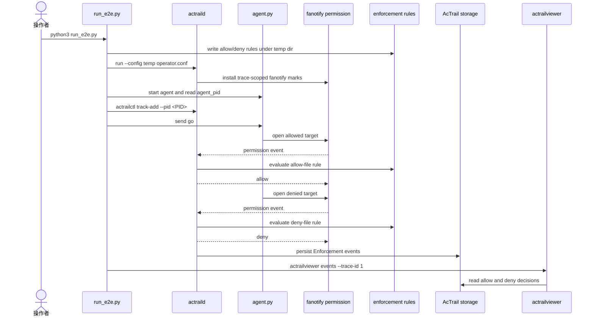

# Fanotify 文件访问阻断 E2E

这个例子验证 AcTrail 的 trace-scoped 文件访问阻断能力：AcTrail 先按配置启动，测试脚本再启动一个模拟 agent，`actrailctl track-add` attach 该 agent 后，agent 访问两个真实文件。AcTrail 通过 fanotify permission event 放行 `allow-file`，拒绝 `deny-file`，最后用 `actrailviewer events` 查看落库的 Enforcement 事件。

测试流程：



## 前置条件

- Linux/WSL root shell，且内核支持 fanotify permission events。
- 已完成 release 构建：

```bash
cargo build --release
```

## 运行

```bash
python3 docs/examples/04.fanotify-enforcement-e2e/run_e2e.py
```

转测时建议同时导出 OTEL：

```bash
python3 docs/examples/04.fanotify-enforcement-e2e/run_e2e.py \
  --otel-output /tmp/actrail-fanotify-e2e.otlp.json
```

如果指定的 OTEL 输出文件已存在，脚本会刷新该文件。

脚本会在 `/tmp/actrail-fanotify-e2e-*` 下生成本次测试需要的 operator config、rules、storage、socket 和目标文件，不复用全局配置。

核心配置由脚本生成，关键项等价于：

```conf
capture.profile_name = fanotify-enforcement-e2e
capture.capabilities includes both proc-lifecycle and enforcement-file-permission-fanotify

ebpf.enabled = true
enforcement_enabled = true
enforcement_backend = fanotify
enforcement_scope = trace
enforcement_rules_path = <tmp>/rules.conf
enforcement_default_decision = allow
enforcement_mark_strategy = parent-directories
enforcement_audit_enabled = true
enforcement_event_buffer_bytes = 65536
```

rules 文件格式为：

```text
allow-file allow open <tmp>/targets/allowed.txt
deny-file deny open <tmp>/targets/denied.txt
```

## 预期结果

终端会看到 agent 的真实访问结果。这两行来自被监控 agent 自己的 stdout，不是 AcTrail 生成的观测事件：`allowed=ok` 表示 agent 实际成功 `open/read` 了允许文件；`denied=permission_denied` 表示 agent 实际访问被拒绝文件时收到了 `PermissionError`。如果被拒绝文件被成功读到，agent 会打印 `denied=unexpected_success` 并以失败退出。

```text
agent_pid=<PID>
trace trace-1 entered Active
allowed=ok
denied=permission_denied
```

脚本随后调用 `actrailviewer events --config <tmp>/operator.conf --trace-id 1`，预期包含两条 Enforcement 事件。这一层验证 AcTrail 观测并持久化了 fanotify 的 allow/deny 决策；它不能替代上面的 agent stdout，因为 stdout 才证明访问者真实收到了允许/阻断结果。

```text
Enforcement  <PID>  open  decision=allow path=<tmp>/targets/allowed.txt rule_id=allow-file result=allowed backend=fanotify
Enforcement  <PID>  open  decision=deny  path=<tmp>/targets/denied.txt  rule_id=deny-file  result=denied  backend=fanotify
```

如果指定 `--otel-output`，脚本会在临时 storage 删除前调用 `actrailviewer export-otel`，并验证导出的 trace 含两个 `enforcement.decision` span：允许文件的 span 为 success/OK，被拒绝文件的 span 为 error，属性中包含 `enforcement.decision`、`enforcement.result`、`enforcement.rule_id`、`file.path` 和 `enforcement.backend=fanotify`。验证通过后脚本输出：

```text
exported trace-1 to /tmp/actrail-fanotify-e2e.otlp.json
otel_output=/tmp/actrail-fanotify-e2e.otlp.json
otel_enforcement_spans=allow,deny
```

本例的生成配置没有启用 `stdio-chunk`，所以 agent stdout 不会作为 stdio payload 出现在 trace 中；本例用 runner 捕获的 agent stdout 验证真实访问结果，用 Enforcement event/span 验证 AcTrail 观测结果。

如果环境不支持 fanotify permission events，`actraild` 会在构建 runtime 时 fail-fast，错误阶段为 `fanotify_enforcement`。
