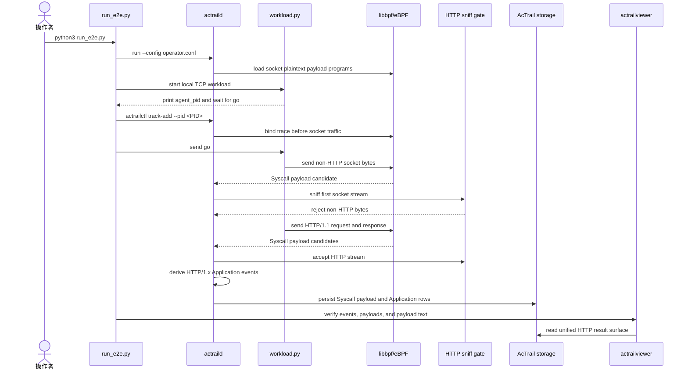

# HTTP Payload Unified Example

这份示例验证 HTTP 明文 socket payload 和 HTTPS TLS plaintext payload 使用同一套 AcTrail 结果面：

```text
local HTTP workload -> libbpf eBPF collector -> AcTrail storage -> actrailviewer payload/Application events
```

本例的 workload 不使用 TLS，也不需要外网或 API key。配置里仍启用 `payload_tls_enabled = true` 和 `payload_tls_capture_backend = tls-sync`，用于覆盖 TLS/socket 同时开启时，plain HTTP workload 仍能通过 socket plaintext 路径正常采集。它启动一个真实本地 TCP server/client workload，先发送一条非 HTTP socket 消息，再发送一条 HTTP/1.1 request/response。AcTrail 只保留识别为 HTTP 的 socket plaintext payload，并从相同 payload 派生 `Application` request/response rows。

测试流程：



## 1. 示例文件

| 文件 | 用途 |
| --- | --- |
| `docs/examples/05.http-payload-unified/operator.conf` | AcTrail operator config，显式启用 `socket-plaintext-payload` 和 `net-application-plaintext-http`。 |
| `docs/examples/05.http-payload-unified/workload.py` | 真实本地 TCP workload，打印 `agent_pid` 后等待 `go`。 |
| `docs/examples/05.http-payload-unified/run_e2e.py` | 端到端验证脚本，启动 daemon、attach trace、释放 workload，并通过 `actrailviewer` 校验结果。 |

## 2. 构建

```bash
cargo build --release
```

本例使用：

```text
./target/release/actraild
./target/release/actrailctl
./target/release/actrailviewer
```

## 3. 配置重点

本例使用同目录的 `operator.conf`。关键配置是：

```text
required_capability = proc-lifecycle
required_capability = net-transport
required_capability = tls-plaintext-payload
required_capability = socket-plaintext-payload
required_capability = net-application-plaintext-http

payload_tls_enabled = true
payload_tls_capture_backend = tls-sync
payload_tls_source = auto
payload_tls_resolver = auto
payload_tls_library = auto
payload_tls_library_path = auto
payload_tls_binary_path = disabled
payload_tls_pattern_path = disabled
payload_socket_enabled = true
payload_socket_capture_backend = bpf-copy
payload_socket_max_segment_bytes = 4095
payload_socket_max_operation_bytes = 4194304
payload_socket_ring_buffer_bytes = 2097152
payload_socket_pending_operation_max_entries = 4096
payload_socket_stream_state_max_entries = 4096
payload_socket_retention_max_bytes_per_trace = 10485760
payload_socket_redaction_policy = disabled
payload_socket_http_sniff_max_bytes = 8192
payload_socket_seccomp_syscall = write
payload_socket_seccomp_syscall = sendto

application_protocol_enabled = true
application_protocol_http1_enabled = true
application_protocol_http2_enabled = false
```

本例的通过条件仍是 `Syscall/socket-syscall` payload，而不是 TLS payload。`tls-sync` 开启后会等待 launch-time runtime 注入；本例使用 `track-add` attach 已运行的本地 plain HTTP workload，因此不会产生 `TlsUserSpace` 行。

`payload_socket_max_segment_bytes = 4095` 是本例的 socket BPF direct-copy 上限。对于 `bpf-copy-seccomp-fallback` 配置，超过该 inline 上限的 outbound HTTP 候选会在 seccomp 暂停窗口由 daemon 读取用户态 buffer；`payload_socket_max_operation_bytes = 4194304` 表示 4MB 以内的 HTTP LLM request 仍可完整保留。不要把 4095 理解成业务请求大小上限，它只是稳定 eBPF socket event ABI 的 inline copy 上限。 如果目标 runtime 用 `writev` 或 `sendmsg` 发送 plain HTTP request，需要在同一配置段额外添加对应的 `payload_socket_seccomp_syscall`；这两个 syscall 的 payload 由 `iovec`/`msghdr` 描述，只走 seccomp user-read fallback，不走 BPF direct-copy。

`payload_socket_http_sniff_max_bytes` 是单条 socket stream 在被判定为 HTTP 或非 HTTP 前最多暂存的字节数。被判定为非 HTTP 的 socket bytes 不会进入 payload storage。

## 4. 自动端到端验证

在仓库根目录执行：

```bash
python3 docs/examples/05.http-payload-unified/run_e2e.py
```

`run_e2e.py` 默认使用同目录 `operator.conf` 和 `workload.py`。它的测试等待边界是：daemon ready 最长 `10.0` 秒、workload 最长 `10.0` 秒、viewer drain 最多 `25` 次、每次间隔 `0.2` 秒；这些值只约束示例脚本等待多久，不改变 AcTrail runtime 行为。需要在慢机器上放宽时，可用同名 `--daemon-ready-timeout-sec`、`--workload-timeout-sec`、`--drain-attempts`、`--drain-sleep-sec` 参数覆盖。

脚本会：

1. 按 `operator.conf` 清理本例使用的 `/tmp/actrail-http-payload.*` 路径。
2. 启动 `actraild --config docs/examples/05.http-payload-unified/operator.conf run`。
3. 启动 `workload.py`，读取它打印的 `agent_pid`。
4. 调用 `actrailctl track-add` attach 这个真实进程。
5. 向 workload 输入 `go`，触发非 HTTP socket 消息和 HTTP/1.1 request/response。
6. 用 `actrailviewer events` 确认 `Application request POST /plain-http` 和 `Application response 200 OK`。
7. 用 `actrailviewer payloads/payload` 确认 payload 来源是 `Syscall/socket-syscall`，并且 payload text 包含 HTTP request、JSON body 和 response body。
8. 确认非 HTTP marker `actrail-non-http` 没有进入 payload text。

## 5. 手动查看

如果手动运行，先启动 daemon：

```bash
./target/release/actraild --config docs/examples/05.http-payload-unified/operator.conf start
./target/release/actrailctl doctor --config docs/examples/05.http-payload-unified/operator.conf
```

再启动 workload：

```bash
python3 docs/examples/05.http-payload-unified/workload.py
```

看到：

```text
agent_pid=<PID>
waiting_for=go
```

另开终端 attach：

```bash
./target/release/actrailctl track-add \
  --config docs/examples/05.http-payload-unified/operator.conf \
  --pid <PID> \
  --name http-payload-unified
```

回到 workload 终端输入：

```text
go
```

查看统一结果面：

```bash
./target/release/actrailviewer events --config docs/examples/05.http-payload-unified/operator.conf --trace-id <N> --head 80
./target/release/actrailviewer payloads --config docs/examples/05.http-payload-unified/operator.conf --trace-id <N> --head 20
./target/release/actrailviewer payload --config docs/examples/05.http-payload-unified/operator.conf --trace-id <N> --segment-id <SEGMENT_ID> --format text
```

`events` 应看到 `Application` request/response；`payloads` 的 `SOURCE` 应是 `Syscall`，`SYMBOL` 通常是 `sendto` 或 `recvfrom`；`payload --format text` 应能看到 `POST /plain-http HTTP/1.1`、JSON body、`HTTP/1.1 200 OK` 和 `actrail-http-ok`。
