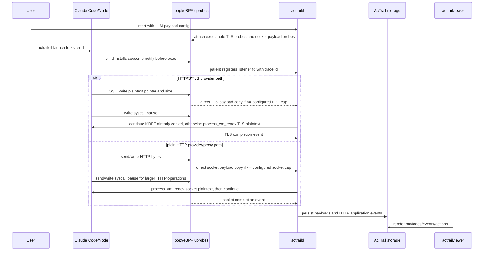

# Claude Code LLM Payload Capture

This example captures a real Claude Code LLM request and, for HTTPS/TLS runtimes, the LLM response returned through `SSL_read`. HTTPS traffic is captured at the TLS plaintext boundary; plain HTTP request traffic is captured at the socket plaintext boundary. Both paths feed the same payload storage, HTTP parser, `llm.request` semantic action, JSON graph export, and OTEL export.

Do not assume a Claude Code installation is always HTTPS. Some hosts configure Claude Code with an HTTP base URL or a local HTTP proxy. In that case expected payload rows use `SOURCE=Syscall` and `LIBRARY=socket-syscall` instead of `SOURCE=TlsUserSpace`.

Claude Code's TLS activity may run on an internal thread whose `comm` is not `claude`. AcTrail therefore binds TLS payload capture to the tracked process tree instead of using a thread-name filter. The automated E2E resolves TLS runtime in this order: Node/OpenSSL launcher, native ELF OpenSSL symbols, then configured Bun/static-BoringSSL symbol map or static BoringSSL entry discovery.



## Files

| File | Purpose |
| --- | --- |
| `operator.conf` | AcTrail operator config template for Claude Code LLM payload capture over HTTPS/TLS or plain HTTP. The automated E2E replaces the `__CLAUDE_*` placeholders; manual runs must replace them before starting `actraild`. |

## Prepare The Binary Path

For manual runs, resolve the TLS runtime first and replace every `__CLAUDE_TLS_*` placeholder in `operator.conf`.

For a Node-based Claude Code launcher, find the concrete Node binary:

```bash
CLAUDE_ENTRY="$(readlink -f "$(command -v claude)")"
head -1 "$CLAUDE_ENTRY"
command -v node
```

If the entry file starts with `#!/usr/bin/env node`, use the resolved `node` executable as `payload_tls_binary_path`. The config must contain the resolved path, not `$CLAUDE_ENTRY` or `$(command -v node)`, because AcTrail config files do not perform shell expansion.

Use these TLS fields for Node/OpenSSL:

```text
payload_tls_resolver = openssl-symbols
payload_tls_library = openssl
payload_tls_binary_path = <resolved node executable>
payload_tls_pattern_path = disabled
```

For a native `claude.exe` ELF executable, first check whether it exposes OpenSSL symbols:

```bash
CLAUDE_ENTRY="$(readlink -f "$(command -v claude)")"
readelf -Ws "$CLAUDE_ENTRY" | grep -E ' SSL_write(@|$)| SSL_write_ex(@|$)'
```

If `SSL_read`, `SSL_write`, `SSL_read_ex`, and `SSL_write_ex` are present, use the same `openssl-symbols` settings with `payload_tls_binary_path = $CLAUDE_ENTRY`. If the executable is statically linked with BoringSSL, either use `payload_tls_resolver = boringssl-static` with `payload_tls_pattern_path = disabled` for the built-in x86_64/aarch64 related-entry detector, or use `payload_tls_resolver = bun-static-boringssl`, `payload_tls_library = boringssl`, and set `payload_tls_pattern_path` to a build-id-matching symbol map.

On hosts where the native Claude executable cannot be copied out for offline
analysis, keep it on the target host and run the profile script there:

```bash
python3 docs/preflight/claude_native_profile.py \
  --json-output /tmp/actrail-claude-native-profile.json \
  --symbol-map-output /tmp/actrail-claude-code-boringssl.map
```

If it prints `status=supported`, use the reported resolver and symbol map. If it
prints `status=profile_missing`, do not treat the Claude TLS example as passed:
the executable is static BoringSSL, but AcTrail has no arch/build-id matching
profile for that release yet. The JSON is text-only and contains the package
version, native optional package, architecture, GNU build-id, SHA-256, and exact
discovery failure needed to add support without exporting the binary.

For automated transfer testing, do not edit the template. Run:

```bash
python3 tests/payload/claude-code/run_e2e.py \
  --config-template docs/examples/06.claude-code-tls-capture/operator.conf
```

The script resolves the current Claude TLS runtime when one is discoverable, writes `/tmp/actrail-claude-code-e2e.resolved.conf`, starts `actraild`, runs a real `claude -p ...` through `actrailctl launch`, checks non-truncated outbound payload rows from either `TlsUserSpace` or `Syscall/socket-syscall`, and verifies exported JSON `Payload` nodes plus the OTEL `llm.request` span.

Keep `payload_tls_library_path = auto` in this executable-mode example. That key is only consumed by `payload_tls_source = shared-library`; executable mode will fail fast if a concrete shared-library path is configured.

For Bun/static-BoringSSL symbol-map mode, `payload_tls_pattern_path` points to a Bun symbol map instead of a byte-pattern file. The map must contain `resolver = bun-static-boringssl`, `library = boringssl`, `arch`, the target GNU `build_id`, plus `symbol = SSL_read|0x...` and `symbol = SSL_write|0x...` virtual addresses from the matching Bun profile/linker-map build. AcTrail validates the build id before attaching and fails fast if the map does not match the target executable.

This example uses `payload_tls_capture_backend = bpf-copy-seccomp-fallback` and `payload_socket_capture_backend = bpf-copy-seccomp-fallback`, with `payload_tls_max_segment_bytes = 4095`. For TLS, tiny writes can be copied by eBPF, while request-body chunks larger than the stable inline budget keep only metadata in eBPF and are read by daemon-side seccomp handling with `process_vm_readv`. For plain HTTP socket payloads, BPF can inline-copy stable small events and seccomp user-read handles larger outbound HTTP operations. The final payload row is not considered complete until the matching TLS or socket return event confirms the write succeeded and reports the actual byte count.

For socket/plain HTTP capture, `payload_socket_max_segment_bytes = 4095` is the stable BPF inline-copy budget. It is not the business request size limit. Operations larger than that inline budget use seccomp user-read up to `payload_socket_max_operation_bytes = 4194304`, so plain HTTP LLM requests up to 4MB are still expected to be complete without making every socket ringbuf event a fixed multi-MB record.

Keep `diagnostic_log_level = info` and `payload_tls_diagnostics_enabled = false` during normal transfer testing. Set `diagnostic_log_level = debug` while debugging TLS capture internals; it logs BPF counter snapshots and TLS diagnostic metadata to `log_path` for `actraild start`, or to the foreground stdout/stderr for `actraild ... run`.

This backend is supported only for `actrailctl launch`: `actrailctl` remains the trace root, forks the Claude child, installs the configured `payload_tls_seccomp_syscall` user-notify filter before exec, copies the listener from `seccomp_notify_reserved_listener_fd`, registers it with `actraild`, and only then lets the child exec `claude`. Attaching an already-running process fails fast because large TLS writes still require the pre-exec seccomp listener.

`export_payload_bytes_enabled = true` and `export_payload_text_enabled = true` are enabled here so `actrailviewer export-json` includes payload node `bytes_base64` and `text` attributes. `otel_live_export_enabled` remains false because complete `llm.request` spans are still produced by offline OTEL export. Disable raw payload export for routine runs that must not carry request content.

## Run

```bash
./target/release/actrailctl clean --config docs/examples/06.claude-code-tls-capture/operator.conf
./target/release/actraild start --config docs/examples/06.claude-code-tls-capture/operator.conf
./target/release/actrailctl doctor --config docs/examples/06.claude-code-tls-capture/operator.conf
```

Use `actrailctl launch`; it tracks the `actrailctl` process first and then runs the child command, so the child enters the tracked process tree before Claude execs:

```bash
./target/release/actrailctl \
  --config docs/examples/06.claude-code-tls-capture/operator.conf \
  launch \
  --name claude-code-tls \
  -- \
  claude -p "当前目录是什么？"
```

Do not use `track-add` for TLS payload capture; AcTrail rejects that path because it cannot install the seccomp listener into an already-running process. Run Claude through `actrailctl launch` so the listener is installed before exec.

After running a real Claude prompt:

```bash
./target/release/actrailviewer payloads \
  --config docs/examples/06.claude-code-tls-capture/operator.conf \
  --trace-id <TRACE_ID> \
  --head 20

./target/release/actrailviewer events \
  --config docs/examples/06.claude-code-tls-capture/operator.conf \
  --trace-id <TRACE_ID> \
  --head 80

./target/release/actrailviewer actions \
  --config docs/examples/06.claude-code-tls-capture/operator.conf \
  --trace-id <TRACE_ID>
```

Expected payload rows are complete outbound plaintext rows from one of these paths:

- HTTPS/TLS: `SOURCE=TlsUserSpace`, `LIBRARY=openssl` for Node/OpenSSL or `LIBRARY=boringssl` for supported native/static-BoringSSL.
- Plain HTTP: `SOURCE=Syscall`, `LIBRARY=socket-syscall`, usually `SYMBOL=sendto` or `SYMBOL=write`.

With this example's current `payload_tls_max_segment_bytes = 4095` and `payload_socket_max_operation_bytes = 4194304`, a typical Claude Code LLM request should appear as one complete outbound payload row per write operation. Outbound LLM request rows marked `Truncated` or operation state `partial` mean the configured capture budget was not enough for that request operation. Inbound response rows can be larger or truncated without invalidating this request-capture case. HTTP/2 rows should include frame and DATA application events when Claude sends HTTPS LLM traffic; plain HTTP rows should include HTTP/1.x request events when Claude uses an HTTP endpoint/proxy. The raw payload stream is the source of truth; semantic HTTP rows are derived from captured plaintext.

`actrailviewer actions` should include a `llm.request` row with `STATUS=success` and `COMPLETENESS=complete`. Process/file/HTTP/enforcement actions are materialized while the daemon observes their underlying events; `llm.request` is assembled from retained outbound plaintext payload during viewer/export reads because it requires the full payload bytes.

This example sets payload redaction to `disabled` because its purpose is to verify raw Claude Code LLM request payload capture first.

To verify JSON export carries the request bytes:

```bash
./target/release/actrailviewer export-json \
  --config docs/examples/06.claude-code-tls-capture/operator.conf \
  --trace-id <TRACE_ID> \
  --output /tmp/actrail-claude-code-tls.json
```

The exported graph should contain `Payload` nodes with non-empty `bytes_base64` and `text` attributes.

To export semantic actions in OpenTelemetry OTLP JSON:

```bash
./target/release/actrailviewer export-otel \
  --config docs/examples/06.claude-code-tls-capture/operator.conf \
  --trace-id <TRACE_ID> \
  --output /tmp/actrail-claude-code-tls.otlp.json
```

The OTLP JSON should contain a span whose `actrail.action.kind` attribute is `llm.request`, with `actrail.action.status=success`, `actrail.action.completeness=complete`, non-empty `llm.request.raw_payload_base64`, and split HTTP request fields. For HTTP/2, `http.request.headers_hpack_base64` carries the encoded header block and `http.request.body_text` / `http.request.body_base64` carry the request body. `llm.request.payload_text` is the body-level text view, not the raw HTTP/2 frame bytes.

## Real CLI E2E

The regression script under `tests/payload/claude-code/` runs a real `claude -p` through `actrailctl launch`. It resolves the current `claude` entrypoint when TLS runtime support is available, writes a temporary operator config, starts `actraild`, verifies that `actrailviewer payloads` returns non-truncated outbound payload rows from HTTPS/TLS or plain HTTP/socket capture, fetches raw payload text for those rows, exports JSON to verify payload nodes include `bytes_base64` and `text`, checks `actrailviewer actions` for a complete successful `llm.request`, and exports OTLP JSON to verify the corresponding semantic span with split HTTP headers/body fields. It does not assert Claude's stdout or match a specific prompt string inside the payload.

## Failure Modes

AcTrail fails fast if the configured TLS binary path does not exist, the pattern file does not exist, a pattern does not match, or a pattern matches multiple offsets. It does not treat encrypted socket bytes as payload. Plain HTTP capture is a separate socket plaintext path and is only valid when the bytes are actually HTTP plaintext.
