<!-- Documents AcTrail idle-detection operation and behavior. -->
# 空转检测使用说明

空转检测记录 Agent 任务在执行期间没有产生可观测进展的时间段。它不会中断进程、自动批准权限或修改 Agent 行为；功能只向存储和 Web 视图写入 `idle_intervals`，供排障、分析和导出使用。

## 模块总览

下面的模块图展示了从观测、用户等待识别，到空转判定、持久化和 Waterfall 展示的完整链路：

```mermaid
flowchart LR
    subgraph Config[配置入口]
        K["operator.conf<br/>[idle_detection]<br/><br/>enabled：总开关<br/>threshold_secs：空转阈值<br/>opencode_auto_inject：插件开关<br/>opencode_plugin_dir：插件目录"]
    end

    subgraph Sources[观测来源]
        E["eBPF / socket / seccomp / TLS<br/>Payload 与语义事件"]
        O["OpenCode CLI"]
    end

    subgraph Adapter[OpenCode 适配器]
        L["actrailctl launch<br/>启动 OpenCode + 注入环境"]
        P["OpenCode idle plugin<br/>事件处理 + permission 对账"]
        U["用户授权等待<br/>permission / question pending<br/>暂停 idle 计时"]
        R["control-socket reporter<br/>transition 串行上报"]
        O --> P --> U --> R
        L -.->|注入 trace、socket 与启用状态| P
    end

    subgraph Daemon[actraild]
        C["Control socket<br/>解码 / 校验 / ACK"]
        S["语义事件链路<br/>LiveSemanticActionRuntime<br/>→ IdleActionProjection"]
        T["scheduler tick()<br/>检查任务状态与截止时间"]
        D["IdleDetector<br/>任务状态机"]
        W["drain_idle_detector_ops"]
        C --> D
        S --> D
        T --> D
        D -->|pending_ops| W
    end

    subgraph Storage[SQLite 持久化]
        A[("semantic_actions / links")]
        I[("idle_intervals<br/>空转区间")]
    end

    subgraph Read[查询与展示]
        API["Web API / JSON graph<br/>action-tree 或 waterfall"]
        WF["Waterfall 前端<br/>独立 Idle lane 渲染时间区间"]
    end

    K -->|总开关与阈值| T
    K -->|插件开关与目录| L
    E --> S
    R -->|UDS：control.sock| C
    C -. ACK .-> R
    W --> A
    W --> I
    A --> API
    I --> API
    API --> WF

    classDef source fill:#e8f1ff,stroke:#4f7cac,color:#17324d,stroke-width:1.5px
    classDef adapter fill:#f3eaff,stroke:#8b5cf6,color:#32145f,stroke-width:1.5px
    classDef daemon fill:#e8f8f2,stroke:#159570,color:#123b2f,stroke-width:1.5px
    classDef storage fill:#fff4df,stroke:#d88916,color:#533306,stroke-width:1.5px
    classDef read fill:#ffe9f1,stroke:#d6537c,color:#541b2c,stroke-width:1.5px

    class E,O source
    class L,P,U,R adapter
    class C,S,D,T,W daemon
    class A,I storage
    class API,WF read
```



关键边界：OpenCode 的审批、确认或提问处于 pending 时，插件向 `IdleDetector` 报告 `waiting_for_user`，空转时钟暂停；只有交互解决、任务仍 active 且没有运行中的 action 时，`tick()` 才可能创建 `idle_intervals`。这些区间随后由 Web API 返回，并在 Waterfall 的独立 `Idle` lane 中展示。

图中的“用户授权等待”表示 OpenCode 正在等待用户对一次交互请求作出决定，并不是 Agent 进程异常或普通模型延迟。例如，Agent 请求执行需要授权的 shell 命令时，OpenCode 会产生 `permission` 请求；需要用户补充信息时，会产生 `question` 请求。插件将请求记录为 pending interaction，并通过 UDS 通知 daemon 将任务标记为 `waiting_for_user`，从而不把用户等待时间误判为空转。用户允许、拒绝或回答后，插件上报 resolved 状态；任务后续恢复有效进展，或在 turn 正常结束后，生命周期才会继续关闭。

配置入口位于 operator 配置的 `[idle_detection]` 段：`enabled` 控制整个空转检测；`threshold_secs` 控制无可观测进展多久后创建区间；`opencode_auto_inject` 控制是否在通过 `actrailctl launch -- opencode` 启动时自动注入 OpenCode 插件；`opencode_plugin_dir` 指定插件及其 `lib/` 支持模块所在目录。只有总开关和 OpenCode 插件开关都满足条件时，OpenCode 才会通过 UDS 上报用户等待生命周期。

## 1. 判定范围

空转检测以 trace 中的任务为单位运行。任务存在且没有活动 action、没有受保护的子进程、也没有等待用户交互时，连续静默超过配置阈值后，daemon 打开一个 idle interval。下一次有效进展到来时，interval 被关闭。

daemon 重启不会恢复重启前任务的在线状态；重启后的事件会作为新的在线检测上下文处理。

下列情况不会计为空转：

- Agent 正在执行尚未结束的 command、子进程或 sub-agent action；
- 当前任务仍处于 active 状态，但已观察到的审批、确认或用户输入请求尚未解决；
- 当前任务已经完成；终态之后等待用户发起下一轮输入的时间属于新任务之前的空闲；
- `idle_detection.enabled` 为 `false`。

这里的“无进展”不等同于 CPU 利用率低、网络延迟或模型响应慢。只有被 AcTrail 观测并投影为有效语义进展的事件才会重置空转计时。

## 2. 配置

在 operator 配置中添加或调整以下段落：

```toml
[idle_detection]
enabled = true
threshold_secs = "30s"

# 仅在使用 OpenCode 并需要其结构化用户等待事件时启用。
opencode_auto_inject = false
opencode_plugin_dir = "/usr/local/lib/actrail/opencode"
```

| 配置项 | 默认值 | 作用 |
| --- | --- | --- |
| `enabled` | `true` | 是否创建和持久化空转区间。 |
| `threshold_secs` | `"30s"` | 活跃任务在无可观测进展后开始计为空转的时长。 |
| `opencode_auto_inject` | `false` | 是否在 `actrailctl launch -- opencode` 时自动注入 OpenCode adapter。 |
| `opencode_plugin_dir` | `/usr/local/lib/actrail/opencode` | OpenCode adapter 的部署目录；启用自动注入时目录必须完整存在。 |

修改配置后重启 `actraild`，再启动新的 trace。已运行任务不会回溯生成此前缺失的 interval。

## 3. OpenCode 的用户等待识别

普通 CLI 启动无法可靠区分“等待用户批准”和“没有进展”。对于 OpenCode，可安装随仓库提供的 adapter，并开启自动注入：

```toml
[idle_detection]
enabled = true
threshold_secs = "30s"
opencode_auto_inject = true
opencode_plugin_dir = "/usr/local/lib/actrail/opencode"
```

随后通过 launcher 启动 OpenCode：

```bash
sudo -E actrailctl launch --name opencode-prod -- opencode
```

adapter 会通过控制 socket 上报 OpenCode turn、权限请求和提问的生命周期。权限或提问处于 pending 时，任务处于 `waiting_for_user`，即使超过 `threshold_secs` 也不会打开 idle interval。用户批准、拒绝或回答后，等待状态解除；任务恢复有效进展后才重新计时。

adapter 目录必须同时包含 `plugins/actrail-idle-plugin.js` 和 `lib/` 支持模块。缺失时 launcher 会在启动 OpenCode 前失败，避免静默降级。adapter 部署、版本兼容和真实 TUI smoke test 见 [OpenCode Agent Host adapter](../deploy/agent-host/README.md)。

## 4. 查看结果

Web action-tree API 会在返回值中包含 `idle_intervals`：

```bash
curl -fsS "http://127.0.0.1:18092/api/traces/<TRACE_ID>/action-tree" \
  | jq '.idle_intervals'
```

这些区间也会显示在 Web 前端的 Waterfall 视图中。Waterfall 会在时间轴下方以独立的 `Idle` lane 绘制空转区间：已关闭的区间显示为灰色时间段，仍在进行中的区间显示为斜纹时间段。`idle_intervals` 不是普通 action，因此不会作为 action tree 的一行出现；它通过 `/api/traces/<TRACE_ID>/waterfall` 或 `/api/traces/<TRACE_ID>/action-tree` 返回，并由前端单独渲染。

如果 Waterfall 中没有看到 `Idle` lane，应先确认接口返回的 `idle_intervals` 非空。

| 字段 | 含义 |
| --- | --- |
| `start_time_unix_nanos` / `end_time_unix_nanos` | 区间起止时间；结束时间为 `null` 表示当前仍处于空转。 |
| `task_id` | 被判定为空转的任务。 |

SQLite 后端保存 `idle_intervals` 供历史区间查询；不建议直接修改该表。

`waiting_for_user` 仅存在于 daemon 的内存检测状态，不写入 SQLite，也不会由 Web API 返回。要确认 OpenCode 是否正等待审批或回答，请查看 OpenCode 自己的交互界面；要验证 AcTrail 的处理结果，则在该状态持续超过 `threshold_secs` 后查询 `idle_intervals`，其中不应出现新的区间。

## 5. 验证步骤

仓库为 OpenCode adapter 提供了可离线运行的 fixture：

```bash
node tests/process/idle-detection/opencode-adapter.test.mjs
```

该 fixture 不依赖外部 LLM、root 或真实 OpenCode 进程，覆盖 OpenCode 生命周期事件到 AcTrail UDS 上报的转换、权限对账及失败重试路径。

如需验证真实 OpenCode 的 approval 路径（需要已安装 OpenCode、可用模型和已构建的 release 二进制），运行：

```bash
python3 tests/process/idle-detection/opencode-approval-e2e.py
```

该用例在强制 approval 的 `pwd` 请求保持 pending 超过测试配置的 idle 阈值后，断言 SQLite 中该 trace 没有 `idle_intervals`；它不会、也不能通过 SQLite 查询 `waiting_for_user`。部署与真实 TUI smoke test 说明见 [OpenCode Agent Host adapter](../deploy/agent-host/README.md)。

## 6. 常见问题

### 为什么任务静默超过阈值却没有 interval？

确认 `idle_detection.enabled=true`，再检查任务是否仍有未完成 action、正在运行的子进程，或处于等待用户状态。这些状态都会抑制空转判定。对于 OpenCode，还应确认是通过 `actrailctl launch -- opencode` 启动，且 adapter 目录完整可读。

### 为什么用户审批期间没有被算为空转？

这是预期行为。已观察到的审批或提问表示 Agent 正在等待用户，而不是无进展。只有等待解除且没有新的有效进展时，空转计时才会重新开始。

### 为什么已经完成的任务没有生成空转区间？

任务终态后的等待属于下一轮用户输入之前的空闲，不归属已完成任务，因此不会记录为该任务的 idle interval。

### 如何暂时关闭功能？

将 `idle_detection.enabled` 设为 `false` 并重启 daemon。若只是不使用 OpenCode adapter，保持 `enabled=true`，将 `opencode_auto_inject=false` 即可。
