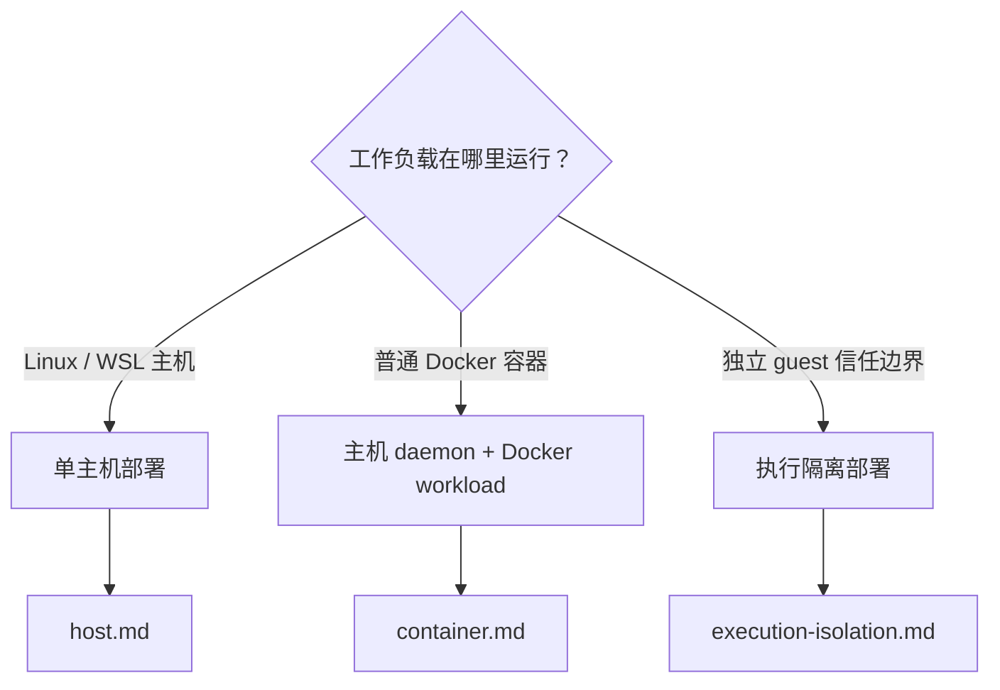

# 选择部署模式

> 本文说明如何根据工作负载边界、采集位置和权限要求选择 AcTrail 部署模式。

| 模式 | daemon 所在位置 | 工作负载 | 适合场景 | 主要限制 |
| --- | --- | --- | --- | --- |
| 单主机 | Linux/WSL 主机 | 同一主机 | 首次部署、主机上的 Agent 或命令 | daemon 具有主机级 collector 权限 |
| 主机 daemon + Docker workload | Linux 主机 | 一个或多个容器 | Agent 环境容器化，但需要统一宿主采集和存储 | 容器必须挂载本地 socket；seccomp 能力取决于 Docker profile |
| 外部 supervisor | Linux 主机 | 同主机或容器 | systemd 等托管 daemon 生命周期 | daemon 必须用 `run` 前台模式 |

默认部署模式为单主机模式。该模式便于判断内核能力、路径权限和数据落点，操作见 [主机部署](host.md)。

当 Agent 必须位于 Docker 容器时，主机仍只运行一个 `actraild`，`/run/actrail` 挂载到 workload，`actrailctl launch` 在容器内运行。Control socket 不得通过未受保护的 TCP 暴露，操作见 [容器化工作负载](container.md)。

执行隔离改变信任边界、传输与故障模型，不属于 Docker workload 模式；需要该边界时使用 [执行隔离部署](execution-isolation.md)。
