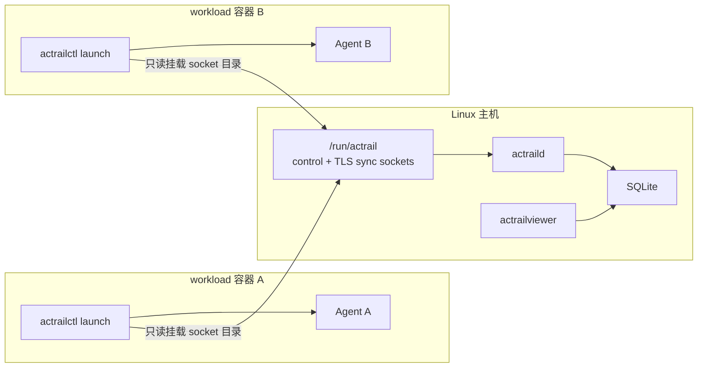

# 观测 Docker 容器中的工作负载

> 本文说明如何使用 Linux 主机上的 AcTrail daemon 安全观测一个或多个 Docker workload 容器。

`actraild`、SQLite 和 viewer 留在主机。容器只运行 `actrailctl launch` 与目标 Agent，并通过只读挂载的 `/run/actrail` 访问主机 control/TLS-sync socket。



## 前置条件

- 主机已经按 [主机部署](host.md) 启动 daemon；
- workload 镜像包含 `actrailctl` 和需要的 TLS sync runtime library；
- Agent、模型配置与密钥由镜像分层、只读挂载或 secrets 注入；
- 主机和容器使用兼容的 release 产物与 operator config。

## 1. 选择 Docker seccomp 模式

| 模式 | `--seccomp-notify auto` | 用途 |
| --- | --- | --- |
| Docker 默认 profile | notify 不可用时明确降级，TLS sync 仍可用 | 最小权限 |
| `deploy/container-auto/seccomp/actrail-notify.json` | 启用 notify，同时保留 Docker 外层 syscall 过滤 | 需要完整 launch-time seccomp 的推荐模式 |
| `seccomp=unconfined` | notify 可用，但关闭 Docker 外层过滤 | 仅限可信排障环境 |

`auto` 允许该权限轴降级；`required` 在能力不可用时失败；`disabled` 保证不启用它。严格证据覆盖需要使用 `required`，自动降级不代表完整采集。

## 2. 创建 workload 容器

示例镜像必须已经包含工作负载与 AcTrail runtime：

```bash
export ACTRAIL_WORKLOAD_IMAGE=registry.example.com/agent-runtime:current
export ACTRAIL_SECCOMP_PROFILE=/absolute/path/to/AcTrail/deploy/container-auto/seccomp/actrail-notify.json

docker run -d --name actrail-agent \
  --user 0:0 \
  --security-opt "seccomp=$ACTRAIL_SECCOMP_PROFILE" \
  -v /run/actrail:/run/actrail:ro \
  -v /etc/actrail:/etc/actrail:ro \
  "$ACTRAIL_WORKLOAD_IMAGE" sleep infinity
```

模型密钥不得写入这一命令，应通过 Docker secrets 或受控 env file 提供。

## 3. 探测实际权限

```bash
docker exec actrail-agent actrailctl probe \
  --config /etc/actrail/actraild.conf \
  --host-ebpf auto \
  --seccomp-notify auto \
  --json
```

该命令同时检查本地 launch 前置条件和 daemon readiness。`--skip-daemon` 只能提供本地预览，不是最终 profile 决策。

## 4. 启动受观测工作负载

```bash
docker exec actrail-agent actrailctl \
  --config /etc/actrail/actraild.conf \
  launch \
  --name container-agent \
  --host-ebpf auto \
  --seccomp-notify auto \
  -- \
  /usr/local/bin/agent-runtime
```

每个容器中的每次 Agent 运行都应单独调用 `launch`。多个容器可以挂载同一 `/run/actrail`；同一 socket 不得由第二个 daemon 重复绑定。

Trace 由主机上的 `actrailviewer` 查看。容器看不到 socket 或出现 `pidfd_getfd ... Operation not permitted` 时，按 [部署故障排查](../troubleshooting/deployment.md) 处理。
