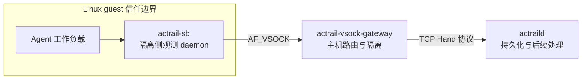

# 部署执行隔离

> 本文说明如何在 Linux guest 内运行隔离观测 daemon，并经主机 VSOCK gateway 将观测发送给 `actraild`。

Virtual socket（VSOCK）是 guest 与 host 之间不依赖 guest IP 网络的通信通道。仅当工作负载必须位于独立 guest 信任边界时使用此模式；普通 Docker workload 使用 [容器部署](container.md)。



## 前置条件

- `actraild`、`actrail-sb` 和 `actrail-vsock-gateway` 来自同一 revision 的 release build；
- 可用的 Firecracker、Cloud Hypervisor 或原生 AF_VSOCK 环境；
- 已有虚拟机生命周期组件负责创建并持有 VSOCK endpoint；
- 配置、socket、插件和存储目录已经按最小权限创建；
- 主机已有完整的 `operator.conf`；`deploy/execution-isolation/actraild-sandbox-resource-alert.startup.toml` 只是 startup plugin fragment，不能独立作为 operator config。

组件边界与故障隔离规则见 [执行隔离架构](../../architecture/components/execution-isolation.md)。

## 生成配置

新配置应由实际加载配置的 release binary 生成。目标文件存在时，`init` 默认拒绝替换；只有确认内容可覆盖时才使用 `--force`。

以下命令配置 Firecracker route：

```bash
sudo mkdir -p /etc/actrail /run/firecracker/actrail

sudo actrail-vsock-gateway init \
  --output /etc/actrail/actrail-vsock-gateway.toml \
  --backend firecracker \
  --uds-path /run/firecracker/actrail/vsock.sock \
  --port 43182 \
  --daemon-address 127.0.0.1:9472

sudo actrail-sb init \
  --output /etc/actrail/actrail-sb.toml \
  --root-process-name xiaoo \
  --root-process-name claude \
  --control-socket /run/actrail/actrail-sb-control.sock \
  --instance-lock-path /run/actrail/actrail-sb.lock
```

所有路径都按虚拟机的 mount namespace 和 chroot 解析。Firecracker 会把 guest 目标端口 `P` 映射到 host listener `${uds_path}_${P}`；配置中的 base `uds_path` 不手工追加端口。

运维人员应将 `deploy/execution-isolation/actraild-sandbox-resource-alert.startup.toml` 合并到主机完整 `operator.conf`，并确保 daemon 身份可以写配置指定的 Sandbox Alert SQLite；仓库 fragment 使用 `/var/lib/actrail/sandbox-alerts.sqlite`。

## 启动并连接

启动顺序依次为主机 daemon 与 gateway、guest daemon、route 激活。以下前台进程分别占用终端；生产部署应把前三个进程交给各自的 service manager。

主机终端 1：

```bash
sudo actraild --config /etc/actrail/operator.conf run
```

主机终端 2：

```bash
sudo actrail-vsock-gateway \
  --config /etc/actrail/actrail-vsock-gateway.toml
```

Guest 终端 1：

```bash
sudo actrail-sb daemon \
  --config /etc/actrail/actrail-sb.toml
```

Guest 终端 2，在 guest daemon ready 后运行：

```bash
sudo actrail-sb connect \
  --control-socket /run/actrail/actrail-sb-control.sock \
  --host-cid 2 \
  --port 43182
```

Guest daemon 可以在尚未打开 VSOCK 时进入 ready。成功执行 `connect` 前产生的 observation 会在进入有界 sender queue 之前丢弃；`connect` 返回成功表示 gateway handshake 已完成。

## 时间与容量关系

| 约束 | 仓库配置值 | 作用 |
| --- | --- | --- |
| Guest `sender.max_silence_interval_ms` 必须小于 gateway `sb_peer_idle_timeout_ms`，并保留调度余量 | `5s < 15s` | 避免健康 guest 被 gateway 当作 idle peer |
| Gateway `upstream_heartbeat_interval_ms` 必须小于 daemon `connection_idle_timeout_ms` | `5s < 15s` | 保持 upstream connection 活跃 |
| `outbound_queue_capacity >= max_sb_connections * per_sb_forward_quota` | `1024 = 64 * 16` | 确保一个调度轮次的 quota 有容量边界 |
| `upstream.daemon_address` 必须到达 daemon Hand listener | 同主机为 `127.0.0.1:9472` | 建立 gateway 到 daemon 的上游观测接收通道；Hand 是该 listener 使用的接入协议 |

违反这些关系时，配置校验必须失败，或故障必须限制在对应 guest/gateway route，不能终止无关的主机采集。

## 检查四个边界

1. `actraild` 已启动，Hand listener ready 且存储可写。
2. Gateway 已持有配置的 VSOCK backend endpoint。
3. `actrail-sb connect` 返回成功。
4. Guest observation record 已出现在主机存储中：

```bash
sudo actrailviewer --config /etc/actrail/operator.conf traces
```

激活失败时，依次检查 guest control response、gateway 的 guest connection（peer）状态、gateway 到 daemon 的 connection（upstream）状态，以及 daemon Hand listener；不通过弱化 peer、路径或凭据校验绕过失败边界。
