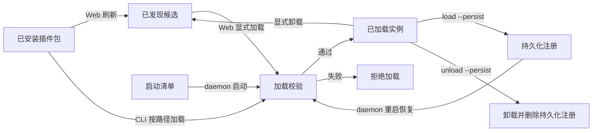
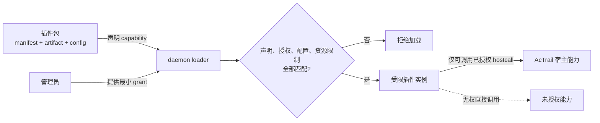

# 管理插件

> 本文指导插件管理员安装插件包、授予最小权限，并通过运行时命令或启动清单管理插件实例。

本文面向已经有可运行 `actraild` 和 operator 配置的管理员。插件管理命令通过 operator
配置中的 control socket 连接 daemon；该 socket 要求 host-root peer，因此常规部署需要
使用 `sudo`。

## 四种状态

- **已安装**：插件包位于插件目录，尚无执行权限。
- **已发现**：Web 对 `plugins.discovery.directory` 做有界扫描后识别到候选包；扫描没有加载副作用。
- **已加载**：daemon 已校验 manifest、配置、授权和运行时，并创建活动实例。
- **已持久化**：运行时加载记录由 AcTrail 保存，daemon 重启后恢复。固定部署更适合使用启动清单。



每个候选包是发现目录的一个直接子目录，必须恰好包含一个 `*.plugin.toml`。artifact、
配置 schema 和 alert payload schema 必须留在包内，不能通过相对路径逃逸。Web 加载只
提交候选包 key；后端重新扫描并解析路径，浏览器不能指定任意 manifest 路径。

**manifest** 描述插件身份和权限请求；**capability** 是插件声明需要使用的一类宿主能力；
**grant** 是管理员对 capability 的实际授权。声明不等于授权。



## 运行时管理

加载需要配置的插件：

```bash
sudo target/release/actraild --config operator.conf plugin load \
  --manifest /absolute/path/my-plugin.plugin.toml \
  --plugin-config /absolute/path/my-plugin.config.toml \
  --instance my.instance
```

manifest 声明 host capability 时，管理员必须逐项授予匹配的最小权限：

```bash
sudo target/release/actraild --config operator.conf plugin load \
  --manifest /absolute/path/my-plugin.plugin.toml \
  --instance my.instance \
  --grant context-query
```

缺少声明所需的 grant，或授予 manifest 没有声明的能力，都会使加载失败。参数化权限
必须把范围写进 grant；管理员不得授予比插件实际用途更宽的环境变量、规则类型或路径范围。

```bash
sudo target/release/actraild --config operator.conf plugin list
sudo target/release/actraild --config operator.conf plugin status --instance my.instance
sudo target/release/actraild --config operator.conf plugin unload --instance my.instance
```

`plugin status` 是判断运行健康度的入口。实例 `state=active` 只表示运行实例存在；异步
exporter 的下游错误还要结合 `last_error`、drop 和 retry 指标判断。

需要 daemon 重启后恢复临时注册时，可在 load 和 unload 上都加 `--persist`。卸载时的
`--persist` 同时删除持久化记录：

```bash
sudo target/release/actraild --config operator.conf plugin unload \
  --instance my.instance --persist
```

## 固定启动清单

固定部署在 operator 配置中声明启动实例：

```toml
[plugins.startup]
enabled = true
failure_policy = "fail-fast"

[[plugins.startup.load]]
instance = "live-observer"
enabled = true
failure_policy = "continue"
manifest = "/etc/actrail/plugins/observer/observer.plugin.toml"
plugin_config = "/etc/actrail/plugins/observer/observer.config.toml"
host_grants = []
```

全局和条目级 `failure_policy` 支持：

- `fail-fast`：插件加载失败会使 daemon 启动失败，适合治理控制插件。
- `continue`：记录错误后继续启动，适合可选观测导出插件。

启动清单与 `--persist` 是两种所有权模型，不应同时管理同一实例。启动清单中的配置
更新要通过重启 daemon 生效。

## 更新和卸载

运行时插件只在加载时读取 manifest、artifact 和插件配置。管理员按以下步骤更新这些文件：

1. 对需要 trace 终态分析的插件，先等待相关 trace 结束。
2. 显式卸载实例。
3. 原子部署新的完整插件包。
4. 使用相同、最小化的 grants 重新加载。
5. 查看 `plugin status`。

卸载不会让未结束 trace 被新实例追溯补处理。删除已发现包也不会隐式卸载活动实例；
必须先显式卸载，再移除包。

## 管理面安全

- 管理员不得把 daemon 插件管理 socket 或具有等价权限的 Web 管理入口暴露到不受信任网络。
- Web 后端必须以能通过 host-root peer 校验的本机管理员身份运行，才可加载或卸载插件。
- builtin 插件也必须经过候选发现或显式路径加载；编译进 daemon 不等于默认启用。
- 插件业务配置独立于 operator 配置，通过 `--plugin-config` 或启动清单传入。
