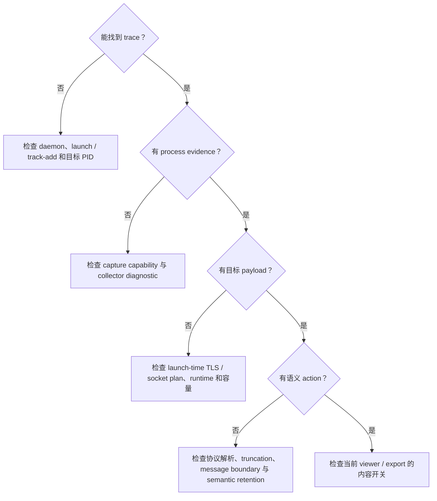

# 采集结果缺失

> 本文说明如何根据可见症状定位进程、payload 或语义 action 缺失的原因。



## 先确认 trace 和诊断

以下命令假设 release binary 位于 `PATH`，并使用默认 `/etc/actrail/actraild.conf`。自定义实例应增加 `--config /path/to/operator.conf`。

```bash
sudo actrailviewer summary --trace-id <TRACE_ID>
sudo actrailviewer diagnostics --trace-id <TRACE_ID>
sudo actrailviewer processes --trace-id <TRACE_ID>
```

如果 trace 根本不存在，确认目标命令确实经 `actrailctl launch` 运行，或 `track-add` 的 PID 当时仍存活；同时检查 daemon `log_path`。

## 有进程，但没有 TLS payload

检查项如下：

```bash
sudo actrailviewer payloads --trace-id <TRACE_ID> --head 40
sudo actrailviewer tls-flow --trace-id <TRACE_ID>
```

运维人员应确认 `[capture].capabilities` 包含 `tls-plaintext-payload`，`[payload.tls].enabled = true`，且目标使用 `actrailctl launch`。`tls-sync` 必须在 exec 前准备 runtime、event socket 和 probe plan；`track-add` 不能补装这些条件。实际 TLS provider/二进制还必须能被 resolver 匹配，runtime library 也必须可读。

加密 socket bytes 不能作为 TLS 明文 fallback。probe plan 不完整时应保留显式失败。

## 有 payload，但没有 `llm.request`

依次查看：

```bash
sudo actrailviewer payloads --trace-id <TRACE_ID> --head 80
sudo actrailviewer events --trace-id <TRACE_ID> --head 80
sudo actrailviewer actions --trace-id <TRACE_ID>
sudo actrailviewer diagnostics --trace-id <TRACE_ID>
```

运维人员应确认 application/HTTP/LLM semantic retention 层已启用。partial、truncated、方向容量溢出或缺少可信 message boundary 会只隔离受影响 stream/direction，并留下 diagnostic；这时不应把不完整 body 投影为完整请求。

## CLI 看不到内容，但底层已采集

payload retention、semantic retention、snapshot export 和 OTEL attribute mode 是独立控制面。检查请求的 viewer surface 是否与目标内容层一致，并确认内容未被 `highest_consumed` 移交给更高层。默认 LLM request body export 为 `none`，不表示底层一定没有内容。
